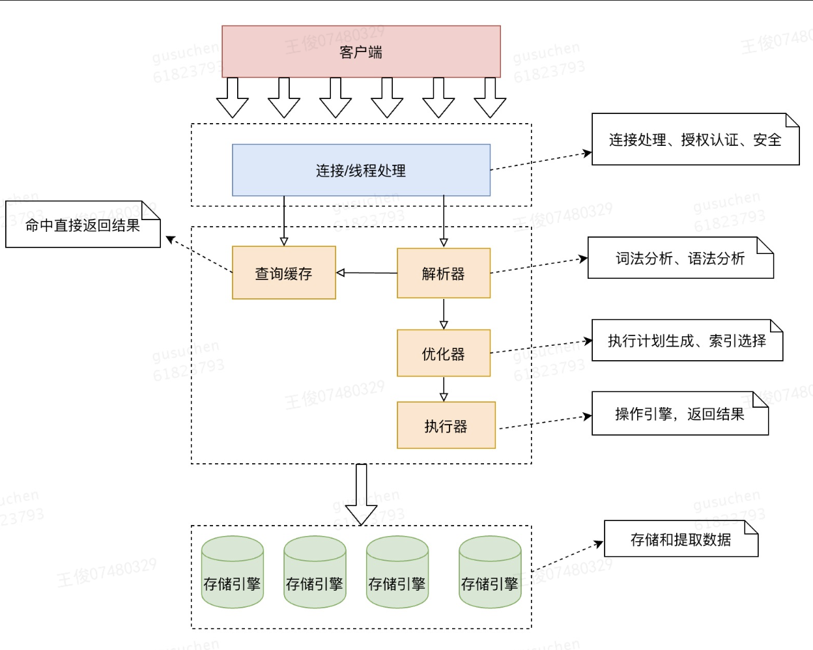

# MySQL的架构

大体来说，MySQL可以分为Server层和存储引擎层两部分。

- Server层是MySQL的"大脑"，负责所有跨存储引擎的核心功能， 涵盖MySQL的大多数核心服务功能，以及所有的内置函数（如日期、时间、数学和加密函数等）比如存储过程、触发器、视图等。Server层包括连接器、分析器、优化器、执行器等。
- 而存储引擎层负责数据的存储和提取。其架构模式是插件式的，支持InnoDB、MyISAM、Memory等多个存储引擎



mySQL server层和存储引擎层肯定必须要在同一个机器上同一个进程内，保证进程内通信。

机器的CPU，主要用于server层，因为server层要负责链接管理和SQL解析，排序、分组，链接计算等等，临时表。

机器内存主要用于引擎层的bufferpoll，这绝对是内存大头。引擎层主要负责快速定位数据，读取数据到内存页，更新脏页等。如果有大量写入，引擎层也会消耗大量CPU。


## 一、server 核心服务层
### 连接器（Connector）：
功能：管理客户端连接、身份认证、权限验证
工作流程：
1. 客户端发起连接请求 
2. 连接器进行用户名密码验证 
3. 验证成功后，读取该用户的权限信息并缓存 
4. 维持连接管理，处理连接超时（wait_timeout 参数控制）
特点：
连接建立后，即使管理员修改了该用户权限，已存在的连接也不会受影响，需要重新连接才会生效
使用show processlist可以查看所有连接状态
客户端如果太长时间没动静，连接器就会自动将它断开。这个时间是由参数wait_timeout控制的，默认值是8小时。
`mysql -h$ip -P$​port -u$user -p`然后输入密码后，校验通过，连接器就会到权限表里查处你拥有的所有权限，之后，这个连接里面的权限判断逻辑，都将依赖于此时读到的权限，这就意味着，一个用户成功建立连接后，即使你用管理员账号对这个用户的权限做了修改，也不会影响已经存在连接的权限。修改完成后，只有再新建的连接才会使用新的权限设置。连接完成后，如果你没有后续的动作，这个连接就处于空闲状态，你可以在show processlist命令中看到它

### 查询缓存-MySQL 8.0已移除
功能：缓存SELECT查询语句及其结果集
大多数情况下我会建议你不要使用查询缓存，为什么呢？因为查询缓存往往弊大于利。
查询缓存的失效非常频繁，只要有对一个表的更新，这个表上所有的查询缓存都会被清空。因此很可能你费劲地把结果存起来，还没使用呢，就被一个更新全清空了。对于更新压力大的数据库来说，查询缓存的命中率会非常低。除非你的业务就是有一张静态表，很长时间才会更新一次。比如，一个系统配置表，那这张表上的查询才适合使用查询缓存

而对于你确定要使用查询缓存的语句，可以用SQL_CACHE显式指定，像下面这个语句一样：
mysql> select SQL_CACHE * from T where ID=10；

需要注意的是，MySQL 8.0版本直接将查询缓存的整块功能删掉了，也就是说8.0开始彻底没有这个功能了。
### 解析器
功能：进行语法分析。识别SQL语句中的关键字、表名、列名等，根据语法规则验证语句是否正确。
生成语法解析树。

### 优化器
功能：生成最优的执行计划
决策内容：
1. 选择使用哪个索引（如果有多个索引可选）
2. 决定表的连接顺序
3. 是否使用覆盖索引
4. 是否使用索引条件下推

如下列SQL，优化器需要决定：先查t1还是t2？用什么索引？
```sql
SELECT * FROM t1 JOIN t2 ON t1.id = t2.id WHERE t1.a = 1 AND t2.b = 2;
```

### 执行器
功能：按照优化器生成的执行计划调用存储引擎接口。
工作流程：
1. 检查用户对表的执行权限 
2. 调用存储引擎接口执行查询 
3. 处理返回的结果集 
4. 返回给客户端

比如我们这个例子中的表T中，ID字段没有索引，那么执行器的执行流程是这样的：
​	1.	调用InnoDB引擎接口取这个表的第一行，判断ID值是不是10，如果不是则跳过，如果是则将这行存在结果集中；
​	2.	调用引擎接口取“下一行”，重复相同的判断逻辑，直到取到这个表的最后一行。
​	3.	执行器将上述遍历过程中所有满足条件的行组成的记录集作为结果集返回给客户端。
至此，这个语句就执行完成了。

对于有索引的表，执行的逻辑也差不多。第一次调用的是“取满足条件的第一行”这个接口，之后循环取“满足条件的下一行”这个接口，这些接口都是引擎中已经定义好的。

你会在数据库的慢查询日志中看到一个rows_examined的字段，表示这个语句执行过程中扫描了多少行。这个值就是在执行器每次调用引擎获取数据行的时候累加的。
在有些场景下，执行器调用一次，在引擎内部则扫描了多行，因此引擎扫描行数跟rows_examined并不是完全相同的

## 二、存储引擎层
存储引擎层负责数据的存储和提取，是MySQL的"手脚"。负责数据的读取和写入、索引的创建和搜索、事务管理、锁管理。
核心引擎：
InnoDB（默认）：支持事务、行级锁、外键，适用于大多数场景
MyISAM：不支持事务，表级锁，适用于读多写少的场景
Memory：数据存储在内存中，速度快但重启后数据丢失

以 SELECT * FROM users WHERE id = 1; 为例：
连接器：验证客户端连接权限
分析器：识别这是SELECT语句，检查语法正确性
优化器：决定使用主键索引进行查询
执行器：
检查对users表的查询权限
调用InnoDB引擎的"读接口"
存储引擎：
在聚集索引B+Tree中查找id=1的记录
返回完整行数据
执行器：接收数据，返回给客户端


功能模块	所属层级	说明
连接管理	Server层	处理客户端连接
权限验证	Server层	验证用户权限
SQL解析	Server层	词法、语法分析
查询优化	Server层	生成执行计划
索引选择	Server层	优化器决定
数据存储	存储引擎层	数据文件组织
索引实现	存储引擎层	B+Tree索引等
事务ACID	存储引擎层	InnoDB支持
锁机制	存储引擎层	行锁、表锁等


