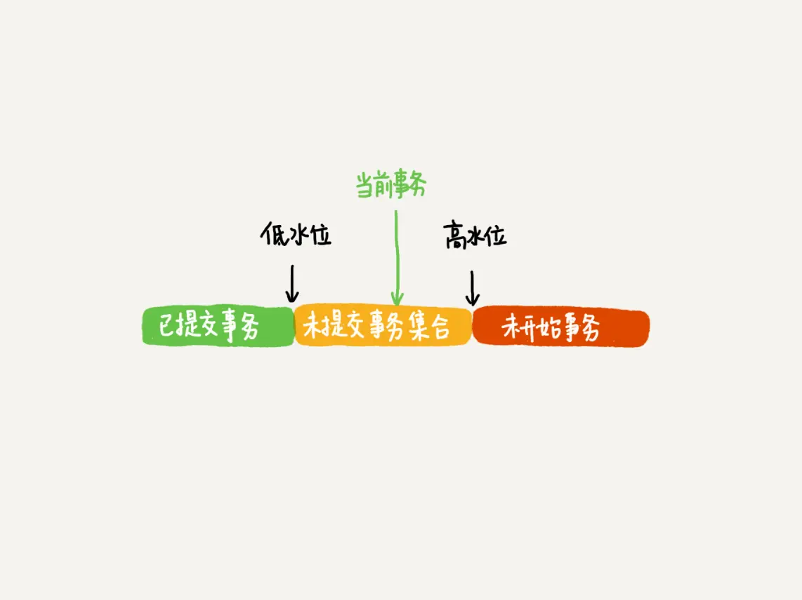

# mysql的事务

事务的四个特征ACID：原子性，一致性，持久性，隔离性。

## 事务的原子性和持久性

原子性就由undolog日志来保证，记录了如果发生错误需要回滚的日志信息。

持久性由redolog来保证，就算数据没有保存成功，只要redolog日志文件在数据就不会丢失。

innoDB为了提升读写效率，引入了缓存池，向数据库写入数据时会先写入缓存池，读也一样，然后定期将缓存池中的数据刷新到磁盘。这样有个问题，如果MySQL宕机，缓存池中更新的数据还没刷到磁盘上，就会导致数据丢失。于是引入redoLog来解决这个问题：

1. 先将原始数据从磁盘中读入内存中来，修改数据的内存拷贝。
2. 生成一条重做日志并写入redo log buffer，记录的是数据被修改后的值。
3. 当事务commit时，将redo log buffer中的内容通过追加写的方式刷新到硬盘redo log file中
4. 定期将内存中修改的数据刷新到磁盘中


具体从一个例子来看下如何交互：


## 事务的隔离性

多个事务在并发情况下会互相干扰，带来一些问题。MySQL是利用MVCC（多版本并发控制）和锁来保证事务的隔离性。

隔离级别有以下四种：

- READ_UNCOMMITTED 未提交读

  ```
      A constant indicating that dirty reads and non-repeatable reads are
    * prevented; phantom reads can occur. This level prohibits a transaction
    * from reading a row with uncommitted changes in it, and it also prohibits
    * the situation where one transaction reads a row, a second transaction
    * alters the row, and the first transaction rereads the row, getting
    * different values the second time (a "non-repeatable read").
  
  ```

- READ_COMMITTED 已提交读	 

  ```
  /**
  * A constant indicating that
  * dirty reads are prevented; non-repeatable reads and phantom
  * reads can occur.  This level only prohibits a transaction
  * from reading a row with uncommitted changes in it.
  */
  ```

- REPEATABLE_READ 可重复读

  ```
  /**
  * A constant indicating that
  * dirty reads and non-repeatable reads are prevented; phantom
  * reads can occur.  This level prohibits a transaction from
  * reading a row with uncommitted changes in it, and it also
  * prohibits the situation where one transaction reads a row,
  * a second transaction alters the row, and the first transaction
  * rereads the row, getting different values the second time
  * (a "non-repeatable read").
  */
  ```

  但是**mysql在可重复读级别下，结合next-key锁避免了幻读的发生**，面试被问到过！

- SERIALIZABLE 串行化

  ```
  /**
  * A constant indicating that
  * dirty reads, non-repeatable reads and phantom reads are prevented.
  * This level includes the prohibitions in
  * <code>TRANSACTION_REPEATABLE_READ</code> and further prohibits the
  * situation where one transaction reads all rows that satisfy
  * a <code>WHERE</code> condition, a second transaction inserts a row that
  * satisfies that <code>WHERE</code> condition, and the first transaction
  * rereads for the same condition, retrieving the additional
  * "phantom" row in the second read.
  */
  ```

幻读和不可重复读相似容易混淆，不可重复读指的是另一个事务修改（ alters the row）了某行的数据，导致第一个事务两次查询的结果不。幻读指的是第一个事务相同查询条件的查询行数，另一个事务增加某行（inserts a row），导致第一个事务两次查询的结果不同。

下面是演示RC级别下，不可重复的问题


在实现上，数据库里面会创建一个视图，访问的时候以视图的逻辑结果为准。在“可重复读”隔离级别下，这个视图是在事务启动时创建的，整个事务存在期间都用这个视图。在“读提交”隔离级别下，这个视图是在每个SQL语句开始执行的时候创建的。这里需要注意的是，“读未提交”隔离级别下直接返回记录上的最新值，没有视图概念；而“串行化”隔离级别下直接用加锁的方式来避免并行访问。

可重复读的定义，一个事务启动的时候，能够看到所有已经提交的事务结果。但是之后，这个事务执行期间，其他事务的更新对它不可见。
在可重复读隔离级别下，事务在启动的时候就“拍了个快照”。注意，这个快照是基于整库的

在实现上， InnoDB为每个事务构造了一个数组，用来保存这个事务启动瞬间，当前正在“活跃”的所有事务ID。“活跃”指的就是，启动了但还没提交。视图数组把所有的row trx_id 分成了几种不同的情况

InnoDB的行数据有多个版本，每个数据版本有自己的row trx_id，每个事务或者语句有自己的一致性视图。普通查询语句是一致性读，一致性读会根据row trx_id和一致性视图确定数据版本的可见性。
•对于可重复读，查询只承认在事务启动前就已经提交完成的数据； •对于读提交，查询只承认在语句启动前就已经提交完成的数据； 而当前读，总是读取已经提交完成的最新版本。

## MVCC

多版本并发控制：读取数据的时候通过一种类似快照的方式把数据保存下来，不同的事务只能看到特定版本的数据。MVCC只在读已提交和可重复读两个隔离级别下存在，未提交读总是读取最新的数据，串行化会对所有行记录加锁。

聚集索引中，每行记录有两个隐藏列：

- trx_id：存储每次对每条聚集索引记录进行修改时的事务id

- roll_pointer：是一个指针，指向undo日志中这条记录的上一个事务版本，从而形成一个版本链。（插入操作是没有undo日志的，因为没有上一条，另外会在没有引用指向时才会删除）

“快照”在MVCC里是怎么工作的？

在可重复读隔离级别下，事务在启动的时候就“拍了个快照”。注意，这个快照是基于整库的。

这时，你会说这看上去不太现实啊。如果一个库有100G，那么我启动一个事务，MySQL就要拷贝100G的数据出来，这个过程得多慢啊。可是，我平时的事务执行起来很快啊。实际上，我们并不需要拷贝出这100G的数据。我们先来看看这个快照是怎么实现的。

InnoDB里面每个事务有一个唯一的事务ID，叫作t**ransaction id。它是在事务开始的时候向InnoDB的事务系统申请的，是按申请顺序严格递增的**。

而每行数据也都是有多个版本的。每次事务更新数据的时候，都会生成一个新的数据版本，并且把transaction id赋值给这个数据版本的事务ID，记为row trx_id。同时，旧的数据版本要保留，并且在新的数据版本中，能够有信息可以直接拿到它。

也就是说，数据表中的一行记录，其实可能有多个版本(row)，每个版本有自己的row trx_id。

如图2所示，就是一个记录被多个事务连续更新后的状态。


图中虚线框里是同一行数据的4个版本，当前最新版本是V4，k的值是22，它是被transaction id 为25的事务更新的，因此它的row trx_id也是25。

你可能会问，前面的文章不是说，语句更新会生成undo log（回滚日志）吗？那么，undo log在哪呢？

实际上，图2中的三个虚线箭头，就是undo log；而V1、V2、V3并不是物理上真实存在的，而是每次需要的时候根据当前版本和undo log计算出来的。比如，需要V2的时候，就是通过V4依次执行U3、U2算出来。

明白了多版本和row trx_id的概念后，我们再来想一下，InnoDB是怎么定义那个“100G”的快照的。

按照可重复读的定义，一个事务启动的时候，能够看到所有已经提交的事务结果。但是之后，这个事务执行期间，其他事务的更新对它不可见。

因此，一个事务只需要在启动的时候声明说，“以我**启动的时刻**为准，如果一个数据版本是在我启动之前生成的，就认；如果是我启动以后才生成的，我就不认，我必须要找到它的上一个版本”。

当然，如果“上一个版本”也不可见，那就得继续往前找。还有，如果是这个事务自己更新的数据，它自己还是要认的。

在实现上， InnoDB为每个事务构造了一个数组，用来保存这个事务启动瞬间，当前正在“活跃”的所有事务ID。“活跃”指的就是，启动了但还没提交。

数组里面事务ID的最小值记为低水位，当前系统里面已经创建过的事务ID的最大值加1记为高水位。

这个视图数组和高水位，就组成了当前事务的一致性视图（read-view）。

而数据版本的可见性规则，就是基于数据的row trx_id和这个一致性视图的对比结果得到的。

这个视图数组把所有的row trx_id 分成了几种不同的情况。



这样，对于当前事务的启动瞬间来说，一个数据版本的row trx_id，有以下几种可能：

​	1.	如果落在绿色部分，表示这个版本是已提交的事务或者是当前事务自己生成的，这个数据是可见的；

	2.	如果落在红色部分，表示这个版本是由将来启动的事务生成的，是肯定不可见的；
 	3.	如果落在黄色部分，那就包括两种情况
     	 a. 若 row trx_id在数组中，表示这个版本是由还没提交的事务生成的，不可见；
      	b. 若 row trx_id不在数组中，表示这个版本是已经提交了的事务生成的，可见。

比如，对于图2中的数据来说，如果有一个事务，它的低水位是18，那么当它访问这一行数据时，就会从V4通过U3计算出V3，所以在它看来，这一行的值是11。

你看，有了这个声明后，系统里面随后发生的更新，是不是就跟这个事务看到的内容无关了呢？因为之后的更新，生成的版本一定属于上面的2或者3(a)的情况，而对它来说，这些新的数据版本是不存在的，所以这个事务的快照，就是“静态”的了。

所以你现在知道了，InnoDB利用了“所有数据都有多个版本”的这个特性，实现了“秒级创建快照”的能力。

接下来，我们继续看一下图1中的三个事务，分析下事务A的语句返回的结果，为什么是k=1。

这里，我们不妨做如下假设：

​	1.	事务A开始前，系统里面只有一个活跃事务ID是99；

​	2.	事务A、B、C的版本号分别是100、101、102，且当前系统里只有这四个事务；

​	3.	三个事务开始前，(1,1）这一行数据的row trx_id是90。

这样，事务A的视图数组就是[99,100], 事务B的视图数组是[99,100,101], 事务C的视图数组是[99,100,101,102]。

为了简化分析，我先把其他干扰语句去掉，只画出跟事务A查询逻辑有关的操作：


从图中可以看到，第一个有效更新是事务C，把数据从(1,1)改成了(1,2)。这时候，这个数据的最新版本的row trx_id是102，而90这个版本已经成为了历史版本。

第二个有效更新是事务B，把数据从(1,2)改成了(1,3)。这时候，这个数据的最新版本（即row trx_id）是101，而102又成为了历史版本。

你可能注意到了，在事务A查询的时候，其实事务B还没有提交，但是它生成的(1,3)这个版本已经变成当前版本了。但这个版本对事务A必须是不可见的，否则就变成脏读了。

好，现在事务A要来读数据了，它的视图数组是[99,100]。当然了，**读数据都是从当前版本读起的**。所以，事务A查询语句的读数据流程是这样的：

​	•	找到(1,3)的时候，判断出row trx_id=101，比高水位大，处于红色区域，不可见；

​	•	接着，找到上一个历史版本，一看row trx_id=102，比高水位大，处于红色区域，不可见；

​	•	再往前找，终于找到了（1,1)，它的row trx_id=90，比低水位小，处于绿色区域，可见。

这样执行下来，虽然期间这一行数据被修改过，但是事务A不论在什么时候查询，看到这行数据的结果都是一致的，所以我们称之为一致性读。

这个判断规则是从代码逻辑直接转译过来的，但是正如你所见，用于人肉分析可见性很麻烦。

所以，我来给你翻译一下。一个数据版本，对于一个事务视图来说，除了自己的更新总是可见以外，有三种情况：

​	1.	版本未提交，不可见；

​	2.	版本已提交，但是是在视图创建后提交的，不可见；

​	3.	版本已提交，而且是在视图创建前提交的，可见。

现在，我们用这个规则来判断图4中的查询结果，事务A的查询语句的视图数组是在事务A启动的时候生成的，这时候：

​	•	(1,3)还没提交，属于情况1，不可见；

​	•	(1,2)虽然提交了，但是是在视图数组创建之后提交的，属于情况2，不可见；

​	•	(1,1)是在视图数组创建之前提交的，可见。

你看，去掉数字对比后，只用时间先后顺序来判断，分析起来是不是轻松多了。所以，后面我们就都用这个规则来分析。

**更新逻辑**

细心的同学可能有疑问了：事务B的update语句，如果按照一致性读，好像结果不对哦？

你看图5中，事务B的视图数组是先生成的，之后事务C才提交，不是应该看不见(1,2)吗，怎么能算出(1,3)来？


是的，如果事务B在更新之前查询一次数据，这个查询返回的k的值确实是1。

但是，**当它要去更新数据的时候，就不能再在历史版本上更新了，否则事务C的更新就丢失了**。因此，事务B此时的set k=k+1是在（1,2）的基础上进行的操作。

所以，这里就用到了这样一条规则：更新数据都是先读后写的，而这个读，**只能读当前的值，称为“当前读”（current read）**。

因此，在更新的时候，当前读拿到的数据是(1,2)，更新后生成了新版本的数据(1,3)，这个新版本的row trx_id是101。

所以，在执行事务B查询语句的时候，一看自己的版本号是101，最新数据的版本号也是101，是自己的更新，可以直接使用，所以查询得到的k的值是3。

这里我们提到了一个概念，叫作当前读。其实，除了update语句外，select语句如果加锁，也是当前读。

所以，如果把事务A的查询语句select * from t where id=1修改一下，加上lock in share mode 或 for update，也都可以读到版本号是101的数据，返回的k的值是3。下面这两个select语句，就是分别加了读锁（S锁，共享锁）和写锁（X锁，排他锁）。

mysql> select k from t where id=1 lock in share mode;

mysql> select k from t where id=1 for update;

再往前一步，假设事务C不是马上提交的，而是变成了下面的事务C’，会怎么样呢？


事务C’的不同是，更新后并没有马上提交，在它提交前，事务B的更新语句先发起了。前面说过了，虽然事务C’还没提交，但是(1,2)这个版本也已经生成了，并且是当前的最新版本。那么，事务B的更新语句会怎么处理呢？

这时候，我们在上一篇文章中提到的“两阶段锁协议”就要上场了。事务C’没提交，也就是说(1,2)这个版本上的写锁还没释放。而事务B是当前读，必须要读最新版本，而且必须加锁，因此就被锁住了，必须等到事务C’释放这个锁，才能继续它的当前读。


到这里，我们把一致性读、当前读和行锁就串起来了。

现在，我们再回到文章开头的问题：事务的可重复读的能力是怎么实现的？

可重复读的核心就是一致性读（consistent read）；而事务更新数据的时候，只能用当前读。如果当前的记录的行锁被其他事务占用的话，就需要进入锁等待。

而读提交的逻辑和可重复读的逻辑类似，它们最主要的区别是：

​	•	在可重复读隔离级别下，只需要在事务开始的时候创建一致性视图，之后事务里的其他查询都共用这个一致性视图；

​	•	在读提交隔离级别下，每一个语句执行前都会重新算出一个新的视图。

那么，我们再看一下，在读提交隔离级别下，事务A和事务B的查询语句查到的k，分别应该是多少呢？

这里需要说明一下，“start transaction with consistent snapshot; ”的意思是从这个语句开始，创建一个持续整个事务的一致性快照。所以，在读提交隔离级别下，这个用法就没意义了，等效于普通的start transaction。

下面是读提交时的状态图，可以看到这两个查询语句的创建视图数组的时机发生了变化，就是图中的read view框。（注意：这里，我们用的还是事务C的逻辑直接提交，而不是事务C’）


这时，事务A的查询语句的视图数组是在执行这个语句的时候创建的，时序上(1,2)、(1,3)的生成时间都在创建这个视图数组的时刻之前。但是，在这个时刻：

​	•	(1,3)还没提交，属于情况1，不可见；

​	•	(1,2)提交了，属于情况3，可见。

所以，这时候事务A查询语句返回的是k=2。

显然地，事务B查询结果k=3。

## Innodb在可重复读级别如何避免幻读

[MySQL官方文档](https://dev.mysql.com/doc/refman/8.0/en/innodb-consistent-read.html)

1. 在快照读（简单的select操作）情况下，通过mvcc来避免幻读：

   可重复读隔离级别只在第一次查询的时候生成readview，再次查询时还使用这个readview，所以即使中间有人插入了数据，它也不知道，查询到的还是第一次查询时事务的情况。

   而读已提交隔离级别会在每一次查询的时候都会生成readview，从中查询已提交的事务，只能避免脏读问题。

2. 在当前读（update、insert、delete、select ... for update等操作）情况下：

   可重复读引入了next-key锁（行锁+GAP锁）， 行锁对查询出来的数据加锁，间隙锁防止别的事务新增，结合起来共同避免了幻读问题！！

   而读已提交只会对查询出来的数据行进行加锁，所以无法避免幻读。

**可重复读隔离级别仍出现"幻读"的bug？**

简单说在可重复隔离级别下：两次快照读之间存在当前读，**readview会重新生成**，导致幻读。

下面是一个例子：

有人以为是BUG进行了上报，[看回复](https://bugs.mysql.com/bug.php?id=63870)，[对应官方文档为](https://dev.mysql.com/doc/refman/8.0/en/innodb-consistent-read.html)，还有一个知乎回答[寇亚龙](https://www.zhihu.com/question/455807256)

原因：MVCC只针对快照读情况生效，针对DML 语句（UPDATE、DELETE、INSERT）和当前读（SELECT ... IN SHARE MODE、SELECT ... FOR UPDATE），事务总是会去读去当前最新的数据。

