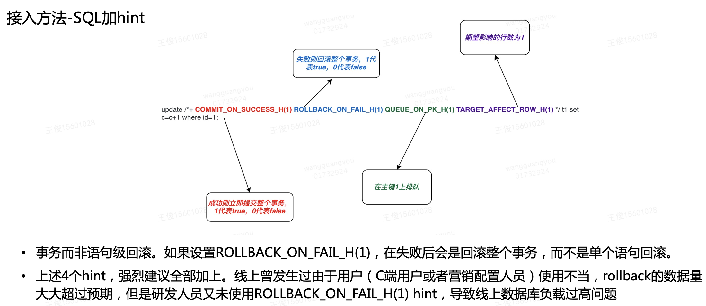
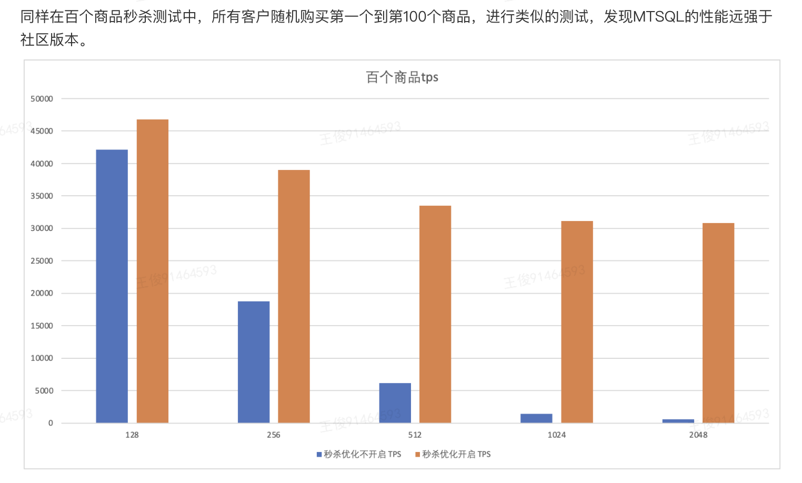

## mySQL8.0的新特性
SQL相关：
•快速DDL。大表的加列操作通常要好几个小时，而且会产生大的临时表。有了快速DDL，就可以避免这些问题，注意仅支持在最后添加列。适用于添加列、修改列的默认值、修改列表
•窗口函数， 支持 over 字句，ROW_NUMBER(), RANK(), LEAD(), LAG() 等，实现一些复杂的分析查询。
• 从8.0开始，UTF8mb4成为MySQL默认支持的字符集，完美支持各类火星文、😆emoji表情等特殊字符。

索引相关：
- 可将索引设为不可见测试性能影响，确认无影响后再删除。alter table t1 alter index idx_name invisible
- 支持降序索引，即指定DESC，避免反向扫描索引。之前默认都是按升序方式存储。
- 支持函数索引。将某列作用函数后作为索引

优化器相关：
主从复制的改进：

InnoDB相关：
- CATS 锁的调度。多个事务的锁等待时不再是FIFI策略，而是CATS，事务拥有权重属性，即一个事务已经锁定许多热点行时，权重更高，请求新锁时将获得优先权。公交车司机即使比出租车后到，但也给他先加油，这样会让更多人更快到达目的地。
- 重启时，InnoDB根据服务器内存自动优化 InnoDB 参数，以尽可能使用更多的服务器资源。减少 DBA 手动配置。

## MySQL Group Replication（MGR）
是 MySQL 官方提供的一个高可用、高可靠、强一致性的数据库集群解决方案。
•核心本质：它是一个 基于 Paxos 协议的分布式状态机复制系统。
•简单理解：MGR 将多个 MySQL 实例组成一个 “组”，这个组对外就像一个单一的数据库。组内任何节点执行的事务都会通过组内协商一致后同步到其他所有节点，从而实现数据的强一致性。
•单主节点，还有多主节点。
通过mySQL Router应用层代理暴露给客户端 

## binlog server
mySQL master 会通过协议同步到salve，但是一般企业会基于binlog做更多事情。
binlog的应用场景：服务实例扩容、binlog订阅；读写分离、HA切换等场景，应用非常广泛。
binlog server 的基本原理和作用机制：通过实时备份master的binlog，并向下游同步binlog，释放master的压力。
binlog server作用很大，因此实现方式有很多种，业界也有很多方案，如
- mysqbinlog：模拟MySQL的从机，向master发送binlog dump命令将从master收到的binlog存放在本地。简单，mysql自带，但是不能作为下游slave的中继节点。 
- kingbus：基于raft强一致协议实现的分布式MySQL binlog 存储系统。它能够充当一个MySQL Slave从真正的Master上同步binlog，并存储在分布式集群中。同时又充当一个MySQL Master将集群中的binlog 同步给其他Slave 
- Google Mysql-ripple、Blackhole存储引擎等。 

## Performance Schema
是一种专门用来监控服务器执行情况的存储引擎，它会把监控服务器执行情况的数据记录在系统自带的数据库performance_schema。setup_instruments保存的数据，表示哪些对象发生的事件可以被系统捕获，
setup_consumers保存的数据用来控制保存哪些事件的信息。我们可以调取监控数据来查看执行情况，从而定位和解决问题。


# MySQL高性能秒杀

## 1. 背景

在用户下单时，无论是外卖、闪购，还是优选、团好货、各产品线发放优惠券，在技术上，都可以抽象成对库存进行扣减。业务必须保证库存的绝对准确，否则就会发生超卖或者少卖。如外卖券 券是有限的，事先会做估算，所以外卖券的发放涉及到秒杀，还有电影券，迪士尼券等等

**秒杀失败的案例**

现象：数据库一主三从变成一主二从，最后一主一从。然后DBA迅速进行限流。

问题：业务进行了限流，QPS600.。然后分到三个库。结果流量全部打到一个库上，单机QPS只有200，不满足600的QPS，

**已有秒杀方案：**

- MysQL

  高并发下性能低，社区版MySQL数据库在处理扣减库存上能力不足，尤其是在海量用户抢购相同的商品时，系统的响应时间急剧恶化，吞吐量大大降低

- redis

  目前还没有非常成熟的机制，在机器出现故障时，保证数据的准确性，因此需要业务耗费较大精力去处理各种异常情况，造成解决方案复杂，易出错鲁棒性低。

- 新方案？

  如何使用MySQL的事务高一致性，又能保持高性能呢？SQL内核团队在数据库中内置了秒杀功能，业务只需通过简单适配，就可以既保证库存准确性，也能获得较为满意的性能。

## 2. 原理

先分析业务和数据库的交互

mySQL是一致性要求非常强的关系数据库系统，对任何记录的修改都要经过一个完整的事务过程，包含“开启事务->加锁修改->提交解锁"三个步骤，不同的事务如果修改完全不同的记录，在数据库中可以完全并行，有比较好的性能。

但如果修改的是同一条记录，则不同会话的事务在数据库里的执行是串行的，形成我们的讲的热点记录，对应到业务则是热点业务。这种热点情况是普遍存在的，比如物美价廉的优质商品的库存记录、发放红包/优惠卷的内部账号、或财务中的企业账号或中间账号。我们来看一下一个典型的减库存的逻辑，如下所示：

```sql
begin;
insert into 库存变动记录 value (....);
update 库存余数记录 set 余数 = 余数 - 1 where 商品id = ? and 余数 > 0;
commit;
```

在Update语句之前，不同会话的事务可以并行，在Update语句执行时，需要加锁然后直到commit语句执行成功才能解锁。我们可以想象一下在Update和Commit中间会经历哪些事情？可能的事情有

​	•	update/commit两条命令之间，需要应用从DB服务器取得Update语句的返回值，然后再将commit语句发过去，涉及一个网络来回，应用和数据库之间可能在同一个AZ内，也可能是跨AZ的。一条简单的纯内存的Update语句的内核执行时间大约在100us以内，同城一个网络来回的时间可能是200us到1500us之间，可以看到网络对热点场景并发能力的影响。

​	•	Update语句不一定放在事务的最后面，比如前面的Update和Insert语句换一个位置，则Update锁的持有时间会明显偏长。这里可以优化应用，进行SQL语句位置的调整。

​	•	目前很多应用是用Java编写的，也可能在Update和commit两条命令之间，发生GC的行为，一次Young GC的时间大约为几十毫秒，如果是一次Full GC，则时间可能达到秒级。

​	•	有些应用逻辑中，可能需要在Update和Commit中间通知其他的应用进行协作，如果涉及外部的应用，时间上会更不可控。这里可以先在本地记录一个事件，然后在事务提交后，通过事件进行外部系统交互。

当我们不用事务模式测试Update语句，执行就会非常快，这里其实是省掉了Update和Commit两个语句之间的时间差。因此我们可以考虑将检查Update语句是否成功的条件，也包括在语句中，直接发到数据库服务器，让数据库服务代为检查Update语句是否成功，如果成功则直接提交，如果失败则直接回滚，**以省略Update和Commit之间的时间差**，从而提升热点业务的处理能力。另外一面，当太多的热点相关的会话进入到数据库事务引擎层中，会增加数据库内部的事务调度（主要是锁冲突和死锁检测相关）的成本，为了更好的并发性能，还可以对进入到事务引擎层的热点更新会话数使用排队机制做出一定的限制，类似于Java应用中普遍使用的线程池机制，对于同一个热点的更新，只允许少量的并行进入。

秒杀场景，从业务角度来看

\- 单语句单商品，也就是只有一张表，如优惠券数量

\* 事务单商品。如开启事务，插入流水表，还需要更新一个库存表，最后提交事务。

\* 事务多商品。如购物车一次提交多个商品。就是开球事务，然后更新多个表，最后提交事务。

## 3. 实现方式

### 3.1 降低update和commit之间的时间差

从图1可以看出，对于一般业务来说，事务提交需要显式的执行set auto_commit=1或者commit语句，那么热点行持有的锁，最少会持续一个网络来回时间。特别是应用服务器与数据库服务器不在同一个机房时，**网络来回时间大概为2ms，由于行锁的存在，那么对于单行更新tps的理论上限为500**。如何减少或避免这个网络交互开销就非常重要。

通过调查发现，业务一般会根据update语句是否成功，来决定业务逻辑。比如在扣库存情况下，如果update成功执行，即affect_row为1，则提交事务，否则认为失败，则回滚事务。因此如果我们在SQL中通过hint指导数据库进行相应操作，就可以尽早的释放锁，提升数据库TPS的理论上限。为此我们引入了三个SQL Hint来用传递指令，如下表所示：

| SQL Hint            | 含义                                                         |
| ------------------- | ------------------------------------------------------------ |
| TARGET_AFFECT_ROW_H | 用来指定Update必须成功更新的记录数，如果记录数不匹配视为更新不成功。 |
| COMMIT_ON_SUCCESS_H | 如果SQL执行不报错，并且更新记录数符合TARGET_AFFECT_ROW_H要求，则自动提交事务。 |
| ROLLBACK_ON_FAIL_H  | 如果SQL执行失败，或更新记录数不符合TARGET_AFFECT_ROW_H要求，则自动回滚事务。 |

在不加上面3个hint的情况下，需要业务主动提交。如果加上COMMIT_ON_SUCCESS_H(1) TARGET_AFFECT_ROW_H(1)，表示当update成功更新一行时，则立即提交，否则等待业务主动发起commit或者rollback操作；如果加上ROLLBACK_ON_FAIL_H(1) TARGET_AFFECT_ROW_H(1)，则表示如果update更新的行数不为1，则立即回滚，否则等待业务主动发起commit或者rollback操作；如果三个hint一起加上，则表示假如update更新的行数为1，则立即提交，否则立即回滚。

把持有关键锁的SQL作为最后一句，添加commit_on_success_rollback_on_fail_target_affect_row,意思就是只要这个SQL执行成功就提交事务，及时释放锁。1.避免了之前SQL执行成功返回，业务再发出commit的网络时间开销。2.也避免了客户端本身阻塞数据库



### 3.2 控制和限制进入InnoDB事务引擎层的热点数量

这里主要涉及一个热点**ID**的标识，使用**QUEUE_ON_PK_H**标识

```sql
update /*+ QUEUE_ON_PK_H(12345) */ tb1 set amount = amount - 1 where id=12345 and amount > 10
```

如上所示，热点ID的标识依靠用户在SQL中以hint的方式注入，该方式有两大优点：

- 业务人员可以根据业务自身情况，只对可能有热点更新的语句使用该优化。
- 不支持该hint的社区版本，也能正常执行该SQL，只是少了秒杀效果。

实现上，值创建一个等待队列，然后直接执行，否则在该等待队列上休眠。在update执行完之后，唤醒相关等待线程继续执行


这样有效的避免死锁检测和锁冲突

____

业务上只需要再SQL中合理的加上前面的四个SQL hint，就可以开启秒杀，不限客户端，也不限框架。

另外需要避免外部调用，尽量采用回调机制。优化事务内SQL语句的顺序，将冲突重的SQL尽可能放后面。如把select放在前面，不要先update后select，这样持有锁的时间更加延长了。。

## 4. 效果

线上压测进行性能评估。关注主从延迟。测试各种场景，如成功提交，失败回滚，库存不足等场景，购物车batch SQL是否正确。

开启优化后，2048个线程时仍能保持6000-7000TPS。

在少量线程时，和没有优化的差不多。

而且这样的方案很方便复用。



