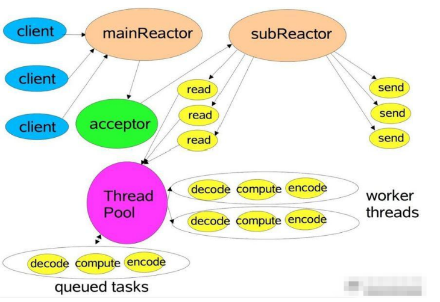

# IO基本概念

进程/线程的切换：所有系统都有调度进程的能力，可以挂起当前正在运行的进程，并恢复某个挂起的进程。

进程/线程的阻塞：运行中的线程，有时需要等待其他事件的执行完成，如等待锁，请求IO的读写。进程在等待时会被系统自动执行阻塞，此时进程不占用CPU。

文件描述符：在Linux中万物皆文件，当打开或者创建一个文件时，内核会向进程返回一个非负整数表示的文件描述符，用于表述指向文件引用的抽象概念。网络套接字Socket也是文件描述符。

进程运行中会接受系统或者进程的信号，类似于中断。

## IO读写过程

所有的网络I/O都分为两个阶段：**等待就绪和操作**。比如，读函数，分为等待系统可读R1和真正的读R2；同理，写函数分为等待网卡可以写和真正的写:

- 当应用程序在用户空间发起对socket套接字的读请求时，会导致上下文切换，用户进程阻塞，等待数据流到达，从网卡缓冲区复制到内核（R1）；然后从内核缓冲区复制到用户缓冲区，此时进程恢复，处理数据（R2）。
- 当进程在用户空间发起对socket的send操作时，也会导致上下文切换，把数据从用户缓存去复制到内核缓存区，数据copy完成，进程恢复。但是我们一般不关心send操作，因为进程只需要阻塞等待数据从用户缓存去copy到内核缓存区，这个是memory- copy，很快，后续的内核到网络缓存区是属于系统的范围，用户进程无需关心。

> 需要说明的是等待就绪的阻塞是不使用CPU的，是在“空等”；而真正的读写操作是使用CPU的，真正在”干活”，而且这个过程非常快，属于memory copy，带宽通常在1GB/s级别以上，可以理解为基本不耗时。

IO模型分为下面几种：


以socket.read()为例子：

传统的BIO里面socket.read()，如果TCP RecvBuffer里没有数据，函数会一直阻塞，直到收到数据，返回读到的数据。

对于NIO，如果TCP RecvBuffer有数据，就把数据从网卡读到内存，并且返回给用户；反之则直接返回0，永远不会阻塞。**在R1等待就绪阶段是非阻塞的，R2阶段I/O操作是同步阻塞的（占用CPU但memory- copy性能非常高）**

最新的AIO(Async I/O)里面会更进一步：不但等待就绪是非阻塞的，就连数据从内核缓存区到用户缓存区的过程也是异步的。

换句话说，**BIO里用户最关心“我要读”，NIO里用户最关心”我可以读了”，在AIO模型里用户更需要关注的是“读完了”**。

# BIO

传统的服务器端同步阻塞BIO处理的经典编程模型：

```java
/**
* 传统的BIO方式，服务端监听端口，client可以利用telnet host port 进行通信！
*/
public static void main(String[] args) throws IOException {
    ExecutorService executor = Executors.newFixedThreadPool(10);

    ServerSocket serverSocket = new ServerSocket(9000);
    // 主线程死循环等待新连接到来
    while (!Thread.currentThread().isInterrupted()) {
        // accept是阻塞的
        Socket socket = serverSocket.accept();
        // 提交到线程池，每个请求需要一个线程处理，阻塞式的
        executor.submit(new ConnectIOnHandler(socket));
    }
}

static class ConnectIOnHandler extends Thread {
    private Socket socket;

    public ConnectIOnHandler(Socket socket) {
        this.socket = socket;
    }

    public void run() {
        while (!Thread.currentThread().isInterrupted() && !socket.isClosed()) {
            byte[] bytes = new byte[1024];
            // 死循环处理读写事件
            int read = 0;
            try {
                // read是阻塞的
                read = socket.getInputStream().read(bytes);
            } catch (IOException e) {
                e.printStackTrace();
            }
            if (read != -1) {
                //处理数据
                System.out.println("接收到数据：" + new String(bytes, 0, read));
            }

        }
    }
}
```

这是经典的一个连接对应一个线程的模型。

之所以使用多线程，主要原因在于socket.accept()、socket.read()、socket.write()三个主要函数都是同步阻塞的，当一个连接在处理I/O的时候，系统是阻塞的，如果是单线程的话必然就挂死在那里；但CPU是被释放出来的，开启多线程，就可以让CPU去处理更多的事情。在活动连接数不是特别高（小于单机1000）的情况下，这种模型是比较不错的，可以让每一个连接专注于自己的I/O并且编程模型简单，也不用过多考虑系统的过载、限流等问题。线程池本身就是一个天然的漏斗，可以缓冲一些系统处理不了的连接或请求。

不过，这个模型最本质的问题在于，严重依赖于线程。但线程是很”贵”的资源，主要表现在： 1. **线程的创建和销毁成本很高**，在Linux这样的操作系统中，线程本质上就是一个进程。创建和销毁都是重量级的系统函数。 2. **线程本身占用较大内存**，像Java的线程栈，一般至少分配512K～1M的空间，如果系统中的线程数过千，恐怕整个JVM的内存都会被吃掉一半。 3. **线程的切换成本是很高的**。操作系统发生线程切换的时候，需要保留线程的上下文，然后执行系统调用。如果线程数过高，可能执行线程切换的时间甚至会大于线程执行的时间，这时候带来的表现往往是系统load偏高、CPU sy使用率特别高（超过20%以上)，导致系统几乎陷入不可用的状态。 4. **容易造成锯齿状的系统负载**。因为系统负载是用活动线程数或CPU核心数，一旦线程数量高但外部网络环境不是很稳定，就很容易造成大量请求的结果同时返回，激活大量阻塞线程从而使系统负载压力过大。

所以，当面对十万甚至百万级连接的时候，传统的BIO模型是无能为力的。随着移动端应用的兴起和各种网络游戏的盛行，**百万级长连接日趋普遍，此时必然需要一种更高效的I/O处理模型。**

# Java NIO

NIO（Non-blocking I/O，也称为New I/O），是一种同步非阻塞的I/O模型，也是I/O多路复用的基础，已经被越来越多地应用到大型应用服务器，成为解决高并发与海量连接、I/O处理问题的有效方式。

Java支持3种网络编程模型，BIO，NIO同步非阻塞，AIO异步非阻塞。

## Java NIO和IO的主要区别

应该何时使用IO，何时使用NIO呢？？

- IO面向流，NIO面向缓冲

  IO是面向流的，NIO是面向缓冲区的。 Java IO面向流意味着每次从流中读一个或多个字节，直至读取所有字节，它们没有被缓存在任何地方。此外，它不能前后移动流中的数据。如果需要前后移动从流中读取的数据，需要先将它缓存到一个缓冲区。 Java NIO的缓冲导向方法略有不同。数据读取到一个它稍后处理的缓冲区，需要时可在缓冲区中前后移动。这就增加了处理过程中的灵活性。但是，还需要检查是否该缓冲区中包含所有您需要处理的数据。而且，需确保当更多的数据读入缓冲区时，不要覆盖缓冲区里尚未处理的数据。

- 阻塞和非阻塞

  Java IO的各种流是阻塞的。这意味着，当一个线程调用read() 或 write()时，该线程被阻塞，直到有一些数据被读取，或数据完全写入。该线程在此期间不能再干任何事情了。 Java NIO的非阻塞模式，使一个线程从某通道发送请求读取数据，但是它仅能得到目前可用的数据，如果目前没有数据可用时，就什么都不会获取。而不是保持线程阻塞，所以直至数据变的可以读取之前，该线程可以继续做其他的事情。 非阻塞写也是如此。一个线程请求写入一些数据到某通道，但不需要等待它完全写入，这个线程同时可以去做别的事情。 线程通常将非阻塞IO的空闲时间用于在其它通道上执行IO操作，所以一个单独的线程现在可以管理多个输入和输出通道（channel）。

- Selector

  Java NIO的选择器允许一个单独的线程来监视多个输入通道，你可以使用一个选择器注册多个通道，然后使用一个单独的线程来“选择”通道：这些通道里已经有可以处理的输入，或者选择已准备写入的通道。这种选择机制，使得一个单独的线程很容易来管理多个通道。

NIO可让您只使用一个（或几个）单线程管理多个通道（网络连接或文件），但付出的代价是解析数据可能会比从一个阻塞流中读取数据更复杂：

- 如果需要管理同时打开的成千上万个连接，这些连接每次只是发送少量的数据，例如聊天服务器，实现NIO的服务器可能是一个优势；
- 如果你有少量的连接使用非常高的带宽，一次发送大量的数据，也许典型的IO服务器实现可能非常契合。


Java NIO 由以下几个核心部分组成：

## Channel

Java中channel的主要实现有：

- FileChannel   从文件中读写数据
- DatagramChannel 通过UDP读写网络数据
- SocketChannel 通过TCP读写网络数据
- ServerSocketChannel  可以监听新进来的TCP连接，像Web服务器那样。对每一个新进来的连接都会创建一个SocketChannel。

**FileChannel**

Java NIO中的FileChannel是一个连接到文件的通道，可以通过文件通道读写文件。

FileChannel无法设置为非阻塞模式，它总是运行在阻塞模式下。

另外如果两个通道中有一个是FileChannel，那你可以直接将数据从一个channel传输到另外一个channel。

FileChannel的force()方法：将通道里尚未写入磁盘的数据强制写到磁盘上。出于性能方面的考虑，操作系统会将数据缓存在内存中，所以无法保证写入到FileChannel里的数据一定会及时写到磁盘上。要保证这一点，需要调用force()方法。force()方法有一个boolean类型的参数，指明是否同时将文件元数据（权限信息等）写到磁盘上：``channel.force(``true);

代码举例：

```java
public void fileChannel() throws IOException {
    // 需要通过使用InputStream、OutputStream或RandomAccessFile来获取FileChannel
    RandomAccessFile aFile = new RandomAccessFile("/Users/Documents/work/code/sail-java/sail-java/src/main/java/com/aop/jdk/IHello.java", "rw");
    FileChannel inChannel = aFile.getChannel();

    ByteBuffer byteBuffer = ByteBuffer.allocate(48);

    // channel的数据必须先读取到一个buffer
    int read = inChannel.read(byteBuffer);
    while (read != -1) {
        // 翻转，可以理解为从写切换为读模式
        byteBuffer.flip();
        while (byteBuffer.hasRemaining()) {
            System.out.print((char) byteBuffer.get());
        }
        // buffer的数据读取完后，要清空。然后再次从channel读取数据
        byteBuffer.clear();

        read = inChannel.read(byteBuffer);
    }

    // 测试写入数据到channel
    byteBuffer.clear();
    byteBuffer.put("this is write to channel".getBytes());
    byteBuffer.flip();
    while (byteBuffer.hasRemaining()) {
        inChannel.write(byteBuffer);
    }

    aFile.close();
}
```

## Buffer

缓冲区本质上是一块内存，可以写入数据然后读取数据。这块内存被包装成NIO Buffer对象，并提供了一组方法，用来方便的访问该块内存。

以下是Java NIO里关键的Buffer实现：

- ByteBuffer
- ShortBuffer
- IntBuffer
- LongBuffer
- FloatBuffer
- DoubleBuffer
- CharBuffer

这些Buffer覆盖了你能通过IO发送的基本数据类型：byte, short, int, long, float, double 和 char。Java NIO 还有个 MappedByteBuffer（底层是DirectByteBuffer），可以让文件直接在内存（堆外内存）进行修改，rocketmq中有使用到。

使用Buffer读写数据一般遵循以下四个步骤：

1. 写入数据到Buffer
2. 调用`flip()`方法
3. 从Buffer中读取数据
4. 调用`clear()`方法或者`compact()`方法

当向buffer写入数据时，buffer会记录下写了多少数据。一旦要读取数据，需要通过flip()方法将Buffer从写模式切换到读模式。

一旦读完了所有的数据，就需要清空缓冲区，让它可以再次被写入。有两种方式能清空缓冲区：调用clear()或compact()方法。clear()方法会清空整个缓冲区。compact()方法只会清除已经读过的数据。任何未读的数据都被移到缓冲区的起始处，新写入的数据将放到缓冲区未读数据的后面。

Buffer 有三个属性要注意：capacity，position，limit。


作为内存块，buffer的大小是固定的，就是capacity。你只能往里写capacity个byte、long，char等类型。一旦Buffer满了，需要将其清空才能继续往里写数据。

**position**

当你写数据到Buffer中时，position表示当前的位置。初始的position值为0.当一个byte、long等数据写到Buffer后， position会向前移动到下一个可插入数据的Buffer单元。position最大可为capacity – 1.

当读取数据时，也是从某个特定位置读。当将Buffer从写模式切换到读模式，position会被重置为0. 当从Buffer的position处读取数据时，position向前移动到下一个可读的位置。

**limit**

在写模式下，Buffer的limit表示你最多能往Buffer里写多少数据。 写模式下，limit等于Buffer的capacity。

当切换Buffer到读模式时， limit表示你最多能读到多少数据。因此，当切换Buffer到读模式时，limit会被设置成写模式下的position值。换句话说，你能读到之前写入的所有数据（limit被设置成已写数据的数量，这个值在写模式下就是position）

> Java NIO开始支持scatter/gather：
>
> 分散（scatter）从Channel中读取是指在读操作时将读取的数据写入多个buffer中。
> 聚集（gather）写入Channel是指在写操作时将多个buffer的数据写入同一个Channel，因此，Channel 将多个Buffer中的数据“聚集（gather）”后发送到Channel。
>
> scatter / gather经常用于需要将传输的数据分开处理的场合，例如传输一个由消息头和消息体组成的消息，你可能会将消息体和消息头分散到不同的buffer中，这样你可以方便的处理消息头和消息体。

## Selector

Selector选择器能够检测多个NIO通道的读写事件是否就绪。这样一个线程就可以管理多个channel，从而管理多个网络连接，避免了线程创建，切换的消耗。

它的select方法会一直阻塞，直到某个channel有事件就绪，一旦select( )方法返回，就可以处理这件事情。

> 注意，select()是阻塞的，无论是通过操作系统的通知（epoll）还是不停的轮询(select，poll)，这个函数都是阻塞的。所以你可以放心大胆地在一个while(true)里面调用这个函数而不用担心CPU空转。
>
> selectNow()是立即返回，非阻塞的

```java
public void selector() throws IOException {
    // open()方法创建Selector
    Selector selector = Selector.open();
    
    SocketChannel channel = SocketChannel.open().bind(new InetSocketAddress(8081));
    channel.configureBlocking(false); // 与selector配合使用时，channel必须是非阻塞的。而FileChannel不能切换到非阻塞模式，而套接字通道都可以
    
    // 必须要将channel注册到Selector上，才能接下来配合使用
    SelectionKey selectionKey = channel.register(selector, SelectionKey.OP_READ);

    while (true) {
        // select()方法返回的int值表示自上次调用select()方法后有多少通道已经就绪
        // 此方法是阻塞的
        int readyChannels = selector.select();
        if (readyChannels == 0) {
            continue;
        }
        Set<SelectionKey> selectedKeys = selector.selectedKeys();
        Iterator<SelectionKey> keyIterator = selectedKeys.iterator();
        while (keyIterator.hasNext()) {
            SelectionKey key = keyIterator.next();
            if (key.isAcceptable()) {
                // a connection was accepted by a ServerSocketChannel.
            } else if (key.isConnectable()) {
                // a connection was established with a remote server.
            } else if (key.isReadable()) {
                // a channel is ready for reading
                System.out.println(key.channel().isBlocking());
            } else if (key.isWritable()) {
                // a channel is ready for writing
            }
            keyIterator.remove();
        }
    }
}
```

SelectionKey意思是Selector监听Channel时对什么事件感兴趣，通道触发了一个事件表示该事件已经就绪。可以监听四种不同类型的事件：

1. Connect    某个channel成功连接到另一个服务器称为“连接就绪”
2. Accept   一个server socket channel准备好接收新进入的连接称为“接收就绪”
3. Read   一个有数据可读的通道可以说是“读就绪”
4. Write  等待写数据的通道可以说是“写就绪”

### Selector的底层原理

**`Selector.open();`主要是依赖系统的EPoll**（当然epoll是Linux系统支持的，Windows提供另外的函数）,

```java
public static Selector open() throws IOException {
    return SelectorProvider.provider().openSelector();
}

// 不同的操作系统提供不同的函数
public AbstractSelector openSelector() throws IOException {
    return new EPollSelectorImpl(this);
}

EPollSelectorImpl(SelectorProvider sp) throws IOException {
    super(sp);

    // epoll的文件描述符
    this.epfd = EPoll.create();
    this.pollArrayAddress = EPoll.allocatePollArray(NUM_EPOLLEVENTS);

    try {
        // epoll对象
        this.eventfd = new EventFD();
        IOUtil.configureBlocking(IOUtil.newFD(eventfd.efd()), false);
    } catch (IOException ioe) {
        EPoll.freePollArray(pollArrayAddress);
        FileDispatcherImpl.closeIntFD(epfd);
        throw ioe;
    }

    // register the eventfd object for wakeups 注册用于唤醒
    EPoll.ctl(epfd, EPOLL_CTL_ADD, eventfd.efd(), EPOLLIN);
}
```

`EPoll.create();`是调用Linux系统的内核函数，创建一个epoll实例，返回指向epoll实例的文件描述符。 另外系统提供的函数还有epoll_wait(epollfd,...)等待直到注册的事件发生，epoll_ctl ()用于注册删除修改事件，添加到epoll的channel集合里。

epoll实例结构内部肯定有存放所有channel的集合，还有事件就绪的channel集合。

> EPoll和poll,select的区别？
>
> epoll是 Linux内核为处理大批量 文件描述符而作了改进的poll，是Linux下多路复用IO接口select/poll的增强版本，它能显著提高程序在大量 并发连接中只有少量活跃的情况下的系统CPU利用率。获取事件的时候，它无须遍历整个被侦听的描述符集，只要遍历那些被内核IO事件异步唤醒而加入Ready队列的描述符集合就行了，底层是哈希表结构，时间复杂度是O(1)。
>
> 另外epoll()的最大连接是没有上限的，select()是有上限的，最大1024或者2048个。

> **Java NIO是属于水平触发**
>
> - 水平触发：对于读操作 只要缓冲内容不为空，LT模式返回读就绪；对于写操作 只要缓冲区还不满，LT模式会返回写就绪。
>
> - 边缘触发:如果文件描述符自上次状态改变后有新的IO活动到来,此时会触发通知
>
> 举例说明:一个管道收到了1kb的数据,epoll会立即返回,此时读了512字节数据,然后再次调用epoll.这时如果是水平触发的,epoll会立即返回,因为有数据准备好了.如果是边缘触发的不会立即返回,因为此时虽然有数据可读但是已经触发了一次通知,在这次通知到现在还没有新的数据到来,直到有新的数据到来epoll才会返回,此时老的数据和新的数据都可以读取到(当然是需要这次你尽可能的多读取).

## NIO总结

使用NIO != 高性能，当连接数<1000，并发程度不高或者局域网环境下NIO并没有显著的性能优势。

NIO并没有完全屏蔽平台差异，它仍然是基于各个操作系统的I/O系统实现的，差异仍然存在。使用NIO做网络编程构建事件驱动模型并不容易，陷阱重重。推荐大家使用成熟的NIO框架，如Netty，MINA等，解决了很多NIO的陷阱，并屏蔽了操作系统的差异，有较好的性能和编程模型。

最后总结一下到底NIO给我们带来了些什么：

> - 事件驱动模型
> - 单线程处理多连接，避免多线程
> - 非阻塞I/O，I/O读写不再阻塞，而是返回0
> - 基于block的传输，通常比基于流的传输更高效
> - 更高级的IO函数，zero-copy
> - IO多路复用大大提高了Java网络应用的可伸缩性和实用性

## NIO与零拷贝

零拷贝zero-copy是网络编程的关键，很多性能优化都离不开。**常用的零拷贝有mmap内存映射和sendfile**。注意零拷贝是从操作系统来说的， `kernel buffer` 只有一份数据.

传统的IO传输数据，需要从内核态拷贝数据到内核态：


mmap通过内存映射，将文件映射到内核缓冲区，同时用户空间可以共享内核空间的数据，减少内核空间到用户空间的拷贝。


Linux2.1 版本提供了 `sendFile` 函数，其基本原理如下：数据根本不经过用户态，直接从内核缓冲区进入到 `SocketBuffer`，由于和用户态完全无关，就减少了一次上下文切换


`Linux在2.4` 版本中，做了一些修改，避免了从内核缓冲区拷贝到 `Socketbuffer` 的操作，直接拷贝到协议栈，从而再一次减少了数据拷贝


### mmap 和 sendFile 的区别

1. `mmap` 适合小数据量读写，`sendFile` 适合大文件传输。
2. `mmap` 需要 `4` 次上下文切换，`3` 次数据拷贝；`sendFile` 需要 `3` 次上下文切换，最少 `2` 次数据拷贝。
3. `sendFile` 从内核缓存区直接拷贝到协议栈，`mmap` 则不能（必须从内核拷贝到 `Socket`缓冲区）。

NIO中是如何使用零拷贝来优化的呢？

`fileChannel.transferTo(0, fileChannel.size(), socketChannel)`底层使用的零拷贝

# AIO

1. `JDK7` 引入了 `AsynchronousI/O`，即 `AIO`。在进行 `I/O` 编程中，常用到两种模式：`Reactor` 和 `Proactor`。`Java` 的 `NIO` 就是 `Reactor`，当有事件触发时，服务器端得到通知，进行相应的处理
2. `AIO` 即 `NIO2.0`，叫做异步非阻塞 IO。`AIO` 引入异步通道的概念，采用了 `Proactor` 模式，简化了程序编写，有效的请求才启动线程，它的特点是先由操作系统完成后才通知服务端程序启动线程去处理，一般适用于连接数较多且连接时间较长的应用
3. 目前 `AIO` 还没有广泛应用，Netty也是基于 `NIO`，而不是 `AIO`，因此我们就不详解 `AIO` 了，有兴趣的同学可以参考[《Java新一代网络编程模型AIO原理及Linux系统AIO介绍》](http://www.52im.net/thread-306-1-1.html)

> ### 事件分发器类型：Proactor与Reactor
>
> 一般情况下，I/O 复用机制需要事件分发器（event dispatcher），即将那些读写事件源分发给各读写事件的处理者，涉及到事件分发器的两种模式称为：Reactor和Proactor。 Reactor模式是基于同步I/O的，而Proactor模式是和异步I/O相关的。
>
> 在Reactor模式中，事件分发器等待某个事件或者可应用或个操作的状态发生（比如文件描述符可读写，或者是socket可读写），事件分发器就把这个事件传给事先注册的事件处理函数或者回调函数，由后者来做实际的读写操作。
>
> 而在Proactor模式中，事件处理者（或者代由事件分发器发起）直接发起一个异步读写操作（相当于请求），而实际的工作是由操作系统来完成的。发起时，需要提供的参数包括用于存放读到数据的缓存区、读的数据大小或用于存放外发数据的缓存区，以及这个请求完后的回调函数等信息。事件分发器得知了这个请求，它默默等待这个请求的完成，然后转发完成事件给相应的事件处理者或者回调。举例来说，在Windows上事件处理者投递了一个异步IO操作（称为overlapped技术），事件分发器等IO Complete事件完成。这种异步模式的典型实现是基于操作系统底层异步API的，所以我们可称之为“系统级别”的或者“真正意义上”的异步，因为具体的读写是由操作系统代劳的。
>
> 举个例子，将有助于理解Reactor与Proactor二者的差异，以读操作为例（写操作类似）。
>
> #### 在Reactor中实现读
>
> - 注册读就绪事件和相应的事件处理器。
> - 事件分发器等待事件。
> - 事件到来，激活分发器，分发器调用事件对应的处理器。
> - 事件处理器完成实际的读操作，处理读到的数据，注册新的事件，然后返还控制权。
>
> #### 在Proactor中实现读：
>
> - 处理器发起异步读操作（注意：操作系统必须支持异步IO）。在这种情况下，处理器无视IO就绪事件，它关注的是完成事件。
> - 事件分发器等待操作完成事件。
> - 在分发器等待过程中，操作系统利用并行的内核线程执行实际的读操作，并将结果数据存入用户自定义缓冲区，最后通知事件分发器读操作完成。
> - 事件分发器呼唤处理器。
> - 事件处理器处理用户自定义缓冲区中的数据，然后启动一个新的异步操作，并将控制权返回事件分发器。

**举例说明**

1. 同步阻塞：到理发店理发，就一直等理发师，直到轮到自己理发。
2. 同步非阻塞：到理发店理发，发现前面有其它人理发，给理发师说下，先干其他事情，一会过来看是否轮到自己.
3. 异步非阻塞：给理发师打电话，让理发师上门服务，自己干其它事情，理发师自己来家给你理发

# netty

开发一个具有较好稳定性和可靠性的 NIO 程序还是挺有难度的。客户端面临重连，网络闪断，半包读写，失败缓存，网络拥塞和异常流的处理等。另外JDK NIO的Bug：如Epoll Bug，会导致Selector空轮询，最终导致CPU 100%，直到JDK1.7也没有根本解决。

于是 Netty 出现，把我们从水深火热当中解救出来，Netty本身是一个基于NIO的网络框架， 封装了Java NIO那些复杂的底层细节，给你提供简单好用的抽象概念来编程。使用Netty的开源框架，可以快速地开发高性能的面向协议的服务器和客户端。 易用、健壮、安全、高效，你可以在Netty上轻松实现各种自定义的协议！


1. Netty是由 JBOSS提供的一个 Java开源框架，现为 Github上的独立项目。
2. Netty是**异步的、基于事件驱动的网络应用框架**，用以快速开发高性能、高可靠性的网络 `IO` 程序。
3. Netty主要针对在 `TCP` 协议下，面向 `Client` 端的高并发应用，或者 `Peer-to-Peer` 场景下的大量数据持续传输的应用。
4. Netty本质是一个 `NIO` 框架，适用于服务器通讯相关的多种应用场景。
5. 要透彻理解 `Netty`，需要先学习 `NIO`，这样我们才能阅读 Netty的源码。


[netty官方文档](https://netty.io/wiki/all-documents.html)，[netty第三方文档](https://netty.io/wiki/related-articles.html)

[使用指导](https://netty.io/wiki/user-guide-for-5.x.html)，对应的[中文翻译](http://ifeve.com/netty5-user-guide/)

[尚硅谷Netty视频教程](https://www.bilibili.com/video/BV1DJ411m7NR?p=73)，[对应的笔记](https://dongzl.github.io/netty-handbook/#/_content/chapter01)

Netty5出现重大BUG已经被官网废弃，所以目前使用较多的就是Netty4.1.x。

## netty的应用场景

注意几个关键词，首先它是个框架，是个“**半成品**”，不能开箱即用，你必须得拿过来做点定制（就像Spring那样），利用它开发出自己的应用程序，然后才能运行。 另外一个关键词是**高性能**，如果你的应用根本没有高并发的压力，那就不一定要用Netty了。

[大量基于Netty开发的产品](https://netty.io/wiki/related-projects.html)

- RPC框架

  分布式服务之间的远程调用，阿里分布式服务RPC框架 `Dubbo` 使用的 `Dubbo` 协议默认使用 Netty用于实现各进程节点之间的内部通信。

- 游戏领域

  其实游戏领域是个更好的例子，长连接，自定义协议，高并发，Netty就是绝配。

  Netty作为高性能的基础通信组件，提供了 `TCP/UDP` 和 `HTTP` 协议栈，方便定制和开发私有协议栈，账号登录服务器。地图服务器之间可以方便的通过 Netty进行高性能的通信。

- 大数据领域

  经典的 `Hadoop` 的高性能通信和序列化组件 `Avro` 的 `RPC` 框架，默认采用 Netty进行跨界点通信，它的 `NettyService` 基于 Netty框架二次封装实现。

## Netty的线程模型

线程模型有：传统的阻塞IO服务模型，Reactor模型（也是面试爱问的点）。

**Reactor模型基于IO多路复用和线程池**，解决了传统阻塞IO服务模型的缺点。Reactor模型也叫反应器模式，分发者模式，通知者模式。


Reactor模式通过IO复用监听多个请求，基于事件驱动，收到事件后，分发给某个工作线程进行处理，这些是网络服务器处理高并发的关键。

Reactor模型根据 `Reactor` 的数量和处理资源的池线程数量不同分为：单Reactor单线程，单Reactor多线程，主从Reactor多线程模型。netty的线程模式是基于主从Reactor多线程模型做了一定的改进，有多个Reactor。

### 单Reactor单线程

通过 `Select` 监控客户端请求事件，收到事件后通过 `Dispatch` 进行分发：

如果是Accept事件，则由 `Acceptor` 通过 `Accept` 处理连接请求，然后创建一个 `Handler` 对象处理连接完成后的后续业务处理。如果不是Accept事件，则 `Reactor` 会分发给对应的 `Handler` 来响应


优点：模型简单，没有多线程切换，通信等问题。但是性能差，只有一个线程处理业务存在性能瓶颈，且可靠性也差，线程可能意外终止或者死循环会导致整个模块不可用。

### 单Reactor多线程

收到事件后，dispatcher分发给accept或者handler。

`handler` 只负责响应事件，不做具体的业务处理，通过 `read` 读取数据后，会分发给后面的 `worker` 线程池的某个线程处理业务，`worker` 线程池会分配独立线程完成真正的业务，并将结果返回给 `handler`。

handler收到响应后，通过 `send` 将结果返回给 `client`


- 优点：可以充分的利用多核 `cpu` 的处理能力

- 缺点：多线程数据共享和访问比较复杂，`Reactor` 处理所有的事件的监听和响应，在单线程运行，在高并发场景容易出现性能瓶颈。

### 主从Reactor多线程

为了避免Reactor单线程下运行出现单点故障

1. 主线程 `MainReactor` 对象通过 `select` 监听连接事件，通过 `Acceptor` 处理连接事件，处理完后将连接分配给 `SubReactor`

2. `subreactor` 将连接加入到连接队列进行监听，并创建 `handler` 进行各种事件处理

   当有新事件发生时，`subreactor` 就会调用对应的 `handler` 处理，`handler` 通过 `read` 读取数据，分发给后面的 `worker` 线程处理

3. `worker` 线程池分配独立的 `worker` 线程进行业务处理，并返回结果

4. `handler` 收到响应的结果后，再通过 `send` 将结果返回给 `client`

MainRecator一个线程可以对应多个 `Reactor` 子线程。




- 优点：

  父线程与子线程的数据交互简单，职责明确，父线程只需要接收新连接然后传给子线程，子线程完成后续的业务处理。

- 缺点：编程复杂度较高

这种模型在许多项目中广泛使用，包括 `Nginx` 主从 `Reactor` 多进程模型，`Memcached` 主从多线程，Netty主从多线程模型的支持.

### netty的线程模型

netty基于主从Reactors多线程模型做了一定的改进，


BossGroup维护一个Selector，只关注Accept，获取到对应的 SocketChannel封装成 NIOSocketChannel，然后注册到 Worker 线程组（事件循环）进行维护

当 Worker组通过Selector 监听到某通道发生自己感兴趣的事件（读写）后，就交给Handler进行处理，注意 handler 已经加入到通道。


1. Netty抽象出两组线程池： `BossGroup` 专门负责接收客户端的连接，`WorkerGroup` 专门负责网络的读写，类型都是 `NioEventLoopGroup`即事件循环组，可以包含多个事件循环 `NioEventLoop`。

2. `NioEventLoop` 表示一个不断循环执行处理任务的线程，每个 `NioEventLoop` 都有一个 `Selector`用于监听绑定在其上的 `socket` 网络通讯。

3. BossNioEventLoop循环执行的步骤有三步：

   - 轮询是否有 `accept` 事件 
   - 处理 `accept` 事件：与 client 建立连接，生成 `NioScocketChannel`，并将其注册到某个 `worker` `NIOEventLoop` 上的 `Selector`
   - 处理任务队列的任务，即 `runAllTasks`

4. 每个Worker的NIOEventLoop循环执行的步骤：

   - 轮询每个NioSocketChannel是否有 `read`，`write` 事件

   - 处理 `I/O` 事件，即 `read`，`write` 事件

   - 处理任务队列的任务，即 `runAllTasks`


# netty主要类

## NioEventLoopGroup和NioEventLoop

`BossEventLoop` 负责接收客户端的连接并将 `SocketChannel` 交给`WorkerEventLoopGroup` 来进行 `IO` 处理，通常一个服务端口即一个 `ServerSocketChannel` 对应一个 `Selector` 和一个 `EventLoop` 线程。`EventLoopGroup` 提供 `next` 接口，可以从组里面按照一定规则（默认是Integer.increment & workerGroup.length() - 1）获取其中一个 `EventLoop` 来处理任务。 

EventLoopGroup是一组 `EventLoop` 的抽象，Netty为了更好的利用多核 `CPU` 资源，一般会有多个 `EventLoop` 同时工作，**每个 `NioEventLoop` 中包含有一个 Selector，一个 `taskQueue`**：

-  `Selector` 上可以注册监听多个 `NioChannel`，每个 `NioChannel` 只会绑定在唯一的 `NioEventLoop` 上，且每个 `NioChannel` 都绑定有一个自己的 `ChannelPipeline`，管道中维护了很多的处理器。`pipeline` 和 `channel`互相对应。

- 每个NioEventLoop 内部采用串行化设计，从消息的 **读取->解码->处理->编码->发送**，始终由一个线程处理，也就是任务先提交到TaskQueue。

  有些读写事件耗时可能较长，线程池也不够，所以需要提交到任务队列TaskQueue后异步执行，三种典型使用场景：

  - 用户程序自定义的普通任务，
  - 用户自定义定时任务，提交到scheduleTaskQueue中
  - 非当前Reactor线程调用channel的各种方法

## 异步IO操作ChannelFuture

netty中的IO操作如Write，bind，Connect都是异步的，这意味着任何IO操作都是立即返回的，返回的ChannelFuture提供了以下方法来获取操作结果或状态:

(注意IO操作失败或取消也是完成状态)

```
                                        +---------------------------+
                                        | Completed successfully    |
                                        +---------------------------+
                                   +---->      isDone() = true      |
   +--------------------------+    |    |   isSuccess() = true      |
   |        Uncompleted       |    |    +===========================+
   +--------------------------+    |    | Completed with failure    |
   |      isDone() = false    |    |    +---------------------------+
   |   isSuccess() = false    |----+---->      isDone() = true      |
   | isCancelled() = false    |    |    |       cause() = non-null  |
   |       cause() = null     |    |    +===========================+
   +--------------------------+    |    | Completed by cancellation |
                                   |    +---------------------------+
                                   +---->      isDone() = true      |
                                        | isCancelled() = true      |
                                        +---------------------------+
```

最佳实践是添加ChannelFutureListener以便在 I/O 操作完成时收到通知，这个是根本不阻塞的，可以获取最佳性能和资源利用率。await()方法会造成不必要的阻塞，且可能发生死锁。

```java
// BAD - NEVER DO THIS
{@code @Override}
public void channelRead({@link ChannelHandlerContext} ctx, Object msg) {
    {@link ChannelFuture} future = ctx.channel().close();
    future.awaitUninterruptibly();
    // Perform post-closure operation
    // ...
}

// GOOD
{@code @Override}
public void channelRead({@link ChannelHandlerContext} ctx, Object msg) {
    {@link ChannelFuture} future = ctx.channel().close();
    future.addListener(new {@link ChannelFutureListener}() {
        public void operationComplete({@link ChannelFuture} future) {
            // Perform post-closure operation
            // ...
        }
    });
 }
```

## ChannelOption

Netty在创建 `Channel` 实例后，一般都需要设置 `ChannelOption` 参数，常见的如下：

- ChannelOption.SO_BACKLOG：对应TCOP/IP协议listen函数中的backlog参数，初始化服务器可连接队列的大小。服务器处理客户端的连接是顺序处理的，也就是同一时刻只能处理一个客户端连接，其他的客户端连接需要放在队列中处理，backlog指定队列的大小
- ChannelOption.SO_KEEPALIVE 一直保持连接的活动状态

## netty的ByteBuf

Netty提供了一个专门操作缓冲区的工具类Unpooled，通过分配新空间，或包装复制现有byte arrays, byte buffers和string来创建新的ByteBuf 。

```java
import static io.netty.buffer.Unpooled.*;

// 分配一个新的固定容量堆缓冲区
ByteBuf heapBuffer = buffer(128);
// 分配一个新的固定容量直接缓冲区
ByteBuf directBuffer = directBuffer(256);
// 包装缓冲区是一个或多个现有字节数组和字节缓冲区的视图。 原始数组或缓冲区内容的任何更改都将在包装的缓冲区中可见。提供了各种包装器方法，它们的名称都是wrappedBuffer() 
ByteBuf wrappedBuffer = wrappedBuffer(new byte[128], new byte[256]);

// 与包装缓冲区不同，原始数据和复制的缓冲区之间没有共享数据。 提供了各种复制方法，它们的名字都是copiedBuffer() 。 使用此操作将多个缓冲区合并为一个缓冲区也很方便
ByteBuf copiedBuffe r = copiedBuffer(ByteBuffer.allocate(128));
```

在netty 的buffer中，不需要使用flip 进行反转 ， 底层维护了 readerindex 和 writerIndex。通过 readerindex 和  writerIndex 和  capacity， 将buffer分成三个区域     

- 0---readerindex 已经读取的区域       
- readerindex---writerIndex  可读的区域    
- writerIndex -- capacity  可写的区域

```java
 *  BEFORE clear()
 *
 *      +-------------------+------------------+------------------+
 *      | discardable bytes |  readable bytes  |  writable bytes  |
 *      +-------------------+------------------+------------------+
 *      |                   |                  |                  |
 *      0      <=      readerIndex   <=   writerIndex    <=    capacity
 *
 *
 *  AFTER clear()
 *
 *      +---------------------------------------------------------+
 *      |             writable bytes (got more space)             |
 *      +---------------------------------------------------------+
 *      |                                                         |
 *      0 = readerIndex = writerIndex            <=            capacity
```

## ChannelPipeline

每个Channel都有对应的ChannelPipeline，ChannelPipeline中维护了多个ChannelHandlerContext（关联着一个ChannelHandler）组成的双向链表，负责处理和拦截inbound和outbound的事件和操作。


一个入站事件会依次从head到tail交给各个handler处理，相反的出站事件会依次从tail到head交给各个ChannelHandler处理，是一种高级的拦截器模式，用户可以完全控制两个Channel间的各个ChannelHandler如何交互。

### ChannelHandlerContext

### ChannelHandler

channelHandler应该通过ChannelHandlerContext与其所属的ChannelPipeline进行交互。 使用ChannelHandlerContext， ChannelHandler可以向上游或下游传递事件，动态修改管道，或存储特定于处理程序的信息（使用AttributeKey s）。

### 编码解码ChannelHandler

编写网络应用程序时，数据在网络中传输时都是二进制的字节码数据。这就需要Codec进行转换

Netty提供一系列实用的编解码器，他们都实现了 `ChannelInboundHadnler` 或者 `ChannelOutboundHandler` 接口，在这些编解码器类中，`channelRead` 方法已经被重写了。以入站为例，对于每个入站 的消息，这个`channelRead` 方法会被调用，随后由解码器的 `decode()` 方法进行解码，将解码后的字节转发给 `ChannelPipeline` 中的下一个 `ChannelInboundHandler`。


1. ByteToMessageDecoder：继承了ChannelInboundHandlerAdapter，是一个较顶层的编码解码类，下面很多是继承这个类的。
2. `LineBasedFrameDecoder`：这个类在 Netty内部也有使用，它使用行尾控制字符（\n或者\r\n）作为分隔符来解析数据。而`DelimiterBasedFrameDecoder`可以使用自定义的特殊字符作为消息的分隔符，对接易流温湿度设备的私有协议就使用0X7E作为分隔符。
3. `HttpObjectDecoder`：一个 `HTTP` 协议数据的解码器
4. `LengthFieldBasedFrameDecoder`：通过指定长度来标识整包消息，这样就可以自动的处理黏包和半包消息。
5. ReplayingDecoder：继承了ByteToMessageDecoder，不必自己判断是否数据够读取，内部会进行处理判断。并不是所有的 ByteBuf 操作都被支持，如果调用了一个不被支持的方法，将会抛出一个 UnsupportedOperationException。

注意：

不论解码器 `handler` 还是编码器 `handler` ，接收的消息类型必须与待处理的消息类型一致，否则该 `handler` 不会被执行

在解码器进行数据解码时，需要判断缓存区（`ByteBuf`）的数据是否足够，否则接收到的结果会期望结果可能不一致

### 高效的数据传输格式Protobuf

Netty 提供的编码器：

- StringEncoder负责字符串数据解码。
- ObjectDecoder和ObjectEncoder负责对象的编解码，但是底层使用的Java序列化技术，无法跨语言，性能太低，序列后体积太大。

所以提供了Protobuf，它是Google发布的[开源项目](https://developers.google.com/protocol-buffers/docs/proto )，全称 `Google Protocol Buffers`，是一种轻便高效的结构化数据存储格式，可以用于结构化数据串行化，或者说序列化。它**很适合做数据存储或 RPC调用的数据交换格式**。目前很多公司由 http + json转为 tcp + protobuf的方式来提高效率。

1. `Protobuf` 是以 `message` 的方式来管理数据的.

2. 支持跨平台、跨语言，即[客户端和服务器端可以是不同的语言编写的]（支持目前绝大多数语言，例如 `C++`、`C#`、`Java`、`python` 等）

3. 高性能，高可靠性

   > 使用 `protobuf` 编译器能自动生成代码，`Protobuf` 是将类的定义使用 `.proto` 文件进行描述。说明，在 `idea` 中编写 `.proto` 文件时，会自动提示是否下载 `.ptoto` 编写插件.可以让语法高亮。然后通过 `protoc.exe` 编译器根据 `.proto` 自动生成 `.java` 文件

## TCP协议的粘包和拆包

TCP协议是**基于流**的，面向连接的可靠算法。

TCP是有粘包和拆包，但不能说是问题！

先说什么是粘包和拆包？

发送端发送了两次数据，但是`Nagle` 算法会做优化，将多个数据量小且间隔较短的数据合并成一个较大的数据然后进行封包发送。这样接收端是无法分辨这两个数据的。


要理解这个，一定要知道TCP是基于流的，所谓流式协议，即协议的内容像水流一样的字节流，内容与内容之间没有明确的分界标志，需要我们人为的去给这些协议划分标界。也就是TCP协议本来就是不处理协议内容的分界，你非要说这是人家的问题？！

处理数据的分界是需要应用层协议来做的，一般两种方式：

- 以指定字符（串）作为包结束标志。

  即字节流中遇到特殊的符号就认为到一个包的末尾了。例如FTP，SMTP就是"\r\n"就表示一个包的结束。不足之处就是协议内容里用到了结束标志就需要进行转义。netty中的DelimiterBasedFrameDecoder就是方便处理特殊字符作为结束符的包。

- 包头+包体的格式

  这种协议的数据分为两个部分，包头和包体。包头大小固定，且必须包含一个字段说明包体有多大。接收端先收取包头大小的数据（不够就接续等），然后解析包头，根据包头中指定的包体大小来收取包体，等包体够了，就作为一个完整的包来处理。netty中一般用继承ByteToMessageDecoder去处理这种自定义协议的数据。

# netty的源码解析

只有看过 Netty源码，才能说是真的掌握了 Netty框架。在 `io.netty.example` 包下，有很多 Netty源码案例，可以用来分析。

## netty的启动流程源码

### 1. EventLoopGroup创建线程组

```java
EventLoopGroup bossGroup = new NioEventLoopGroup(1);
// 不指定线程数，默认是NettyRuntime.availableProcessors() * 2
EventLoopGroup workerGroup = new NioEventLoopGroup();
```

这里的NioEventLoopGroup继承了抽象类MultithreadEventLoopGroup

```java
// 注意它继承了多线程执行Executor
public abstract class MultithreadEventLoopGroup extends MultithreadEventExecutorGroup implements EventLoopGroup {
    
}
// 最终的构造方法
protected MultithreadEventExecutorGroup(int nThreads, Executor executor,
                                            EventExecutorChooserFactory chooserFactory, Object... args) {
    // 线程数必须为正数
    checkPositive(nThreads, "nThreads");

    if (executor == null) {
        // 没有指定就是用默认的执行器
        executor = new ThreadPerTaskExecutor(newDefaultThreadFactory());
    }

    // 关键：为每个线程创建一个执行器，也就是说执行器都有一个线程不停的执行
    children = new EventExecutor[nThreads];
    for (int i = 0; i < nThreads; i ++) {
        boolean success = false;
        try {
            // newChild创建线程，由子类NioEventLoopGroup自己实现，创建NioEventLoop线程
            children[i] = newChild(executor, args);
            success = true;
        } catch (Exception e) {
            // TODO: Think about if this is a good exception type
            throw new IllegalStateException("failed to create a child event loop", e);
        } finally {
            // 如果某个线程创建失败，就把之前创建好的都优雅关闭
            if (!success) {
                for (int j = 0; j < i; j ++) {
                    children[j].shutdownGracefully();
                }

                for (int j = 0; j < i; j ++) {
                    EventExecutor e = children[j];
                    try {
                        while (!e.isTerminated()) {
                            e.awaitTermination(Integer.MAX_VALUE, TimeUnit.SECONDS);
                        }
                    } catch (InterruptedException interrupted) {
                        // Let the caller handle the interruption.
                        Thread.currentThread().interrupt();
                        break;
                    }
                }
            }
        }
    }

    chooser = chooserFactory.newChooser(children);

    final FutureListener<Object> terminationListener = new FutureListener<Object>() {
        @Override
        public void operationComplete(Future<Object> future) throws Exception {
            if (terminatedChildren.incrementAndGet() == children.length) {
                terminationFuture.setSuccess(null);
            }
        }
    };

    // 为每个线程池添加监听器
    for (EventExecutor e: children) {
        e.terminationFuture().addListener(terminationListener);
    }

    // 将线程池数组放到一个只读的set中
    Set<EventExecutor> childrenSet = new LinkedHashSet<EventExecutor>(children.length);
    Collections.addAll(childrenSet, children);
    readonlyChildren = Collections.unmodifiableSet(childrenSet);
}
```

### 2. ServerBootstrap引导类

```java
ServerBootstrap b = new ServerBootstrap();
b.group(bossGroup, workerGroup)
    // 根据类型创建一个channel，这里是用于服务端的channel
    .channel(NioServerSocketChannel.class)
    // 用一个LinkedHashMap保存上面channel的属性，传null就清空设置
    .option(ChannelOption.SO_BACKLOG, 100)
    // 这个 hanlder 只专属于 ServerSocketChannel 而不是 SocketChannel
    .handler(new LoggingHandler(LogLevel.INFO))
    // 这里的handler处理每个连接
    .childHandler(new ChannelInitializer<SocketChannel>() {
        @Override
        public void initChannel(SocketChannel ch) throws Exception {
            ChannelPipeline p = ch.pipeline();
            if (sslCtx != null) {
                p.addLast(sslCtx.newHandler(ch.alloc()));
            }
            //p.addLast(new LoggingHandler(LogLevel.INFO));
            p.addLast(serverHandler);
        }
    });
```

### 3.doBind 启动

先初始化channel，然后绑定端口。

```java
// Start the server.
ChannelFuture f = b.bind(PORT).sync();

private ChannelFuture doBind(final SocketAddress localAddress) {
    // 1. initAndRegister核心方法
    final ChannelFuture regFuture = initAndRegister();
    final Channel channel = regFuture.channel();
    if (regFuture.cause() != null) {
        return regFuture;
    }

    if (regFuture.isDone()) {
        // At this point we know that the registration was complete and successful.
        ChannelPromise promise = channel.newPromise();
        // 2. 进行绑定
        doBind0(regFuture, channel, localAddress, promise);
        return promise;
    } 
}
```

先说initAndRegister()先创建了一个ServerSocketChannel，然后交给下面init进行初始化  

```java
@Override
void init(Channel channel) {
    setChannelOptions(channel, newOptionsArray(), logger);
    setAttributes(channel, newAttributesArray());

    ChannelPipeline p = channel.pipeline();

    final EventLoopGroup currentChildGroup = childGroup;
    final ChannelHandler currentChildHandler = childHandler;
    final Entry<ChannelOption<?>, Object>[] currentChildOptions = newOptionsArray(childOptions);
    final Entry<AttributeKey<?>, Object>[] currentChildAttrs = newAttributesArray(childAttrs);

    p.addLast(new ChannelInitializer<Channel>() {
        @Override
        public void initChannel(final Channel ch) {
            final ChannelPipeline pipeline = ch.pipeline();
            ChannelHandler handler = config.handler();
            if (handler != null) {
                pipeline.addLast(handler);
            }

            ch.eventLoop().execute(new Runnable() {
                @Override
                public void run() {
                    pipeline.addLast(new ServerBootstrapAcceptor(
                        ch, currentChildGroup, currentChildHandler, currentChildOptions, currentChildAttrs));
                }
            });
        }
    });
}
```

pipeline.addLast(handler)是核心方法，它创建一个 `AbstractChannelHandlerContext` 对象，这里说一下，`ChannelHandlerContext` 对象是 `ChannelHandler` 和 `ChannelPipeline` 之间的关联，每当有 `ChannelHandler` 添加到 `Pipeline` 中时，都会创建 `Context`。

将 `Context` 添加到链表中，也就是追加到 `tail` 节点的前面。pipeline双向链表的tail是固定的，负责一些系统的初始化工作，addLast()实际上是加到tail的前面。

再看doBind0()

```java
private static void doBind0(
        final ChannelFuture regFuture, final Channel channel,
        final SocketAddress localAddress, final ChannelPromise promise) {

    // This method is invoked before channelRegistered() is triggered.  Give user handlers a chance to set up
    // the pipeline in its channelRegistered() implementation.
    channel.eventLoop().execute(new Runnable() {
        @Override
        public void run() {
            if (regFuture.isSuccess()) {
                //bind方法这里下断点，这里下断点，来玩!!
                channel.bind(localAddress, promise).addListener(ChannelFutureListener.CLOSE_ON_FAILURE);
            } else {
                promise.setFailure(regFuture.cause());
            }
        }
    });
}
```

## netty接收请求的流程源码

服务器启动后肯定是要接受客户端请求并返回客户端想要的信息 ，下面源码分析 Netty在启动之后是如何接受客户端请求，将其注册到workerGroup上的。

Eventloop的作用是个死循环，做三件事：

- 有条件的等待nio事件

- 处理nio事件

- 处理消息队列中的任务

nioEventLoop死循环中对于accept事件交给`private void processSelectedKey(SelectionKey k, AbstractNioChannel ch)`方法中，readyOps=16是accept事件，

```java
// 获取包装好的channel,添加到容器readBuf里，
int localRead = doReadMessages(readBuf);

// 循环从readBuf获取channel
for (int i = 0; i < size; i++) {
    readPending = false;
    pipeline.fireChannelRead(readBuf.get(i));
}
```

  这里的pipeline.fireChannelRead会对每个channel调用多个handler。`pipeline` 里面有 4个`handler`，分别是 `Head`，`LoggingHandler`，`ServerBootstrapAcceptor`，`Tail`。

```java
// 我们重点看ServerBootstrapAcceptor的channelRead方法
public void channelRead(ChannelHandlerContext ctx, Object msg) {
    // 将msg强转成Channel
    final Channel child = (Channel) msg;

    // 为这个进来的连接channel设置多个属性
    // 将用户配置的childHandler添加到这个channel的pipeline中
    child.pipeline().addLast(childHandler);
    setChannelOptions(child, childOptions, logger);
    setAttributes(child, childAttrs);

    try {
        // 这里，就是这里将客户端连接注册到 worker 线程池
        childGroup.register(child).addListener(new ChannelFutureListener() {
            @Override
            public void operationComplete(ChannelFuture future) throws Exception {
                if (!future.isSuccess()) {
                    forceClose(child, future.cause());
                }
            }
        });
    } catch (Throwable t) {
        forceClose(child, t);
    }
}
```

**总结**：

- NioEventLoopGroup的NioEventLoop循环监听，当接收到一个连接时，通过JDK创建一个SocketChannel，包装成NioSocketChannel，添加到容器里。

- 然后循环对容器里的channl执行handler，其中ServerBootstrapAcceptor，会负责为channel设置handler，属性等，并注册到childGroup的一个Eventloop上，并添加一个监听器。

## ChannelPipeline | ChannelHandlerContext | ChannelHandler介绍

我们需要从源码来分析netty是如何设计这三个非常核心的组件，分析是如何创建和协同工作的。

每当serverSocket accept一个新的连接时，就会创建对应一个客户端的socket，并会分配一个ChannelPipeline，它内部包含多个ChannelHandlerContext，他们一起组成了双向链表。ChannelHandlerContext是对ChannelHandler的封装，包含了一些上下文信息。

### 1. ChannelPipeline

它继承了`inBound`，`outBound`，`Iterable` 接口，表示他可以调用数据出站的方法和入站的方法，同时也能遍历内部的链表。


它的方法基本都是针对channelHandler的插入，追加，删除，替换，就是链表的一些操作，另外也能返回对应的channel（socket)。


**handler链的调用顺序**

```java
ChannelPipeline pipeline = ch.pipeline();
pipeline.addLast(new MyLongToByteEncoder());
// 后加的handler在队尾，更靠近自己。最先处理出站的消息，最后处理入站的消息
pipeline.addLast(new MyClientHandler());
```

在 `pipeline` 的接口文档上，提供了一幅图


这幅图左边底部描述了IO线程通过scoket.read()读取到数据后，交由各个Inbound channelHandler处理，其中通过调用 `ChannelHandlerContext.fireChannelRead` 方法转发给其最近的处理程序。

```java
// 寻找下一个入站的handler，其实就是while循环，每个handler有出站入站的标志 
private AbstractChannelHandlerContext findContextInbound() {
     AbstractChannelHandlerContext ctx = this;
     do {
         ctx = ctx.next;
     } while (!ctx.inbound);
     return ctx;
 }
```


### 2.ChannelHandler


简单分析ChannelHandler的接口体系设计：最顶层ChannelHandler只有handlerAdded,handlerRemoved的方法，然后因为入站和出站的操作不同分为两个子接口，每个接口都有默认的实现HandlerAdapter，它只是简单的转发给下一个handler,需要子类自己覆盖实现。

如果同时需要拦截操作和状态更新，可以使用`public class ChannelDuplexHandler extends ChannelInboundHandlerAdapter implements ChannelOutboundHandler {}`，它继承了入站实现类，并直接实现了出站接口，能够同时处理入站事件和出站事件。实际生产尽量避免使用，因为很容易混淆入站和出站。

**ChannelHandler的状态管理** 

ChannelHandler可以使用成员变量来存储状态，但是注意这时在添加到channelPipeline中时，必须是new ChannelHandler()为每个channelPipeline创建一个实例，避免其他channe非法获取到成员变量的状态信息。

如果只想创建一个ChannelHandler实例添加到多个channelPipeline中，则必须在ChannelHandler添加@sharable表明这个handler是可以共享的。此时可以利用AttributeKey保存每个handler的状态。

```java
@Sharable
public class DataServerHandler extends SimpleChannelInboundHandler<Message> {
    private final AttributeKey<Boolean> auth = AttributeKey.valueOf("auth");

    @Override
    public void channelRead(ChannelHandlerContext ctx, Message message) {
        Attribute<Boolean> attr = ctx.attr(auth);
        Channel ch = ctx.channel();
        if (message instanceof LoginMessage) {
            authenticate((LoginMessage) o);
            attr.set(true);
        } else (message instanceof GetDataMessage) {
            if (Boolean.TRUE.equals(attr.get())) {
                ch.write(fetchSecret((GetDataMessage) o));
            } else {
                fail();
            }
        }
    }
    ...
}
   
// 现在处理程序的状态已附加到ChannelHandlerContext ，您可以将相同的处理程序实例添加到不同的管道：
public class DataServerInitializer extends ChannelInitializer<Channel> {
    
    @Autowired
    private DataServerHandler dataServerHandler;

    @Override
    public void initChannel(Channel channel) {
        channel.pipeline().addLast("handler", dataServerHandler);
    }
}
```

### 3. ChannelHandlerContext

ChannelHandlerContext不仅继承了出站和入站的方法，同时也定义了一些自己的方法，比如能够获取`channel`，`executor`，`handler`，`pipeline`，内存分配器，关联的 `handler` 是否被删除。


作用：

- 可以通知同一管道里下一个handler

  `ChannelFuture writeAndFlush(Object msg)`：将数据写到
  当前ChannelPipeline 中下一个ChannelHandler处理（出站）

- 可以在运行时动态插入，删除，替换ChannelPipeline中的handlers

- 保留ChannelHandlerContext，在handler方法之外触发事件

  ```java
  public class MyHandler extends ChannelDuplexHandler {
  
      private ChannelHandlerContext ctx;
      
      public void beforeAdd(ChannelHandlerContext ctx) {
          this.ctx = ctx;
      }
  
      public void login(String username, password) {
          ctx.write(new LoginMessage(username, password));
      }
      ...
  }
  ```

- handler可以有多个Context

  一个ChannelHandler实例可以被添加到多个ChannelPipeline，也就是说一个ChannelHandler可能有多个ChannelHandlerContext，因此ChannelHandler可能被多个ChannelHandlerContext调用。 

  ```java
  // 这个handler会有多个独立的AttributeKey，无论是添加到不同的ChannelPipeline还是多次添加到同一个ChannelPipeline
  public class FactorialHandler extends ChannelInboundHandlerAdapter {
    
      private final AttributeKey<Integer> counter = AttributeKey.valueOf("counter");
  
      // This handler will receive 从1开始的递增序列msg
      @Override
      public void channelRead(ChannelHandlerContext ctx, Object msg) {
          Integer a = ctx.attr(counter).get();
  
          if (a == null) {
              a = 1;
          }
  
          attr.set(a * (Integer) msg);
      }
  }
  
  
  // 即使同一个FactorialHandler实例fh，被添加到不同的ChannelPipeline。阶乘也会被正确的计算四次，因为AttributeKey属于ChannelHandlerContext的
  FactorialHandler fh = new FactorialHandler();
  
  ChannelPipeline p1 =  Channels.pipeline();
  p1.addLast("f1", fh);
  p1.addLast("f2", fh);
  
  ChannelPipeline p2 = Channels.pipeline();
  p2.addLast("f3", fh);
  p2.addLast("f4", fh);
  ```

### 创建

创建socket时为其分配pipeline

```java
// 构造channel的过程
protected AbstractChannel(Channel parent) {
    this.parent = parent;
    // channelID的生成涉及到机器，进程ID，时间戳，随机数
    id = newId();
    unsafe = newUnsafe();
    // 这里创建channel时就会为其分配一个pipeline
    pipeline = newChannelPipeline();
}

// 生成pipeline,肯定需要传入一个Channel
protected DefaultChannelPipeline(Channel channel) {
    this.channel = ObjectUtil.checkNotNull(channel, "channel");
    succeededFuture = new SucceededChannelFuture(channel, null);
    voidPromise = new VoidChannelPromise(channel, true);

    // 双向链表的头和尾，从这里可以看出每个pipeline都有一个固定的head和tail，
    tail = new TailContext(this);
    // HeadContext即可以处理入站又可以处理出站。TailContext只处理入站 
    head = new HeadContext(this);

    // 首尾指针连接
    head.next = tail;
    tail.prev = head;
}
```

接下来看创建handler的过程

```java
@Override
public final ChannelPipeline addLast(EventExecutorGroup group, String name, ChannelHandler handler) {
    final AbstractChannelHandlerContext newCtx;
    // 防止同时更新
    synchronized (this) {
        // 检查handler是否是可共享的，是否被添加过
        checkMultiplicity(handler);

        // handler都会封装成一个对应的ChannelHandlerContext
        newCtx = newContext(group, filterName(name, handler), handler);

        // 添加到链表尾部，之前初始化好的tail并不变
        addLast0(newCtx);

        // If the registered is false it means that the channel was not registered on an eventLoop yet.
        // In this case we add the context to the pipeline and add a task that will call
        // ChannelHandler.handlerAdded(...) once the channel is registered.
        if (!registered) {
            newCtx.setAddPending();
            callHandlerCallbackLater(newCtx, true);
            return this;
        }

        EventExecutor executor = newCtx.executor();
        if (!executor.inEventLoop()) {
            callHandlerAddedInEventLoop(newCtx, executor);
            return this;
        }
    }
    callHandlerAdded0(newCtx);
    return this;
}
```

### 4. channelPipeline如何调度handler？

当一个请求进来的时候，会第一个调用 `pipeline` 的相关方法，如果是入站事件都是 `fire` 开头，表示开始管道的流动，让后面的 `handler` 继续处理

```java
public class DefaultChannelPipeline implements ChannelPipeline {
    // 当一个请求过来时，首先会调用ChannelPipeline的fireChannelActive()
    @Override
    public final ChannelPipeline fireChannelActive() {
        AbstractChannelHandlerContext.invokeChannelActive(head);
        return this;
    }
    
    @Override
    public final ChannelPipelinefireChannelInactive() {
        AbstractChannelHandlerContext.invokeChannelInactive(head);
        return this;
    }
    
    @Override
    public final ChannelPipeline fireExceptionCaught(Throwable cause) {
        AbstractChannelHandlerContext.invokeExceptionCaught(head, cause);
        return this;
    }
    
    @Override
    public final ChannelPipeline fireUserEventTriggered(Object event) {
        AbstractChannelHandlerContext.invokeUserEventTriggered(head, event);
        return this;
    }
    
    @Override
    public final ChannelPipeline fireChannelRead(Objectmsg) {
        AbstractChannelHandlerContext.invokeChannelRead(head, msg);
        return this;
    }
    
    @Override
    public final ChannelPipeline fireChannelReadComplete() {
        AbstractChannelHandlerContext.invokeChannelReadComplete(head);
        return this;
    }
    
    @Override
    public final ChannelPipeline fireChannelWritabilityChanged() {
        AbstractChannelHandlerContext.invokeChannelWritabilityChanged(head);
        return this;
    }
}
```

仔细看会发现，这些都是inbound的方法，通过AbstractChannelHandlerContext的静态方法，传入head（pipeline头部第一个handler，还记得他是inbound类型的吗），里面会调用head的ChannelInboundInvoker方法，然后顺序触发handler的真正方法。

再看channelPipeline的出站方法

```java
public class DefaultChannelPipeline implements ChannelPipeline {
    @Override
    public final ChannelFuture bind(SocketAddress localAddress) {
        return tail.bind(localAddress);
    }
    
    @Override
    public final ChannelFuture connect(SocketAddress remoteAddress) {
        return tail.connect(remoteAddress);
    }
    
    @Override
    public final ChannelFuture connect(SocketAddress remoteAddress, SocketAddress localAddress) {
        return tail.connect(remoteAddress, localAddress);
    }
    
    @Override
    public final ChannelFuture disconnect(){
        return tail.disconnect();
    }
    
    @Override
    public final ChannelFuture close() {
        return tail.close();
    }
    
    @Override
    public final ChannelFuture deregister() {
        return tail.deregister();
    }
    
    @Override
    public final ChannelPipeline flush() {
        tail.flush();
        return this;
    }
    
    @Override
    public final ChannelFuture bind(SocketAddress localAddress, ChannelPromise promise) {
        return tail.bind(localAddress, promise);
    }
    
    @Override
    public final ChannelFuture connect(SocketAddress remoteAddress, ChannelPromise promise) {
        return tail.connect(remoteAddress, promise);
    }
    
    @Override
    public final ChannelFuture connect(SocketAddress remoteAddress, SocketAddress localAddress, ChannelPromise promise) {
        return tail.connect(remoteAddress, localAddress, promise);
    }
    
    @Override
    public final ChannelFuture disconnect(ChannelPromise promise) {
        return tail.disconnect(promise);
    }
}
```

上面这些出站方法都是调用的tail的方法，通过它来触发其他outbound handler的方法。

出站是 `tail` 开始，入站从 `head` 开始。

总结来说：

入站事件，会借助channelHandlerContext的静态方法，传入head，静态方法里会调用context的invoker方法，invoker会调用handler的真正方法，之后会调用context的fireXXX继续传递给下一个handler，直到结束。


## netty的心跳检测

netty提供了下面三种handler来检测channel连接的有效性

- IdleStateHandler ：当Channel有一段时间没有执行读或者写操作时触发IdleStateEvent ，包括IdleState#READER_IDLE，IdleState#WRITER_IDLE，IdleState#ALL_IDLE。你可以在自己的handler中userEventTriggered处理这三种事件。

  ```java
  // 用法介绍
  public class MyChannelInitializer extends {@link ChannelInitializer}&lt;{@link Channel}&gt; {
        {@code @Override}
        public void initChannel({@link Channel} channel) {
            channel.pipeline().addLast("idleStateHandler", new {@link IdleStateHandler}(60, 30, 0));
            channel.pipeline().addLast("myHandler", new MyHandler());
        }
    }
  
  // Handler should handle the {@link IdleStateEvent} triggered by {@link IdleStateHandler}.
  public class MyHandler extends {@link ChannelDuplexHandler} {
      {@code @Override}
      public void userEventTriggered({@link ChannelHandlerContext} ctx, {@link Object} evt) throws {@link Exception} {
          if (evt instanceof {@link IdleStateEvent}) {
              {@link IdleStateEvent} e = ({@link IdleStateEvent}) evt;
              if (e.state() == {@link IdleState}.READER_IDLE) {
                  ctx.close();
              } else if (e.state() == {@link IdleState}.WRITER_IDLE) {
                  ctx.writeAndFlush(new PingMessage());
              }
          }
      }
  }
  ```

- ReadTimeoutHandler：在一定时间没有写操作时会触发WriteTimeoutException

- WriteTimeoutHandler：在一定时间内channe没有读操作时会触发ReadTimeoutException，这两个都会自动关闭连接，而且是抛出异常。

下面具体分析IdleStateHandler。

```java
// 是否考虑出站较慢的情况,默认false
private final boolean observeOutput;
// 读事件的空闲时间，0-表示禁用
private final long readerIdleTimeNanos;
// 写事件的空闲时间，0-表示禁用
private final long writerIdleTimeNanos;
// 读或者写事件的空闲时间，0-表示禁用
private final long allIdleTimeNanos;
```

handler初次添加到pipeline时，会进行初始化

```java
private void initialize(ChannelHandlerContext ctx) {
    state = 1;
    initOutputChanged(ctx);

    lastReadTime = lastWriteTime = ticksInNanos();
    // 为三种事件分别都创建定时任务
    if (readerIdleTimeNanos > 0) {
        // 创建定时任务，这里会调用eventLoop 的 schedule 方法，将定时任务添加到队列中
        readerIdleTimeout = schedule(ctx, new ReaderIdleTimeoutTask(ctx),
                                     readerIdleTimeNanos, TimeUnit.NANOSECONDS);
    }
    if (writerIdleTimeNanos > 0) {
        writerIdleTimeout = schedule(ctx, new WriterIdleTimeoutTask(ctx),
                                     writerIdleTimeNanos, TimeUnit.NANOSECONDS);
    }
    if (allIdleTimeNanos > 0) {
        allIdleTimeout = schedule(ctx, new AllIdleTimeoutTask(ctx),
                                  allIdleTimeNanos, TimeUnit.NANOSECONDS);
    }
}
```

上面的三个task有共同的父类AbstractIdleTask，模板方法当通道关闭时就不再执行任务。下面以ReaderIdleTimeoutTask为例看下具体怎么检测的

```java
private final class ReaderIdleTimeoutTask extends AbstractIdleTask {

    ReaderIdleTimeoutTask(ChannelHandlerContext ctx) {
        super(ctx);
    }

    @Override
    protected void run(ChannelHandlerContext ctx) {
        long nextDelay = readerIdleTimeNanos;
        if (!reading) {
            // 当前时间 - 上次读取时间
            nextDelay -= ticksInNanos() - lastReadTime;
        }

        // 如果小于0就触发事件
        if (nextDelay <= 0) {
            // Reader is idle - set a new timeout and notify the callback.
            // 重新注册任务
            readerIdleTimeout = schedule(ctx, this, readerIdleTimeNanos, TimeUnit.NANOSECONDS);

            boolean first = firstReaderIdleEvent;
            firstReaderIdleEvent = false;

            try {
                // 创建一个IdleStateEvent，传递给下一个handler
                IdleStateEvent event = newIdleStateEvent(IdleState.READER_IDLE, first);
                channelIdle(ctx, event);
            } catch (Throwable t) {
                ctx.fireExceptionCaught(t);
            }
        } else {
            // 用剩余的时间nextDelay再次注册一个任务
            // Read occurred before the timeout - set a new timeout with shorter delay.
            readerIdleTimeout = schedule(ctx, this, nextDelay, TimeUnit.NANOSECONDS);
        }
    }
}
```

总结：

`IdleStateHandler` 可以实现心跳功能，当服务器和客户端没有任何读写交互时，并超过了给定的时间，则会触发用户 `handler` 的 `userEventTriggered` 方法。用户可以在这个方法中尝试向对方发送信息，如果发送失败，则关闭连接。`IdleStateHandler` 的实现基于 `EventLoop` 的定时任务，每次读写都会记录一个值，在定时任务运行的时候，通过计算当前时间和设置时间和上次事件发生时间的结果，来判断是否空闲。

## EventLoop的分析

NioEventLoop是一个单线程的线程池，可以接受多个channel的注册，处理该channel的所有IO操作，里面的死循环，不断做三件事，监听端口，处理端口事件，处理队列事件。

NioEventLoop可以处理任务，也可以处理定时任务。


NioEventLoop的源码较长，简单来说，它的run方法就是：`elect` 获取感兴趣的事件。 `processSelectedKeys` 处理事件。 `runAllTasks` 执行队列中的任务。

总结：

每次执行 `execute` 方法都是向队列中添加任务。当第一次添加时就启动线程，执行 `run` 方法，而 `run` 方法是整个 `EventLoop` 的核心，就像 `EventLoop` 的名字一样，`LoopLoop`，不停的 `Loop`，`Loop` 做什么呢？做 `3` 件事情：

- 调用 `selector` 的 `select` 方法，默认阻塞一秒钟，如果有定时任务，则在定时任务剩余时间的基础上在加上 `0.5` 秒进行阻塞。当执行 `execute` 方法的时候，也就是添加任务的时候，唤醒 `selecor`，防止 `selector` 阻塞时间过长。

- 当 `selector` 返回的时候，回调用 `processSelectedKeys` 方法对 `selectKey` 进行处理。

- 当 `processSelectedKeys` 方法执行结束后，则按照 `ioRatio` 的比例执行 `runAllTasks` 方法，默认是 `IO` 任务时间和非 `IO` 任务时间是相同的，你也可以根据你的应用特点进行调优。比如非 `IO` 任务比较多，那么你就将`ioRatio` 调小一点，这样非 `IO` 任务就能执行的长一点,防止队列积攒过多的任务。

## 如何执行异步任务

在netty中做耗时的，不可预料的操作，会影响netty对socket的读取速度，因此可以将耗时的任务添加到异步线程池中，有两种方式：

- 在耗时handler 里添加业务线程池

  ```java
  static final EventExecutorGroup businessGroup = new DefaultEventExecutorGroup(16);
  
  @Override
  public void channelRead(ChannelHandlerContext ctx, Object msg) throws UnsupportedEncodingException, InterruptedException {
      // 刚进来时，当前线程时workerGroup的某个子线程
      final Object msgCop = msg;
      final ChannelHandlerContext cxtCop = ctx;
      // 交给业务线程池
      group.submit(new Callable<Object>() {
          @Override
          public Object call() throws Exception {
              ByteBuf buf = (ByteBuf)msgCop;
              byte[] req = new byte[buf.readableBytes()];
              buf.readBytes(req);
              String body = new String(req, "UTF-8");
              Thread.sleep(10 * 1000);
              System.err.println(body + " " + Thread.currentThread().getName());
              String reqString = "Helloiamserver~~~";
              ByteBuf resp = Unpooled.copiedBuffer(reqString.getBytes());
              // 当这里调用ctx.writeAndFlush时，又将任务交给IO线程
              cxtCop.writeAndFlush(resp);
              return null;
          }
      });
  }
  ```

  

- 在ChannelHandlerContext中添加线程池 

  ```java
  static EventExecutorGroup executors = new DefaultEventLoopGroup(2);
  
  public static void main(String[] args) throws Exception {
      // Configure the server.
      EventLoopGroup bossGroup = new NioEventLoopGroup(1);
      EventLoopGroup workerGroup = new NioEventLoopGroup();
      final EchoServerHandler serverHandler = new EchoServerHandler();
      try {
          ServerBootstrap b = new ServerBootstrap();
          b.group(bossGroup, workerGroup)
              .channel(NioServerSocketChannel.class)
              .option(ChannelOption.SO_BACKLOG, 100)
              .handler(new LoggingHandler(LogLevel.INFO))
              .childHandler(new ChannelInitializer<SocketChannel>() {
                  @Override
                  public void initChannel(SocketChannel ch) throws Exception {
                      ChannelPipeline p = ch.pipeline();
                      if (sslCtx != null) {
                          p.addLast(sslCtx.newHandler(ch.alloc()));
                      }
                      // 这里表示serverHandler先交给自定义的executors执行，而不是workerGroup
                      p.addLast(executors, serverHandler);
                  }
              });
  
          // Start the server.
          ChannelFuture f = b.bind(PORT).sync();
  
          // Wait until the server socket is closed.
          f.channel().closeFuture().sync();
      } finally {
          // Shut down all event loops to terminate all threads.
          bossGroup.shutdownGracefully();
          workerGroup.shutdownGracefully();
      }
  }
  ```

第一种方式比较自由灵活  ，可以按需将耗时长的任务放入异步线程池。第二种方式将对应handler的所有任务都交给异步线程池。
