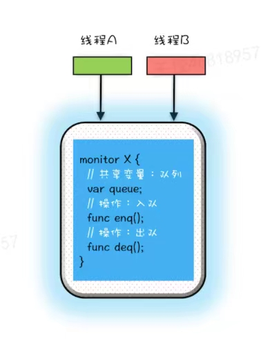
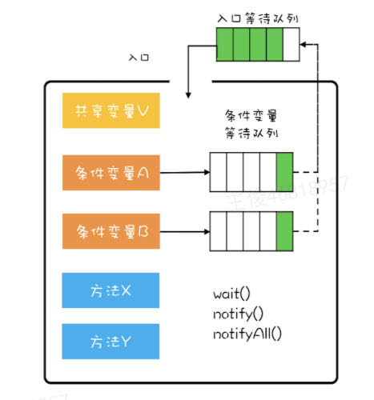

### 基本概念
并发编程的三个核心问题：
- 互斥：保证原子性，临界区代码同一时刻只有一个线程执行
- 同步：线程执行顺序
- 通信问题：线程间传递信息，分工

### 管程
管程对应的英文是monitor，指的是管理共享变量以及对共享变量的操作过程，让他们支持并发。 操作系统原理书上介绍，管程是解决并发问题的核心技术，它和信号量是等价的，即用管程能实现信号量，也能用信号量实现管程。 那为啥java不用信号量呢？因为管程更易使用,编程不容易出错，所以Java选择了管程，C#/C++等高级语言也是支持管程的，但C是不支持管程的。
并发编程里的两个核心问题：互斥和同步都可以由管程来解决。管程是解决并发问题的通用模型，学好管程，理论上所有的并发问题都可以解决，很多并发工具也都是利用管程实现的。
在管程的发展史上，有三个模型，Hasen模型，Hoare模型和MESA模型，其中广泛应用的是MESA模型，Java采用的也是MESA模型。MESA模型的特点是1. 被唤醒的线程不会立即执行，要重新竞争锁  2. 需要在循环中检查条件，因为条件可能在被唤醒后再次变化

管程是如何解决互斥的问题呢？
管程有一个很重要的特性是任一时刻管程中只能有一个活跃线程（Java是通过synchronized），这一特性使得管程能有效完成互斥。就是将共享变量和对共享变量的操作封装起来，多个线程想要访问和操作共享变量，只能通过管程提供的方法，管程内部保证方法的互斥性。

管程如何解决同步问题呢？
管程引入了条件变量和其对应的等待队列，且每个条件变量都有一个等待队列。类似于Java中阻塞队列的实现，内部是生产者-消费者模型，可以实现如果队列满了，生产者必须阻塞等待。Java内置的synchronized方案，使用简单，但是只支持一个条件变量，Java提供的Lock锁，await()，signal()可以有多个条件变量Condition。

高级工具都是管程的"语法糖"，所有同步工具都是管程的不同表现形式。
- synchronized关键字和wait(),notify(),notifyAll()方法其实就是管程的具体实现
- ReentrantLock
- BlockingQueue = 管程 + 队列状态条件
- CyclicBarrier = 管程 + 线程到达条件
- CountDownLatch = 管程 + 计数器条件

# 线程安全

## 并发线程的安全问题源头

1. 缓存一致性导致的可见性问题。
CPU在执行指令时，会将运算需要的数据从主存复制一份到CPU的高速缓存当中，那么CPU进行计算时就可以直接从它的高速缓存读取数据和向其中写入数据，当运算结束之后，再将高速缓存中的数据刷新到主存当中。

2. 编译优化带来的有序性和线程切换原子性问题

   一般来说，处理器为了提高程序运行效率，可能会对输入代码进行优化，它不保证程序中各个语句的执行先后顺序同代码中的顺序一致，但是它会保证程序最终执行结果和代码顺序执行的结果是一致的。**指令重排序不会影响单个线程的执行，但是会影响到多个线程并发执行的正确性**。

   CPU每个指令的操作是原子性的，但是对于高级语言的如count++却并不能保证原子性，因为它对应着三个CPU指令。

## Java内存模型JMM

在Java虚拟机规范中试图定义一种Java内存模型（Java Memory Model，JMM）来屏蔽各个硬件平台和操作系统的内存访问差异，以实现让Java程序在各种平台下都能达到一致的内存访问效果。那么Java内存模型规定了哪些东西？它定义了程序中变量的访问规则，往大一点说是定义了程序执行的次序。注意，为了获得较好的执行性能，Java内存模型并没有限制执行引擎使用处理器的寄存器或者高速缓存来提升指令执行速度，也没有限制编译器对指令进行重排序。也就是说在java内存模型中，也会存在缓存一致性问题和指令重排序的问题。

**可见性**： Java内存模型规定所有的变量都是存在主存当中，每个线程都有自己的工作内存。线程对变量的所有操作都必须在工作内存中进行，而不能直接对主存进行操作，并且每个线程不能访问其他线程的工作内存。

**有序性**： Java内存模型具备一些先天的有序性，即不需要通过任何手段就能够得到保证的有序性，这个通常也称为 **happens-before 原则**。如果两个操作的执行次序无法从[happens-before](https://blog.csdn.net/java_collect/article/details/103953265)原则推导出来，那么它们就不能保证它们的有序性，虚拟机可以随意地对它们进行重排序。 **happens-before 原则**的核心是前一个操作的结果对后一个操作是可见的，它约束了编译器的优化行为，虽然允许编辑器优化，但是优化后要遵守happens-before 原则。

> - 单个线程里，按照程序的顺序，前面的操作happens-before后面的操作
> - 对于volatile变量的写操作happens-before于后续对这个变量的读操作
> - 传递性
> - 对于一个锁的解锁happens-before后续对这个锁的加锁
> - 线程Start原则，即如果在线程A中调用线程B的start()方法，则线程B的start()操作happens-before于线程B的任何操作。
> - 主线程A等待线程B完成，则主线程A能看到线程B的所有操作，即线程Bhappens-before主线程A

**原子性**：只有简单的读取、赋值（而且必须是将数字赋值给某个变量，变量之间的相互赋值不是原子操作）才是原子操作。Java中的原子操作包括：

- 除long和double之外的基本类型的赋值操作
- 所有引用reference的赋值操作
- java.concurrent.Atomic.* 包中所有类的一切操作。

**volatile关键字的两层语义**

一旦一个共享变量（类的成员变量、类的静态成员变量）被volatile修饰之后，那么就具备了两层语义：

1）保证了不同线程对这个变量进行操作时的可见性，即一个线程修改了某个变量的值，这新值对其他线程来说是立即可见的。当一个共享变量被volatile修饰时，它会保证修改的值会立即更新到主存，当有其他线程需要读取时，它会去内存中读取新值。而普通的共享变量不能保证可见性，因为普通共享变量被修改之后，什么时候被写入主存是不确定的，当其他线程去读取时，此时内存中可能还是原来的旧值，因此无法保证可见性。

2）禁止进行指令重排序。

## 锁

synchronized是Java里提供的锁，其实对应着管程的原语。锁要注意保护是什么资源，锁的是什么。

# 线程的生命周期

[并发编程学习网站](http://concurrent.redspider.group/article/01/4.html)

通用的线程生命周期分别是：初始状态、可运行状态、运行状态、休眠状态和终止状态。但是在不同的编程语言里，这5种状态会有简化合并。Java语言中线程共有六种状态，分别是：

## NEW:

A thread that has not yet started is in this state

## RUNNABLE:  

Thread state for a runnable thread.  A thread in the runnable state is executing in the Java virtual machine but it may be waiting for other resources from the operating system such as processor.

java线程根据导致线程休眠的原因不同，分为BLOCKED（阻塞状态），WATING（无时限等待），TIMED_WAITING（有时限等待）

## BLOCKED: 

Thread state for a thread blocked waiting for a monitor lock. A thread in the blocked state is waiting for a monitor lock to enter a synchronized block/method or reenter a synchronized block/method after calling

线程由runnable转为Blocked状态是由于等待synchronized的隐式锁。如果你熟悉操作系统线程的生命周期的话，可能会有个疑问：线程调用阻塞式API时，是否会转换到BLOCKED状态呢？在操作系统层面，线程是会转换到休眠状态的，但是在JVM层面，Java线程的状态不会发生变化，也就是说Java线程的状态会依然保持RUNNABLE状态。JVM层面并不关心操作系统调度相关的状态，因为在JVM看来，等待CPU使用权（操作系统层面此时处于可执行状态）与等待I/O（操作系统层面此时处于休眠状态）没有区别，都是在等待某个资源，所以都归入了RUNNABLE状态。而我们平时所谓的Java在调用阻塞式API时，线程会阻塞，指的是操作系统线程的状态，并不是Java线程的状态

## WAITING:

 A thread that is waiting indefinitely for another thread to perform a particular action is in this state。调用以下三种方法之一会触发这种转换。

1. 获得synchronized隐式锁的线程，调用无参数的Object.wait()方法，会等待另一个线程调用notify()或者notifyAll()方法。
2. 调用无参数的Thread.join()方法。其中的join()是一种线程同步方法，例如有一个线程对象thread A，当调用A.join()的时候，执行这条语句的线程会等待thread A执行完。而等待中的这个线程，其状态会从RUNNABLE转换到WAITING，当线程thread A执行完，原来等待它的线程又会从WAITING状态转换到RUNNABLE。
3. 调用LockSupport.park()方法。其中的LockSupport对象，也许你有点陌生，其实Java并发包中的锁，都是基于它实现的。调用LockSupport.park()方法，当前线程会阻塞，线程的状态会从RUNNABLE转换到WAITING。调用LockSupport.unpark(Thread thread)可唤醒目标线程，目标线程的状态又会从WAITING状态转换到RUNNABLE。

## TIMED_WAITING:

 A thread that is waiting for another thread to perform an action for up to a specified waiting time is in this state。调用以下五种方法之一会进入TIMED_WAITING状态：

​	1.	调用Thread.sleep(long millis)方法；

​	2.	获得synchronized隐式锁的线程，调用带超时参数的Object.wait(long timeout)方法；

​	3.	调用带超时参数的Thread.join(long millis)方法；

​	4.	调用带超时参数的LockSupport.parkNanos(Object blocker, long deadline)方法；

​	5.	调用带超时参数的LockSupport.parkUntil(long deadline)方法。

这里你会发现TIMED_WAITING和WAITING状态的区别，仅仅是触发条件多了超时参数

## TERMINATED:

 A thread that has exited is in this state

interrupt()方法仅仅是通知线程，线程有机会执行一些后续操作，同时也可以无视这个通知。被interrupt的线程，是怎么收到通知的呢？一种是异常，另一种是主动检测。

当线程A处于WAITING、TIMED_WAITING状态时，如果其他线程调用线程A的interrupt()方法，会使线程A返回到RUNNABLE状态，同时线程A的代码会触发InterruptedException异常。上面我们提到转换到WAITING、TIMED_WAITING状态的触发条件，都是调用了类似wait()、join()、sleep()这样的方法，我们看这些方法的签名，发现都会throws InterruptedException这个异常。这个异常的触发条件就是：其他线程调用了该线程的interrupt()方法。

当线程A处于RUNNABLE状态时，并且阻塞在java.nio.channels.InterruptibleChannel上时，如果其他线程调用线程A的interrupt()方法，线程A会触发java.nio.channels.ClosedByInterruptException这个异常；而阻塞在java.nio.channels.Selector上时，如果其他线程调用线程A的interrupt()方法，线程A的java.nio.channels.Selector会立即返回。

上面这两种情况属于被中断的线程通过异常的方式获得了通知。还有一种是主动检测，如果线程处于RUNNABLE状态，并且没有阻塞在某个I/O操作上，例如中断计算圆周率的线程A，这时就得依赖线程A主动检测中断状态了。如果其他线程调用线程A的interrupt()方法，那么线程A可以通过isInterrupted()方法，检测是不是自己被中断了。

注意：处于阻塞状态的线程被打断时会清除中断标记位并抛出中断异常
