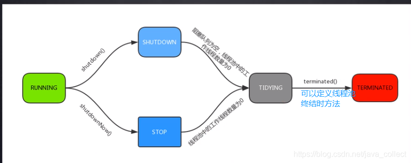

# 线程池解析

java线程对应内核线程，创建与销毁需要切换到内核态，是系统开销较大的操作，因此需要设法复用线程。线程池就是一个线程缓存，负责对线程统一分配，调优与监控，线程池的优势：

提高性能：重用线程减少线程创建消亡的开销
提高响应速度：任务到达时可以立即执行，不需要再去创建线程
方便管理线程：便于统一分配、调控和监控

## 执行Runnable任务流程

简单说处理任务的优先级为：核心线程、任务队列、最大线程，如果三者都满了，使用handler处理被拒绝的任务。


具体如何实现的呢？

```java
/**
* 在将来某个时间执行该任务Runnable，可能是新建一个线程或者复用线程池已有的线程。
* 如果一个任务不能提交执行，要么是因为线程池shutdown了，要么是容量达到上限，此时执行拒绝策略
*/
public void execute(Runnable command) {
    if (command == null)
        throw new NullPointerException();
    // AtomicInteger原子变量，前3位表示状态，后29位表示线程数
    int c = ctl.get();
    if (workerCountOf(c) < corePoolSize) {
        // 1. addWorker方法里面会原子检查当前running State和工作线程数目，防止并发时错误的多创建，
        // 也就是如果有别的线程添加任务达到corePoolSize，addWorker会返回false表示创建失败
        if (addWorker(command, true))
            return;
        c = ctl.get();
    }
    
    if (isRunning(c) && workQueue.offer(command)) {
        // 2. 即使任务成功的入队，仍然需要再次检查是否应该增加线程，因为此时从last checking可能线程都死亡或者线程池shutdown
        int recheck = ctl.get();
        // 所以我们需要再次检查线程池状态，如果已经shutdown需要移除任务并拒绝该任务
        if (! isRunning(recheck) && remove(command))
            reject(command);
        // 如果线程都已死亡就新建一个
        else if (workerCountOf(recheck) == 0)
            addWorker(null, false);
       
     // 如果入队失败，再尝试新建线程。如果失败说明线程池shutdown，或者饱和达到maximumPoolSize,应该执行拒绝策略
    }else if (!addWorker(command, false))
        reject(command);
}
```


另外很重要的方法addWorker()，注意调用此方法是用来新建线程

```java
/**
* 检查是否可以根据当前池状态和给定界限（corePoolSize或maximumPoolSize）添加新的工作线程。
* 如果可能，将创建并启动一个worker，将firstTask作为其第一个任务运行。
*
* 如果池已stopped或shutdown中，或者threadfactory创建线程失败，则此方法返回 false。 
* 如果线程创建失败，或者threadfactory返回null，或者由于异常（通常是Thread.start()中的 OutOfMemoryError），我们会干净利落地回滚。
*
* @firstTask – 新线程应该首先运行的任务（如果没有，则为null）。当线程少于corePoolSize时（在这种情况下我们总是启动一个），
* 或者当队列已满（在这种情况下我们必须绕过队列）时，使用初始的第一个任务（在方法 execute() 中创建工作线程.
* 最初空闲线程通常通过 prestartCoreThread 创建或替换其他垂死的工人。
*/
private boolean addWorker(Runnable firstTask, boolean core) {
    retry:
    for (;;) {
        int c = ctl.get();
        int rs = runStateOf(c);

        // Check if queue empty only if necessary.
        if (rs >= SHUTDOWN &&
            ! (rs == SHUTDOWN &&
               firstTask == null &&
               ! workQueue.isEmpty()))
            return false;

        for (;;) {
            int wc = workerCountOf(c);
            if (wc >= CAPACITY ||
                // check线程数是否超过限制
                wc >= (core ? corePoolSize : maximumPoolSize))
                return false;
            if (compareAndIncrementWorkerCount(c))
                break retry;
            c = ctl.get();  // Re-read ctl
            if (runStateOf(c) != rs)
                continue retry;
            // else CAS failed due to workerCount change; retry inner loop
        }
    }

    boolean workerStarted = false;
    boolean workerAdded = false;
    Worker w = null;
    try {
        // 创建新的线程
        w = new Worker(firstTask);
        final Thread t = w.thread;
        if (t != null) {
            // 获取锁！！
            final ReentrantLock mainLock = this.mainLock;
            mainLock.lock();
            try {
                // Recheck while holding lock.
                // Back out on ThreadFactory failure or if
                // shut down before lock acquired.
                int rs = runStateOf(ctl.get());

                if (rs < SHUTDOWN ||
                    (rs == SHUTDOWN && firstTask == null)) {
                    if (t.isAlive()) // precheck that t is startable
                        throw new IllegalThreadStateException();
                    // 添加worker
                    workers.add(w);
                    // 更新 池的最大值	
                    int s = workers.size();
                    if (s > largestPoolSize)
                        largestPoolSize = s;
                    workerAdded = true;
                }
            } finally {
                mainLock.unlock();
            }
            if (workerAdded) {
                // 添加成功就启动线程
                t.start();
                workerStarted = true;
            }
        }
    } finally {
        if (! workerStarted)
            addWorkerFailed(w);
    }
    return workerStarted;
}
```

## 如何循环取任务执行的？

注意Worker实现了AQS，防止正在等待任务的线程被中断

```java
final void runWorker(Worker w) {
    Thread wt = Thread.currentThread();
    Runnable task = w.firstTask;
    w.firstTask = null;
    w.unlock(); // allow interrupts
    boolean completedAbruptly = true;
    try {
        // 这里除了执行当前task，只要从队列中能取getTask()就会不停的循环
        while (task != null || (task = getTask()) != null) {
            w.lock();
            // If pool is stopping, ensure thread is interrupted;
            // if not, ensure thread is not interrupted.  This
            // requires a recheck in second case to deal with
            // shutdownNow race while clearing interrupt
            if ((runStateAtLeast(ctl.get(), STOP) ||
                 (Thread.interrupted() &&
                  runStateAtLeast(ctl.get(), STOP))) &&
                !wt.isInterrupted())
                wt.interrupt();
            try {
                beforeExecute(wt, task);
                Throwable thrown = null;
                try {
                    task.run();
                } catch (RuntimeException x) {
                    thrown = x; throw x;
                } catch (Error x) {
                    thrown = x; throw x;
                } catch (Throwable x) {
                    thrown = x; throw new Error(x);
                } finally {
                    afterExecute(task, thrown);
                }
            } finally {
                task = null;
                w.completedTasks++;
                w.unlock();
            }
        }
        completedAbruptly = false;
    } finally {
        // 没有任务了就退出逻辑：停止线程，但会保证维持corePoolSize
        processWorkerExit(w, completedAbruptly);
    }
}
```


## 线程池状态

线程池状态是通过一个AtomicInteger的前3位表示的


- Running：表示能接受新任务及处理队列中的任务
- Shutdown：表示不接受新任务，但是会处理队列中的任务
- stop：表示不接受新任务，不处理队列中的任务，并且中断正在处理的任务
- Tidying：表示所有的任务已经终止，ctl记录的“workerCount”为0，将会执行terminated()的钩子方法
- Terminated：terminated()方法执行完毕

转换过程如下：

SHUTDOWN -> TIDYING：线程池线程数为空，工作队列为空

STOP -> TIDYING：只要线程池线程数为空即可

TIDYING -> TERMINATED：terminated() 的钩子方法执行完后



## 线程池中的阻塞工作队列

阻塞队列是队列的常见应用。常见的BlockingQueue主要有三种实现：

SynchronousQueue是不缓存任务，相当于一个中转站

ArrayBlockingQueue是一个用数组实现的有界阻塞队列，必须设置容量。

LinkedBlockingQueue是一个用链表实现的阻塞队列，容量可以设置，不设置的话最大长度为Integer.MAX_VALUE，将是一个无边界的阻塞队列。对于一个无边界队列来说，是可以不断的向队列中加入任务的，这种情况下就有可能因为任务过多而导致内存溢出问题。newFixedThreadPool中创建的就是未指定容量的LinkedBlockingQueue。

# 任务拒绝策略

当最大线程满后，会使用handler来处理被拒绝的任务，先看下 JDK 定义的 拒绝策略接口

```java
public interface RejectedExecutionHandler {
    void rejectedExecution(Runnable r, ThreadPoolExecutor executor);
}
```
接口定义很明确，当触发拒绝策略时，线程池会调用你设置的具体的策略，将当前提交的任务以及线程池实例本身传递给你处理，具体作何处理，不同场景会有不同的考虑，下面看 JDK 为我们内置了默认的四种处理策略为：

- AbortPolicy 抛出异常。

```java
public static class AbortPolicy implements RejectedExecutionHandler {
    public AbortPolicy() { }

    public void rejectedExecution(Runnable r, ThreadPoolExecutor e) {
        throw new RejectedExecutionException("Task " + r.toString() +
                                             " rejected from " +
                                             e.toString());
    }
}
```

不执行此任务，而且直接抛出一个运行时异常 RejectedExecutionException，为java线程池**默认的阻塞策略**。切记会中断调用者的处理过程，因此需要try catch，否则程序会直接退出。
- DiscardPolicy 直接静悄悄的丢弃这个任务，不触发任何动作。这个策略基本不会使用
	

```java
public static class DiscardPolicy implements RejectedExecutionHandler {
    public DiscardPolicy() { }

    public void rejectedExecution(Runnable r, ThreadPoolExecutor e) {
    }
}
```

- DiscardOldestPolicy 丢弃队列最前面（最旧）的任务，然后重新尝试执行任务（重复此过程）。

```java
public static class DiscardOldestPolicy implements RejectedExecutionHandler {
    public DiscardOldestPolicy() { }

    public void rejectedExecution(Runnable r, ThreadPoolExecutor e) {
        if (!e.isShutdown()) {
            e.getQueue().poll();
            e.execute(r);
        }
    }
}
```

- CallerRunsPolicy 由调用线程处理该任务 。

```java
public static class CallerRunsPolicy implements RejectedExecutionHandler {
    public CallerRunsPolicy() { }

    public void rejectedExecution(Runnable r, ThreadPoolExecutor e) {
        if (!e.isShutdown()) {
            r.run();
        }
    }
}
```
功能：当触发拒绝策略时，只要线程池没有关闭，就由提交任务的当前线程处理。

使用场景：一般在不允许失败的、对性能要求不高、并发量较小的场景下使用，因为线程池一般情况下不会关闭，也就是提交的任务一定会被运行，但是由于是调用者线程自己执行的，当多次提交任务时，就会阻塞后续任务执行，性能和效率自然就慢了。


下面我们看下第三方框架中都有哪些拒绝策略

### Dubbo 中的线程拒绝策略

```java
public class AbortPolicyWithReport extends ThreadPoolExecutor.AbortPolicy {

    protected static final Logger logger = LoggerFactory.getLogger(AbortPolicyWithReport.class);

    private final String threadName;

    private final URL url;

    private static volatile long lastPrintTime = 0;

    private static Semaphore guard = new Semaphore(1);

    public AbortPolicyWithReport(String threadName, URL url) {
        this.threadName = threadName;
        this.url = url;
    }

    @Override
    public void rejectedExecution(Runnable r, ThreadPoolExecutor e) {
        String msg = String.format("Thread pool is EXHAUSTED!" +
                        " Thread Name: %s, Pool Size: %d (active: %d, core: %d, max: %d, largest: %d), Task: %d (completed: %d)," +
                        " Executor status:(isShutdown:%s, isTerminated:%s, isTerminating:%s), in %s://%s:%d!",
                threadName, e.getPoolSize(), e.getActiveCount(), e.getCorePoolSize(), e.getMaximumPoolSize(), e.getLargestPoolSize(),
                e.getTaskCount(), e.getCompletedTaskCount(), e.isShutdown(), e.isTerminated(), e.isTerminating(),
                url.getProtocol(), url.getIp(), url.getPort());
        logger.warn(msg);
        dumpJStack();
        throw new RejectedExecutionException(msg);
    }

    private void dumpJStack() {
       //省略实现
    }
}
```
可以看到，当dubbo的工作线程触发了线程拒绝后，主要做了三个事情，原则就是尽量让使用者清楚触发线程拒绝策略的真实原因

- 输出了一条警告级别的日志，日志内容为线程池的详细设置参数，以及线程池当前的状态，还有当前拒绝任务的一些详细信息。可以说，这条日志，使用dubbo的有过生产运维经验的或多或少是见过的，这个日志简直就是日志打印的典范，其他的日志打印的典范还有spring。得益于这么详细的日志，可以很容易定位到问题所在
- 输出当前线程堆栈详情，这个太有用了，当你通过上面的日志信息还不能定位问题时，案发现场的dump线程上下文信息就是你发现问题的救命稻草
- 继续抛出拒绝执行异常，使本次任务失败，这个继承了JDK默认拒绝策略的特性

### Netty 中的线程池拒绝策略

```java
private static final class NewThreadRunsPolicy implements RejectedExecutionHandler {
    NewThreadRunsPolicy() {
        super();
    }

    public void rejectedExecution(Runnable r, ThreadPoolExecutor executor) {
        try {
            final Thread t = new Thread(r, "Temporary task executor");
            t.start();
        } catch (Throwable e) {
            throw new RejectedExecutionException(
                "Failed to start a new thread", e);
        }
    }
}
```
Netty新建了一个线程来处理的。所以，Netty的实现相较于调用者执行策略的使用面就可以扩展到支持高效率高性能的场景了。但是也要注意一点，Netty的实现里，在创建线程时未做任何的判断约束，也就是说只要系统还有资源就会创建新的线程来处理，直到new不出新的线程了，才会抛创建线程失败的异常


### PinPoint 中的线程池拒绝策略

```java
public class RejectedExecutionHandlerChain implements RejectedExecutionHandler {
    private final RejectedExecutionHandler[] handlerChain;

	//通过静态方法来返回一个对象
    public static RejectedExecutionHandler build(List<RejectedExecutionHandler> chain) {
        Objects.requireNonNull(chain, "handlerChain must not be null");
        RejectedExecutionHandler[] handlerChain = chain.toArray(new RejectedExecutionHandler[0]);
        return new RejectedExecutionHandlerChain(handlerChain);
    }

    private RejectedExecutionHandlerChain(RejectedExecutionHandler[] handlerChain) {
        this.handlerChain = Objects.requireNonNull(handlerChain, "handlerChain must not be null");
    }

    @Override
    public void rejectedExecution(Runnable r, ThreadPoolExecutor executor) {
        for (RejectedExecutionHandler rejectedExecutionHandler : handlerChain) {
            rejectedExecutionHandler.rejectedExecution(r, executor);
        }
    }
}
```
pinpoint的拒绝策略实现很有特点，和其他的实现都不同。他定义了一个拒绝策略链，包装了一个拒绝策略列表，当触发拒绝策略时，会将策略链中的rejectedExecution依次执行一遍
### ActiveMQ 中的线程池拒绝策略

```java
new RejectedExecutionHandler() {
    @Override
    public void rejectedExecution(final Runnable r, final ThreadPoolExecutor executor) {
        try {
            executor.getQueue().offer(r, 60, TimeUnit.SECONDS);
        } catch (InterruptedException e) {
            throw new RejectedExecutionException("Interrupted waiting for BrokerService.worker");
        }
        throw new RejectedExecutionException("Timed Out while attempting to enqueue Task.");
    }
});
```
activeMq中的策略属于最大努力执行任务型，当触发拒绝策略时，在尝试一分钟的时间重新将任务塞进任务队列，当一分钟超时还没成功时，就抛出异常。这种方式感觉可以用于这样的场景，比如接受设备上报的消息大部分情况下都是比较少能处理的过来，每个任务处理时间不长，只有很小概率消息任务数量增加，就可以阻塞一段时间，等待其他任务完成。


BlockingQueue的核心方法：
放入数据：
　　offer(anObject):表示如果可能的话,将anObject加到BlockingQueue里,即如果BlockingQueue可以容纳,
　　　　则返回true,否则返回false.（本方法不阻塞当前执行方法的线程）
　　offer(E o, long timeout, TimeUnit unit),可以设定等待的时间，如果在指定的时间内，还不能往队列中
　　　　加入BlockingQueue，则返回失败。
　　put(anObject):把anObject加到BlockingQueue里,如果BlockQueue没有空间,则调用此方法的线程被阻塞
　　　　直到BlockingQueue里面有空间再继续.
获取数据：
　　poll(time):取走BlockingQueue里排在首位的对象,若不能立即取出,则可以等time参数规定的时间,
　　　　取不到时返回null;
　　poll(long timeout, TimeUnit unit)：从BlockingQueue取出一个队首的对象，如果在指定时间内，
　　　　队列一旦有数据可取，则立即返回队列中的数据。否则直到时间超时还没有数据可取，返回失败。
　　take():取走BlockingQueue里排在首位的对象,若BlockingQueue为空,阻断进入等待状态直到
　　　　BlockingQueue有新的数据被加入; 
　　drainTo():一次性从BlockingQueue获取所有可用的数据对象（还可以指定获取数据的个数）， 
　　　　通过该方法，可以提升获取数据效率；不需要多次分批加锁或释放锁。

# Java提供的几种线程池


- FixedThreadPool(int n)

  `new ThreadPoolExecutor(nThreads, nThreads, 0L, TimeUnit.MILLISECONDS,  new LinkedBlockingQueue<Runnable>());`核心线程和最大线程都是n，使用LinkedBlockingQueue无界队列。所以当请求越来越多无法及时处理时，就会不断堆积，容易造成内存溢出OOM。

- SingleThreadExecutor 单个工作线程的线程池

  `new ThreadPoolExecutor(1, 1, 0L, TimeUnit.MILLISECONDS, new LinkedBlockingQueue<Runnable>())`等同于FixedThreadPool(1)，只有一个工作线程。保证提交的任务按顺序执行，所以可以用来解决面试经常问到的如何控制多个线程顺序打印’ABCABC’问题如何控制多个线程的执行顺序

- CachedThreadPool

  底层是`return new ThreadPoolExecutor(0, Integer.MAX_VALUE, 60L, TimeUnit.SECONDS, new SynchronousQueue<Runnable>());，synchronousQueue是直接交换队列，不缓存任务。这个线程池会利用已有的线程，没有就新建，适合用来处理处理时间较短的异步任务，但是如果任务很多，会不断创建线程直到超出系统限制（如发生线程内存分配不足）。如果线程超过60s没有被使用，会被回收。

- ScheduledThreadPool(int corePoolSize)

  可以用来执行一些简单的延迟或按固定频率的任务。 延迟5秒后执行任务scheduledExecutorService.schedule(thread,5, TimeUnit.SECONDS);
  在1s后执行一次，然后每隔3秒执行任务#scheduledExecutorService.scheduleAtFixedRate(thread,1,3,TimeUnit.SECONDS);

- WorkStealingPool

  `return new ForkJoinPool(parallelism, ForkJoinPool.defaultForkJoinWorkerThreadFactory, null, true);`，JDK8加入的，返回一个工作窃取线程池ForkJoinPool，会维护足够的线程以支持给定的并行度级别，并且可以使用多个队列来减少争用。 并行度级别对应于主动参与或可用于参与任务处理的最大线程数。 线程的实际数量可能会动态增长和收缩。 工作窃取池不保证提交任务的执行顺序

  适合线程会产生子任务的，线程会把产生的子任务放进自己的工作队列，其他线程可以帮助这个线程执行。

Spring提供的线程池ThreadPoolTaskExecutor，方便我们自定义线程池：

```java
@Configuration
@EnableAsync//开启异步任务的支持
public class TaskExecutorConfig {

    @Bean(value = "businessEventProcessTaskExecutor", destroyMethod = "destroy")
    public ThreadPoolTaskExecutor getAsyncExecutor() {
        ThreadPoolTaskExecutor executor = new ThreadPoolTaskExecutor();
        // 获取JAVA虚拟机的可用处理器数量。IO密集型建议核心线程数是该值2倍；计算密集型建议核心线程数是该值1倍
        int processorNum = Runtime.getRuntime().availableProcessors();

        // 设置核心线程数量。若池中的实际线程数小于该值，无论其中是否有空闲的线程，都会产生新的线程
        executor.setCorePoolSize(processorNum * 2);

        // 设置最大线程数量
        executor.setMaxPoolSize(processorNum * 4);

        // 设置阻塞任务队列大小
        executor.setQueueCapacity(100);

        // 线程名称前缀
        executor.setThreadNamePrefix("demo-");
        
        // 设置线程池中任务的等待时间，若超过等待时间仍未销毁则强制销毁，以确保应用最后能够被关闭，而不是阻塞住
        executor.setAwaitTerminationSeconds(AWAIT_TERMINATION_SECONDS);

        // 设置拒绝策略，当线程池阻塞队列已满时对新任务的处理。调节机制，即饱和时回退主线程执行
        executor.setRejectedExecutionHandler(new ThreadPoolExecutor.CallerRunsPolicy());
        executor.initialize();
        return executor;
    }
}
```


线程池如何设置线程数：
耗时IO密集型：如读写数据库、文件、网络通信了，建议核心线程数是处理器数量的数倍，因为IO操作相对于CPU来说比较慢，为了不让CPU过多的等待空耗；
计算密集型：建议核心线程数是处理器数量的1-2倍，因为CPU基本一直在工作。

# 源码使用举例

定时任务

```java
// rocket-mq namesrv中
private final ScheduledExecutorService scheduledExecutorService = Executors.newSingleThreadScheduledExecutor(new ThreadFactoryImpl("NSScheduledThread"));

// 初始化心跳检测定时任务，每10秒去扫描不活动的broke
this.scheduledExecutorService.scheduleAtFixedRate(new Runnable() {
    @Override
    public void run() {
        NamesrvController.this.routeInfoManager.scanNotActiveBroker();
    }
}, 5, 10, TimeUnit.SECONDS);
```


固定线程池：

```java
this.adminBrokerExecutor = Executors.newFixedThreadPool(this.brokerConfig.getAdminBrokerThreadPoolNums(), new ThreadFactoryImpl("AdminBrokerThread_"));
```


