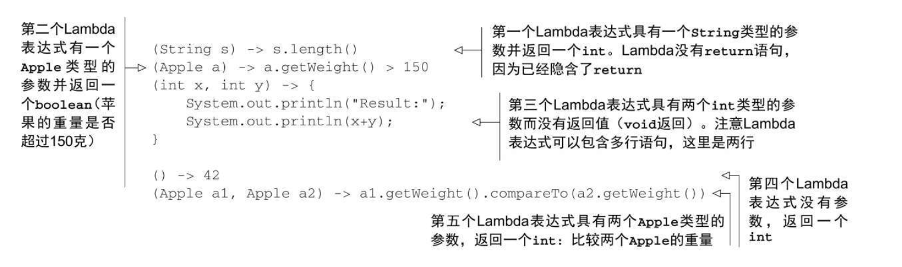
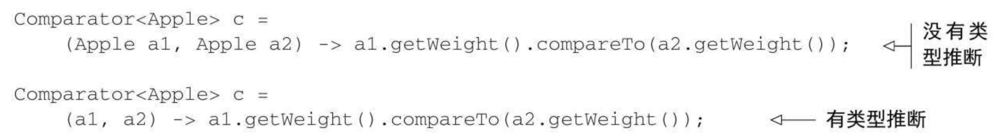
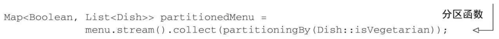
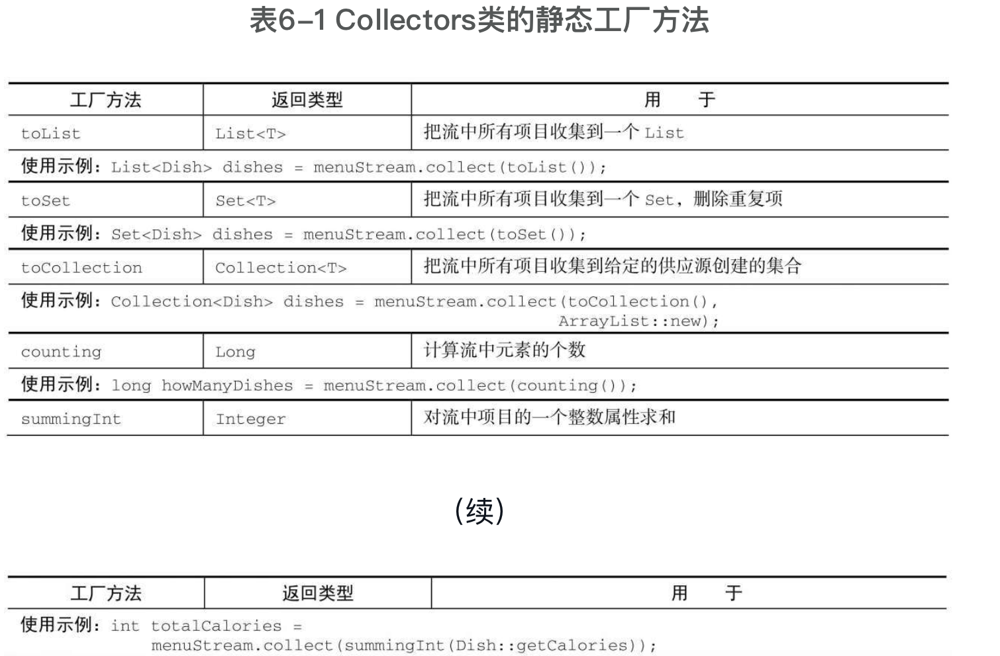
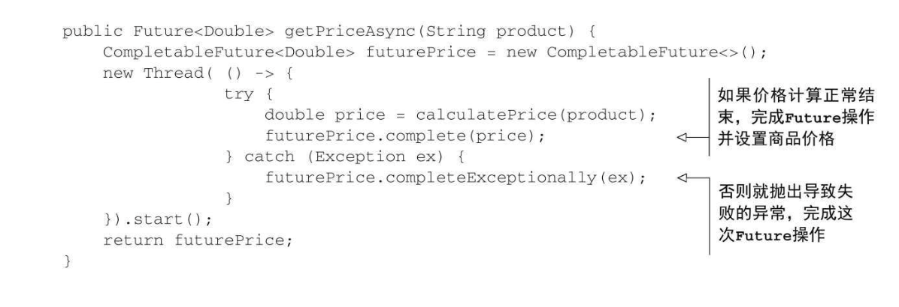
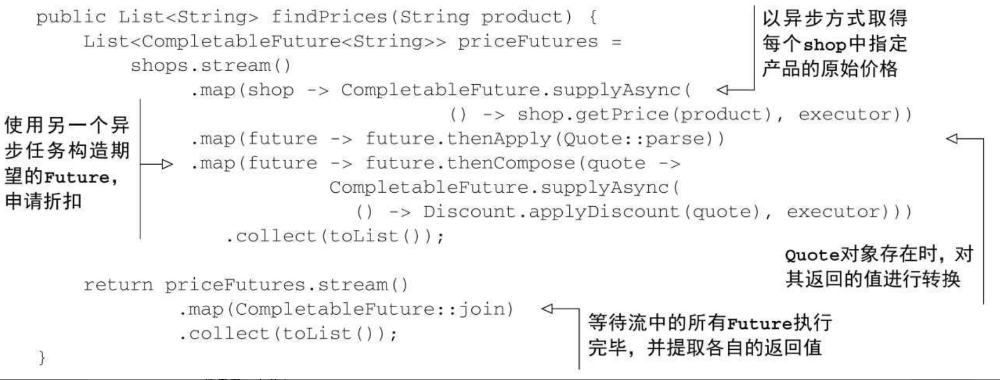
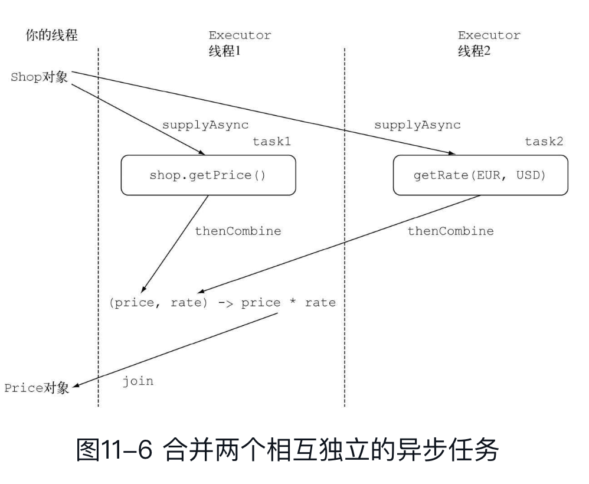
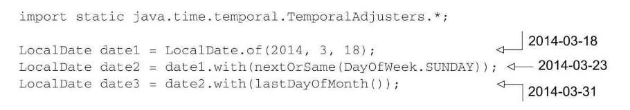
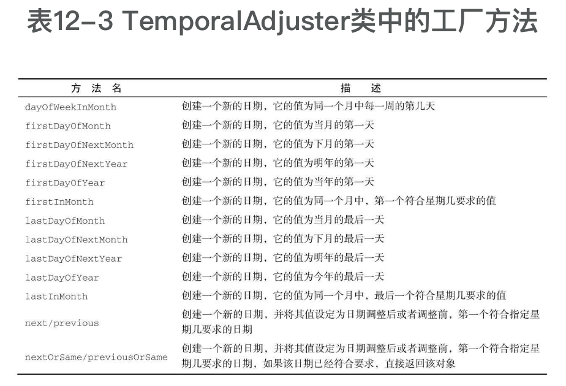

# 函数式编程-行为参数化

Java8新增了将方法和函数，即代码传递给其他方法的能力。从Java8开始，方法和函数也是一等公民了，也可以作为参数传递。Lambda匿名函数，同样体现了更广义的将函数作为值的思想，(int x)-> x+1，表示“调用时给定参数x，就返回x+1值的函数”。

```java
        filter(inventory, (Apple a)-> a.getWeight() > 150 );
```

> Java 8中加入默认方法主要是为了支持库设计师，让他们能够写出更容易改进的接口。

行为参数化就是可以帮助你处理频繁变更的需求的一种软件开发模式。一言以蔽之，它意味着拿出一个代码块，把它准备好却不去执行它。这个代码块以后可以被你程序的其他部分调用，这意味着你可以推迟这块代码的执行。例如，你可以将代码块作为参数传递给另一个方法，稍后再去执行它。这样，这个方法的行为就基于那块代码被参数化了。

将方法参数化很啰嗦，可以利用匿名方法，但还是很麻烦。所以引入lambda表达式！

```java
          Thread t=new Thread(new Runnable() {
              public void run(){
                  System.out.println("Hello world");
              }
          });
```

​        如果用lambda表达式

```java
          Thread t=new Thread(()-> System.out.println("Hello world"));
```

行为参数化，就是一个方法接受多个不同的行为作为参数，并在内部使用它们，完成不同行为的能力。行为参数化可让代码更好地适应不断变化的要求，减轻未来的工作量。 传递代码，就是将新行为作为参数传递给方法。但在Java 8之前这实现起来很啰嗦。为接口声明许多只用一次的实体类而造成的啰嗦代码，在Java 8之前可以用匿名类来减少。

## lamdba表达式

可以把Lambda表达式理解为简洁地表示**可传递的匿名函数**的一种方式：它没有名称，但它有参数列表、函数主体、返回类型，可能还有一个可以抛出的异常列表。我们说它是函数，是因为Lambda函数不像方法那样属于某个特定的类。但和方法一样，Lambda有参数列表、函数主体、返回类型，还可能有可以抛出的异常列表。❑ 传递——Lambda表达式可以作为参数传递给方法或存储在变量中。


lambda的有效表达式是  `(parameters)-> expression`或者  `(parameters)-> { statements; }`



在哪些地方可以使用lambda表达式呢？你只可以**在函数式接口上使用lambda表达式**！

### 函数式接口

函数式接口就是**只定义一个抽象方法的接口**，比如Predicate，Callable，Comparator和Runnable。

Lambda表达式允许你直接以内联的形式为函数式接口的抽象方法提供实现，并把整个表达式作为函数式接口的实例（具体说来，是函数式接口一个具体实现的实例）。你用匿名内部类也可以完成同样的事情，只不过比较笨拙：需要提供一个实现，然后再直接内联将它实例化。

@FunctionalInterface表示该接口会设计成一个函数式接口。Java8中常用的函数式接口：


函数式接口的抽象方法的签名可以描述Lambda表达式的签名。函数式接口的抽象方法的签名称为函数描述符。

有时候显式写出类型更易读，有时候去掉它们更易读。没有什么法则说哪种更好；对于如何让代码更易读，程序员必须做出自己的选择。



Lambda可以没有限制地捕获（也就是在其主体中引用）实例变量和静态变量。但局部变量必须显式声明为final，或事实上是final。换句话说，Lambda表达式只能捕获指派给它们的局部变量一次。为什么局部变量有这些限制？第一，实例变量和局部变量背后的实现有一个关键不同。实例变量都存储在堆中，而局部变量则保存在栈上。如果Lambda可以直接访问局部变量，而且Lambda是在一个线程中使用的，则使用Lambda的线程，可能会在分配该变量的线程将这个变量收回之后，去访问该变量。因此，Java在访问自由局部变量时，实际上是在访问它的副本，而不是访问原始变量。如果局部变量仅仅赋值一次那就没有什么区别了——因此就有了这个限制。

### 方法引用

如果你希望将一个既有的方法作为参数传递给另一个方法，那么方法引用无疑是我们推荐的方法，利用这种方式我们能写出非常简洁的代码。

方法引用可以被看作仅仅调用特定方法的Lambda的一种快捷写法。它的基本思想是，如果一个Lambda代表的只是“直接调用这个方法”，那最好还是用名称来调用它，而不是去描述如何调用它。


# stream流

Java 8也用Stream API（java.util.stream）解决了这两个问题：集合处理时的套路和晦涩，以及难以利用多核。stream使用声明式的方式，这样更简洁更易读，而且更灵活，也能并行。

集合讲的是数据，流讲的是计算！集合是外部迭代，流是内部迭代，替你把迭代做了。

## 流支持的操作

可以连接起来的流操作称为中间操作，关闭流的操作称为终端操作。filter、map和limit可以连成一条流水线，collect触发流水线执行并关闭它。

流都利用了短路：找到结果就立即停止计算；没有必要处理整个流

流支持的筛选操作：filter，distinct，limit，skip。

流支持的映射操作：map，flatmap，

流支持的查找和匹配：allMatch、anyMatch、noneMatch、findFirst，findAny

流支持的归约操作：reduce

```java
int sum = numbers.stream().reduce(0, Integer::sum);
Optional<Integer> max = numbers.stream().reduce(Integer::max);
// 集合中的个数
int count = menu.stream()
    .map(d-> 1)
    .reduce(0, (a, b)-> a+b);
```


## 原始类型特化

Java 8引入了三个原始类型特化流接口：IntStream、DoubleStream和LongStream，分别将流中的元素特化为int、long和double，从而避免了暗含的装箱成本。每个接口都带来了进行常用数值归约的新方法，比如对数值流求和的sum，找到最大元素的max。此外还有在必要时再把它们转换回对象流的方法。要记住的是，这些特化的原因并不在于流的复杂性，而是装箱造成的复杂性——即类似int和Integer之间的效率差异。

## 构建流

- 由值创建流

  ```java
          Stream<String> stream=Stream.of("Java 8 ", "Lambdas ", "In ", "Action");
          stream.map(String::toUpperCase).forEach(System.out::println);
  ```

- 由数组创建流

  Arrays.stream()

- 由文件生成流

- 由函数生成流

  ```java
  Stream.iterate(0, n-> n+2)
      .limit(10)
      .forEach(System.out::println);
  ```

  iterate方法接受一个初始值（在这里是0），还有一个依次应用在每个产生的新值上的Lambda（UnaryOperator<t>类型）。这里，我们使用Lambda n-> n+2，返回的是前一个元素加上2。因此，iterate方法生成了一个所有正偶数的流：流的第一个元素是初始值0。然后加上2来生成新的值2，再加上2来得到新的值4，以此类推。这种iterate操作基本上是顺序的，因为结果取决于前一次应用。请注意，此操作将生成一个无限流——这个流没有结尾，因为值是按需计算的，可以永远计算下去。我们说这个流是无界的

```java
Stream.generate(Math::random)
    .limit(5)
    .forEach(System.out::println);
```

generate方法也可让你按需生成一个无限流。但generate不是依次对每个新生成的值应用函数的。它接受一个Supplier<T>类型的Lambda提供新的值。

## 用流收集操作

collect是一个归约操作，就像reduce一样可以接受各种做法作为参数，将流中的元素累积成一个汇总结果。具体的做法是通过定义新的Collector接口来定义的，因此区分Collection、Collector和collect是很重要的。

>  收集器可以高效地复合起来，进行多级分组、分区和归约。
>
> 你可以实现Collector接口中定义的方法来开发你自己的收集器。

collect是一个终端操作，它接受的参数是将流中元素累积到汇总结果的各种方式（称为收集器）。Collectors类提供的预定义的收集器主要由三大功能，1. 将流元素归约和汇总为一个值， 2. 元素分组， 3.元素分区

### 将流元素归约和汇总为一个值

计算最大值和最小值：   

```java
Comparator<Dish> dishCaloriesComparator=
    Comparator.comparingInt(Dish::getCalories);

Optional<Dish> mostCalorieDish=
    menu.stream()
    .collect(maxBy(dishCaloriesComparator));
```

  汇总：

```java
// 求出每个菜单的总热量
int totalCalories=menu.stream().collect(summingInt(Dish::getCalories));
```

Collectors.summingLong和Collectors.summingDouble方法的作用完全一样，可以用于求和字段为long或double的情况。但汇总不仅仅是求和；还有Collectors.averagingInt，连同对应的averagingLong和averagingDouble可以计算数值的平均数。

你已经看到了如何使用收集器来给流中的元素计数，找到这些元素数值属性的最大值和最小值，以及计算其总和和平均值。不过很多时候，你可能想要得到两个或更多这样的结果，而且你希望只需一次操作就可以完成。在这种情况下，你可以使用summarizingInt工厂方法返回的收集器。例如，通过一次summarizing操作你可以就数出菜单中元素的个数，并得到菜肴热量总和、平均值、最大值和最小值：

```java
IntSummaryStatistics menuStatistics=
                menu.stream().collect(summarizingInt(Dish::getCalories));
// 会把所有这些信息收集到一个叫作IntSummaryStatistics的类里，它提供了方便的取值（getter）方法来访问结果
IntSummaryStatistics{count=9, sum=4300, min=120,
                              average=477.777778, max=800}
```

连接字符串：

joining工厂方法返回的收集器会把对流中每一个对象应用toString方法得到的所有字符串连接成一个字符串。

```java
String shortMenu=menu.stream().collect(joining());
// 用逗号连接
String shortMenu=menu.stream().map(Dish::getName).collect(joining(", "));
```

更一般化的归约操作：

前面讨论的所有收集器，都是一个可以用reducing工厂方法定义的归约过程的特殊情况而已。Collectors.reducing工厂方法是所有这些特殊情况的一般化。

```java
int totalCalories=menu.stream().collect(reducing(
                                            0, Dish::getCalories, (i, j)-> i+j));
```

- 第一个参数是归约操作的起始值，也是流中没有元素时的返回值，所以很显然对于数值和而言0是一个合适的值。
- 第二个参数就是一个函数，将菜肴转换成一个表示其所含热量的int。

-  第三个参数是一个BinaryOperator，将两个项目累积成一个同类型的值。这里它就是对两个int求和。

还有一个单参数的reducing：

```java
String shortMenu=menu.stream().map(Dish::getName)
                              .collect( reducing( (s1, s2)-> s1+s2 ) ).get();
```

函数式编程（特别是Java 8的Collections框架中加入的基于函数式风格原理设计的新API）通常提供了多种方法来执行同一个操作。这个例子还说明，收集器在某种程度上比Stream接口上直接提供的方法用起来更复杂，但好处在于它们能提供更高水平的抽象和概括，也更容易重用和自定义。我们的建议是，尽可能为手头的问题探索不同的解决方案，但在通用的方案里面，始终选择最专门化的一个。无论是从可读性还是性能上看，这一般都是最好的决定


你可能想知道，Stream接口的collect和reduce方法有何不同？因为两种方法通常会获得相同的结果。

一个语义问题和一个实际问题。语义问题在于，reduce方法旨在把两个值结合起来生成一个新值，它是一个不可变的归约。与此相反，collect方法的设计就是要改变容器，从而累积要输出的结果。以错误的语义使用reduce方法还会造成一个实际问题：这个归约过程不能并行工作，因为由多个线程并发修改同一个数据结构可能会破坏List本身。在这种情况下，如果你想要线程安全，就需要每次分配一个新的List，而对象分配又会影响性能。这就是collect方法特别适合表达可变容器上的归约的原因，更关键的是它适合并行操作

### 分组

```java
 Map<Dish.Type, List<Dish>> dishesByType=
                                menu.stream().collect(groupingBy(Dish::getType));
// 更复杂的自定义分组
public enum CaloricLevel { DIET, NORMAL, FAT }
Map<CaloricLevel, List<Dish>> dishesByCaloricLevel=menu.stream().collect(
    groupingBy(dish-> {
        if (dish.getCalories() <=400) return CaloricLevel.DIET;
        else if (dish.getCalories() <=700) return
            CaloricLevel.NORMAL;
        else return CaloricLevel.FAT;
    } ));
```

多级分组：还可以接受collector类型的第二个参数。那么要进行二级分组的话，我们可以把一个内层groupingBy传递给外层groupingBy，并定义一个为流中项目分类的二级标准


进一步说，传递给第一个groupingBy的第二个收集器可以是任何类型，而不一定是另一个groupingBy。例如，要数一数菜单中每类菜有多少个，可以传递counting收集器作为groupingBy收集器的第二个参数：

```java
Map<Dish.Type, Long> typesCount=menu.stream().collect(
                      groupingBy(Dish::getType, counting()));
// 按照类型，每种最大热量的菜肴
 Map<Dish.Type, Optional<Dish>> mostCaloricByType=
            menu.stream()
                .collect(groupingBy(Dish::getType,
                                      maxBy(comparingInt(Dish::getCalories))));

  Map<Dish.Type, Optional<Dish>> mostCaloricByType=
                menu.stream()
                        .collect(groupingBy(Dish::getType,CollectingAndThen(
                                maxBy(comparingInt(Dish::getCalories)), Optional::get)));
```

groupingBy和mapping结合起来：

```java
Map<Dish.Type, Set<CaloricLevel>> caloricLevelsByType=
    menu.stream().collect(
    groupingBy(Dish::getType, mapping(
        dish-> { if (dish.getCalories() <=400) return CaloricLevel.DIET;
                else if (dish.getCalories() <=700) return CaloricLevel.NORMAL;
                else return CaloricLevel.FAT; },
        toSet() )));
```

### 分区

分区是分组的特殊情况：由一个谓词（返回一个布尔值的函数）作为分类函数，它称分区函数。分区函数返回一个布尔值，这意味着得到的分组Map的键类型是Boolean，于是它最多可以分为两组——true是一组，false是一组。



Collectors类的静态工厂方法能够创建的所有收集器，所有这些收集器都是对Collector接口的实现，




## 利用Java8新特性重构

重构代码

- 用Lambda表达式取代匿名类，但是要注意二者间语义的微妙差别，比如关键字this，以及变量隐藏。
- 用方法引用重构Lambda表达式，方法引用的可读性更好。
- 用Stream API重构命令式的数据处理

优化已有的设计的模式：利用lambda表达式可以简化策略模式，模板模式，观察者模式，工厂模式中一些僵化的代码。

使用peek可以帮助我们调试stream流代码，能将中间变量的值输出到日志中，是非常有用的工具。


# Java8其他特性

## 默认方法

Java8中的接口可以通过添加默认方法和静态方法提供方法的代码实现！默认方法开头是default。

默认方法的出现是为了方便类库的设计者以向后兼容的方式添加接口定义。具体来说，向接口添加方法是万恶之源，一旦接口发生变化，实现这些接口的类往往也需要更新，提供新添方法的实现才能适配接口的变化。如果你对接口以及它所有相关的实现有完全的控制，这可能不是个大问题。但是这种情况是极少的。这就是引入默认方法的目的：它让类可以自动地继承接口的一个默认实现。

默认方法还使得你现在可以实现行为的多继承！这是一种让类从多个来源重用代码的能力

> 静态方法及接口同时定义接口以及工具辅助类（companion class）是Java语言常用的一种模式，工具类定义了与接口实例协作的很多静态方法。比如，Collections就是处理Collection对象的辅助类。由于静态方法可以存在于接口内部，你代码中的这些辅助类就没有了存在的必要，你可以把这些静态方法转移到接口内部。为了保持后向的兼容性，这些类依然会存在于Java应用程序的接口之中。

Java 8中的抽象类和抽象接口那么抽象类和抽象接口之间的区别是什么呢？它们不都能包含抽象方法和包含方法体的实现吗？首先，一个类只能继承一个抽象类，但是一个类可以实现多个接口。其次，一个抽象类可以通过实例变量（字段）保存一个通用状态，而接口是不能有实例变量的。


如果一个类的默认方法使用相同的函数签名继承自多个接口，解决冲突的机制其实相当简单。你只需要遵守下面这三条准则就能解决所有可能的冲突：

- 首先，类或父类中显式声明的方法，其优先级高于所有的默认方法。
- 如果用第一条无法判断，方法签名又没有区别，那么选择提供最具体实现的默认方法的接口。
- 最后，如果冲突依旧无法解决，你就只能在你的类中覆盖该默认方法，显式地指定在你的类中使用哪一个接口中的方法。

## optional

将类属性或方法参数声明称Optional<T>

Optional是如何丰富你模型的语义？使用Optional而不是null的一个非常重要而又实际的语义区别是，这句声明非常清楚地表明了这里发生变量缺失是允许的。引入Optional类的意图并非要消除每一个null引用。与此相反，它的目标是帮助你更好地设计出普适的API，让程序员看到方法签名，就能了解它是否接受一个Optional的值。这种强制会让你更积极地将变量从Optional中解包出来，直面缺失的变量值。

使用**map**提取和转换值

map的作用是，如果Optional包含一个值，那函数就将该值作为参数传递给map，对该值进行转换。如果Optional为空，就什么也不做。

```java
// 提取值
boardSiteReqOptional.map(req -> queryWrapper.eq(SiteInfo::getManagementType, req.getManagementType()));
// 转换值
Optional<String> name=optInsurance.map(Insurance::getName);

// 组合使用。如果是多层的Optional对象，需要用flatMap链接
public Optional<Insurance> nullSafeFindCheapestInsurance( Optional<Person> person, 																	Optional<Car> car) {
      return person.flatMap(p-> car.map(c-> findCheapestInsurance(p, c)));
}
```

定义默认值

- get()是这些方法中最简单但又最不安全的方法。如果变量存在，它直接返回封装的变量值，否则就抛出一个NoSuchElementException异常。所以，除非你非常确定Optional变量一定包含值，否则使用这个方法是个相当糟糕的主意

- orElse(T other)允许你在Optional对象不包含值时提供一个默认值。

- orElseGet(Supplier<? extends T> other)是orElse方法的延迟调用版，Supplier方法只有在Optional对象不含值时才执行调用

- orElseThrow(Supplier<? extends X> exceptionSupplier)和get方法非常类似，它们遭遇Optional对象为空时都会抛出一个异常，但是使用orElseThrow你可以定制希望抛出的异常类型。ifPresent(Consumer<? super T>)让你能在变量值存在时执行一个作为参数传入的方法，否则就不进行任何操作

使用filter剔除特定的值

你经常需要调用某个对象的方法，查看它的某些属性。比如，你可能需要检查保险公司的名称是否为“Cambridge-Insurance”。为了以一种安全的方式进行这些操作，你首先需要确定引用指向的Insurance对象是否为null，之后再调用它的getName方法，如下所示：

```java
Insurance insurance=...;
if(insurance !=null && "CambridgeInsurance".equals(insurance.getName())){
      System.out.println("ok");
 }

// 可以改成
Optional<Insurance> optInsurance=...;
optInsurance.filter(insurance->
                "CambridgeInsurance".equals(insurance.getName()))
          .ifPresent(x-> System.out.println("ok"));
```

filter方法接受一个谓词作为参数。如果Optional对象的值存在，并且它符合谓词的条件，filter方法就返回其值；否则它就返回一个空的Optional对象。如果你还记得我们可以将Optional看成最多包含一个元素的Stream对象，这个方法的行为就非常清晰了。如果Optional对象为空，它不做任何操作，反之，它就对Optional对象中包含的值施加谓词操作。如果该操作的结果为true，它不做任何改变，直接返回该Optional对象，否则就将该值过滤掉，将Optional的值置空


**重构实战**

用Optional封装可能为null的值，如 `Optional<Object> value = Optional.ofNullable(map.get("key"));`

与Stream对象一样，Optional也提供了类似的基础类型——OptionalInt、OptionalLong以及OptionalDouble,但我们不推荐大家使用基础类型的Optional，因为基础类型的Optional不支持map、flatMap以及filter方法，而这些却是Optional类最有用的方法

基于旧写法的改造

```java
public int readDuration(Properties props, String name) {
      return Optional.ofNullable(props.getProperty(name))
              .flatMap(OptionalUtility::stringToInt)
               .filter(i-> i > 0)
              .orElse(0);
}
```


## CompletableFuture：组合式异步编程

Future接口在Java 5中被引入，设计初衷是对将来某个时刻会发生的结果进行建模。它建模了一种异步计算，返回一个执行运算结果的引用，当运算结束后，这个引用被返回给调用方。在Future中触发那些潜在耗时的操作把调用线程解放出来，让它能继续执行其他有价值的工作，不再需要呆呆等待耗时的操作完成。打个比方，你可以把它想象成这样的场景：你拿了一袋子衣服到你中意的干洗店去洗。干洗店的员工会给你张发票，告诉你什么时候你的衣服会洗好（这就是一个Future事件）。衣服干洗的同时，你可以去做其他的事情。

但是future接口有很多局限性，比如将两个异步计算合并为一个——这两个异步计算之间相互独立，同时第二个又依赖于第一个的结果。❑ 等待Future集合中的所有任务都完成。❑ 仅等待Future集合中最快结束的任务完成（有可能因为它们试图通过不同的方式计算同一个值），并返回它的结果。 应对Future的完成事件（即当Future的完成事件发生时会收到通知，并能使用Future计算的结果进行下一步的操作，不只是简单地阻塞等待操作的结果）

### 提供异步的API

我们可以创建一个代表异步计算的CompletableFuture对象实例，它在计算完成时会包含计算的结果。接着，你调用fork创建了另一个线程去执行实际的价格计算工作，不等该耗时计算任务结束，直接返回一个Future实例。


如果没有意外，我们目前开发的代码工作得很正常。但是，如果价格计算过程中产生了错误会怎样呢？非常不幸，这种情况下你会得到一个相当糟糕的结果：用于提示错误的异常会被限制在试图计算商品价格的当前线程的范围内，最终会杀死该线程，而这会导致等待get方法返回结果的客户端永久地被阻塞！

客户端可以使用重载版本的get方法，它使用一个超时参数来避免发生这样的情况。这是一种值得推荐的做法，你应该尽量在你的代码中添加超时判断的逻辑，避免发生类似的问题。使用这种方法至少能防止程序永久地等待下去。不过，也因为如此，你不会有机会发现计算商品价格的线程内到底发生了什么问题才引发了这样的失效。为了让客户端能了解商店无法提供请求商品价格的原因，你需要使用CompletableFuture的completeExceptionally方法将导致CompletableFuture内发生问题的异常抛出



客户端现在会收到一个ExecutionException异常，该异常接收了一个包含失败原因的Exception参数，即价格计算方法最初抛出的异常

### CompletableFuture类提供的工厂方法

CompletableFuture类自身提供了大量精巧的工厂方法，使用这些方法能更容易地完成整个流程，还不用担心实现的细节。

比如采用**supplyAsync方法**重写上面的异步方法，supplyAsync方法接受一个生产者（Supplier）作为参数，返回一个CompletableFuture对象，该对象完成异步执行后会读取调用生产者方法的返回值

```java
public Future<Double> getPriceAsync(String product) {
    return CompletableFuture.supplyAsync(()-> calculatePrice(product));
}
```

当然我们可以指定自定义配置的线程池

### 等待所有异步操作的结果

现在假设你分别请求不同的商店获取产品的价格，推荐的做法


注意：这里必须使用两个不同的流，不然因为流的延迟特性，单一流智能以同步顺序的方式执行。

CompletableFuture类中的join方法和Future接口中的get有相同的含义，并且也声明在Future接口中，它们唯一的不同是join不会抛出任何检测到的异常

### 组合多个异步任务

thenCompose方法允许你对两个异步操作进行流水线，第一个操作完成时，将其结果作为参数传递给第二个操作。换句话说，你可以创建两个CompletableFutures对象，对第一个CompletableFuture对象调用thenCompose，并向其传递一个函数。当第一个CompletableFuture执行完毕后，它的结果将作为该函数的参数，这个函数的返回值是以第一个CompletableFuture的返回做输入计算出的第二个CompletableFuture对象



### thenCombine方法

如果你需要将两个完全不相干的CompletableFuture对象的结果整合起来，而且你也不希望等到第一个任务完全结束才开始第二项任务。这种情况，你应该使用thenCombine方法，它接收名为BiFunction的第二参数，这个参数定义了当两个CompletableFuture对象完成计算后，结果如何合并。

比如有一家商店提供的价格是以欧元（EUR）计价的，但是你希望以美元的方式提供给你的客户。你可以用异步的方式向商店查询指定商品的价格，同时从远程的汇率服务那里查到欧元和美元之间的汇率。当二者都结束时，再将这两个结果结合起来，用返回的商品价格乘以当时的汇率，得到以美元计价的商品价格





thenAccep接收CompletableFuture执行完毕后的返回值做参数，`        findPricesStream("myPhone").map(f-> f.thenAccept(System.out::println));`

allOf工厂方法接收一个由CompletableFuture构成的数组，对allOf方法返回的CompletableFuture执行join操作是个不错的主意。anyOf可以在由第一个future执行完毕立即返回

```java

long start=System.nanoTime();
CompletableFuture[] futures=findPricesStream("myPhone27S")
    // thenAccept 消费
    .map(f-> f.thenAccept(
        s-> System.out.println(s+" (done in "+
                               ((System.nanoTime() - start) / 1_000_000)+" msecs)")))
    .toArray(size-> new CompletableFuture[size]);
CompletableFuture.allOf(futures).join();
System.out.println("All shops have now responded in "
                   +((System.nanoTime() - start) / 1_000_000)+" msecs");
```


## 全新的日期时间类 LocalDateTime

旧的Date和Calendar都很难用，而且也是可以变的。DateFormat不是线程安全的。这意味着两个线程如果尝试使用同一个formatter解析日期，你可能会得到无法预期的结果

### LocalDate和LocalTime

LocalDate类的实例是一个不可变对象，它只提供了简单的日期，并不含当天的时间信息。另外，它也不附带任何与时区相关的信息。

```java
LocalDate.now();
LocalDate date = LocalDate.of(2022, 3, 23);
int year = date.getYear();
DayOfWeek dow = date.getDayOfWeek();
int len = date.lengthOfMonth(); // 返回31
```

你还可以通过传递一个TemporalField参数给get方法拿到同样的信息。TemporalField是一个接口，它定义了如何访问temporal对象某个字段的值。ChronoField枚举实现了这一接口，所以你可以很方便地使用get方法得到枚举元素的值，如下所示

```java
int year=date.get(ChronoField.YEAR);
int month=date.get(ChronoField.MONTH_OF_YEAR);
int day=date.get(ChronoField.DAY_OF_MONTH);
```

你可以向parse方法传递一个DateTimeFormatter。该类的实例定义了如何格式化一个日期或者时间对象。正如我们之前所介绍的，它是替换老版java.util.DateFormat的推荐替代品

```java
LocalDate date=LocalDate.parse("2014-03-18");
LocalTime time=LocalTime.parse("13:45:20");
```

### 机器的时间格式

从计算机的角度来看，建模时间最自然的格式是表示一个持续时间段上某个点的单一大整型数。这也是新的java.time.Instant类对时间建模的方式，基本上它是以Unix元年时间（传统的设定为UTC时区1970年1月1日午夜时分）开始所经历的秒数进行计算。

可以通过向静态工厂方法ofEpochSecond传递一个代表秒数的值创建一个该类的实例。静态工厂方法ofEpochSecond还有一个增强的重载版本，它接收第二个以纳秒为单位的参数值，对传入作为秒数的参数进行调整。重载的版本会调整纳秒参数，确保保存的纳秒分片在0到999999999之间。这意味着下面这些对ofEpochSecond工厂方法的调用会返回几乎同样的Instant对象：


正如你已经在LocalDate及其他为便于阅读而设计的日期-时间类中所看到的那样，Instant类也支持静态工厂方法now，它能够帮你获取当前时刻的时间戳。我们想要特别强调一点，Instant的设计初衷是为了便于机器使用。它包含的是由秒及纳秒所构成的数字。所以，它无法处理那些我们非常容易理解的时间单位

### 定义Duration或Period

目前为止，你看到的所有类都实现了Temporal接口，Temporal接口定义了如何读取和操纵为时间建模的对象的值。

Duration类是表示两个Temporal对象之间的间隔。

```java
Duration d1=Duration.between(time1, time2);
Duration d1=Duration.between(dateTime1, dateTime2);
Duration d2=Duration.between(instant1, instant2);
```


如果你需要以年、月或者日的方式对多个时间单位建模，可以使用Period类。使用该类的工厂方法between，你可以使用得到两个LocalDate之间的时长

```java
Period tenDays=Period.between(LocalDate.of(2014, 3, 8),
                              LocalDate.of(2014, 3, 18));

// 不仅可以以两个temporal对象的差值的方式来定义，还能直接创建对应的实例
Duration threeMinutes=Duration.of(3, ChronoUnit.MINUTES);

Period tenDays=Period.ofDays(10);
Period threeWeeks=Period.ofWeeks(3);
Period twoYearsSixMonthsOneDay=Period.of(2, 6, 1);
```

Duration类和Period类共享了很多相似的方法


### 操纵日期

如果你已经有一个LocalDate对象，想要创建它的一个修改版，最直接也最简单的方法是使用withAttribute方法。withAttribute方法会创建对象的一个副本，并按照需要修改它的属性。注意，下面的这段代码中所有的方法都返回一个修改了属性的对象。**它们都不会修改原来的对象！**更确切地说，使用get和with方法，我们可以将Temporal对象值的读取和修改区分开

```java
LocalDate date=LocalDate.of(2014, 3, 18);
date=date.with(ChronoField.MONTH_OF_YEAR, 9);
date=date.plusYears(2).minusDays(10);
date.withYear(2011);
```

像LocalDate、LocalTime、LocalDateTime以及Instant这样表示时间点的日期-时间类提供了大量通用的方法：


使用TemporalAdjuster

有的时候，你需要进行一些更加复杂的操作，比如，将日期调整到下个周日、下个工作日，或者是本月的最后一天。这时，你可以使用重载版本的with方法，向其传递一个提供了更多定制化选择的TemporalAdjuster对象，更加灵活地处理日期。对于最常见的用例，日期和时间API已经提供了大量预定义的TemporalAdjuster。你可以通过TemporalAdjuster类的静态工厂方法访问它们





正如我们看到的，使用TemporalAdjuster我们可以进行更加复杂的日期操作，而且这些方法的名称也非常直观，方法名基本就是问题陈述。此外，即使你没有找到符合你要求的预定义的TemporalAdjuster，创建你自己的TemporalAdjuster也并非难事。实际上，Temporal-Adjuster接口只声明了单一的一个方法（这使得它成为了一个函数式接口

```java
@FunctionalInterface
public interface TemporalAdjuster {
    Temporal adjustInto(Temporal temporal);
}
```

自定义一个，返回在一个工作日，如果是周五或周六就延长至下周一。很好用！


```java
TemporalAdjuster nextWorkingDay=TemporalAdjusters.ofDateAdjuster(
    temporal-> {
        DayOfWeek dow=
            DayOfWeek.of(temporal.get(ChronoField.DAY_OF_WEEK));
        int dayToAdd=1;
        if (dow==DayOfWeek.FRIDAY) dayToAdd=3;
        if (dow==DayOfWeek.SATURDAY) dayToAdd=2;
        return temporal.plus(dayToAdd, ChronoUnit.DAYS);
    });

date=date.with(nextWorkingDay);
```

### 解析和格式化日期

新的java.time.format包中，最重要的类是DateTime-Formatter，用来解析和格式化日期。和老的java.util.DateFormat相比较，所有的DateTimeFormatter实例都是线程安全的。所以，你能够以单例模式创建格式器实例，就像DateTimeFormatter所定义的那些常量，并能在多个线程间共享这些实例。

```java
// 解析字符串
LocalDate date1=LocalDate.parse("20140318",
                                DateTimeFormatter.BASIC_ISO_DATE);
LocalDate date2=LocalDate.parse("2014-03-18",
                                DateTimeFormatter.ISO_LOCAL_DATE);
// 自定义DateTimeFormatter
DateTimeFormatter formatter=DateTimeFormatter.ofPattern("dd/MM/yyyy");
LocalDate date1=LocalDate.of(2014, 3, 18);
String formattedDate=date1.format(formatter);
LocalDate date2=LocalDate.parse(formattedDate, formatter);
```

如果你还需要更加细粒度的控制，DateTimeFormatterBuilder类还提供了更复杂的格式器，你可以选择恰当的方法，一步一步地构造自己的格式器。另外，它还提供了非常强大的解析功能，比如区分大小写的解析、柔性解析（允许解析器使用启发式的机制去解析输入，不精确地匹配指定的模式）、填充，以及在格式器中指定可选节

```java
DateTimeFormatter italianFormatter=new DateTimeFormatterBuilder()
    .appendText(ChronoField.DAY_OF_MONTH)
    .appendLiteral(". ")
    .appendText(ChronoField.MONTH_OF_YEAR)
    .appendLiteral(" ")
    .appendText(ChronoField.YEAR)
    .parseCaseInsensitive()
    .toFormatter(Locale.ITALIAN);
```

### 处理不同的时区

新的java.time.ZoneId类是老版java.util.TimeZone的替代品。

每个特定的ZoneId对象都由一个地区ID标识，比如：地区ID都为“{区域}/{城市}”的格式，这些地区集合的设定都由英特网编号分配机构（IANA）的时区数据库提供

```java
ZoneId romeZone=ZoneId.of("Europe/Rome");

// 将一个老的时区对象转换为ZoneId
 ZoneId zoneId=TimeZone.getDefault().toZoneId();
```

一旦得到一个ZoneId对象，你就可以将它与LocalDate、LocalDateTime或者是Instant对象整合起来，构造为一个ZonedDateTime实例，它代表了相对于指定时区的时间点

```java
LocalDate date=LocalDate.of(2014, Month.MARCH, 18);
ZonedDateTime zdt1=date.atStartOfDay(romeZone);

LocalDateTime dateTime=LocalDateTime.of(2014, Month.MARCH, 18, 13, 45);
ZonedDateTime zdt2=dateTime.atZone(romeZone);

Instant instant=Instant.now();
ZonedDateTime zdt3=instant.atZone(romeZone);

// LocalDateTime和Instant相互转换
LocalDateTime dateTime=LocalDateTime.of(2014, Month.MARCH, 18, 13, 45);
Instant instantFromDateTime=dateTime.toInstant(romeZone);
Instant instant=Instant.now();
LocalDateTime timeFromInstant=LocalDateTime.ofInstant(instant, romeZone);
```


另一种比较通用的表达时区的方式是利用当前时区和UTC/格林尼治的固定偏差。比如，基于这个理论，你可以说“纽约落后于伦敦5小时”。这种情况下，你可以使用ZoneOffset类，它是ZoneId的一个子类，表示的是当前时间和伦敦格林尼治子午线时间的差异：

```java
ZoneOffset newYorkOffset=ZoneOffset.of("-05:00");
// ZoneOffset是ZoneId的一个子类
LocalDateTime dateTime=LocalDateTime.of(2014, Month.MARCH, 18, 13, 45);
OffsetDateTime dateTimeInNewYork=OffsetDateTime.of(date, newYorkOffset);
```

