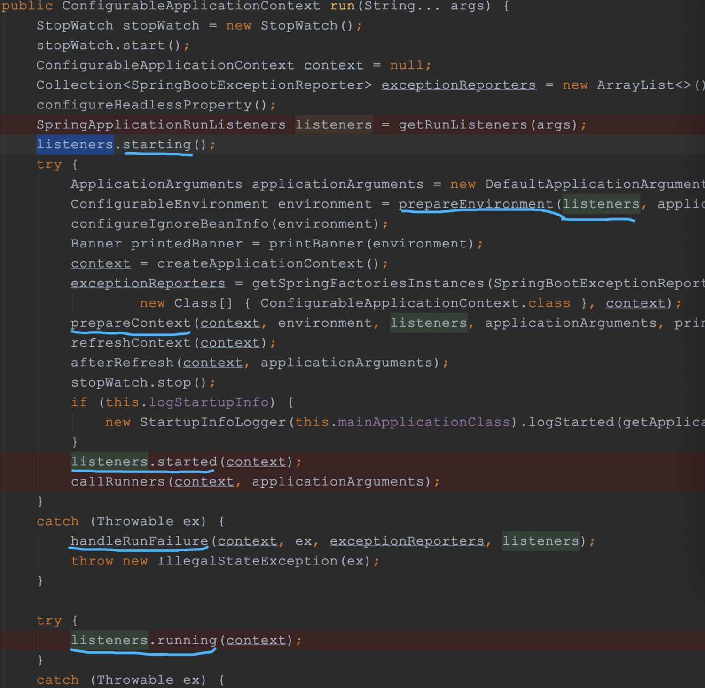

# 1. 核心注解

## 1.1 @Import 
注解的主要作用是将指定的类实例注入到 Spring IOC 容器中。
- 导入普通类或@Configuration配置类
- 导入 ImportSelector 实现类,这是 Spring Boot 自动配置的核心模式。允许根据条件动态决定要导入哪些全限定类名
- 导入 ImportBeanDefinitionRegistrar 实现类,是最高级的扩展模式，允许你直接操作 Bean 定义注册表（BeanDefinitionRegistry）。MyBatis 的 @MapperScan 就是用它来扫描接口并生成代理 Bean 的。

> Spring Boot 自动配置是如何实现的？（必考） 解析与思路：启动类上的 @SpringBootApplication 包含 @EnableAutoConfiguration。@EnableAutoConfiguration 内部使用了 @Import(AutoConfigurationImportSelector.class)。AutoConfigurationImportSelector 会读取 META-INF/spring.factories（或新版 imports 文件）中的配置类列表。结合 @Conditional 系列注解进行过滤，最终将符合条件的配置类注入容器
  •实现 @EnableXXX 功能特性，，会发现各种开启功能的注解底层都是 @Import

# 2. 启动流程

1. main方法里调用 `SpringApplication.run()`*，里面*`return new SpringApplication(primarySources).run(args);`先去创建了SpringApplication对象，然后调用run方法
2. 创建SpringApplication对象：

```java
public SpringApplication(ResourceLoader resourceLoader, Class<?>... primarySources) {
        this.resourceLoader = resourceLoader;
        Assert.notNull(primarySources, "PrimarySources must not be null");
        this.primarySources = new LinkedHashSet<>(Arrays.asList(primarySources));
        // 推断应用类型，是否是内嵌的servlet容器，还是不内嵌或者reactive应用
        this.webApplicationType = WebApplicationType.deduceFromClasspath();
        // 利用类加载器从springboot和spring autoconfigure项目的META-INF/spring.factories下加载所有的ApplicationContextInitializer
        setInitializers((Collection) getSpringFactoriesInstances(ApplicationContextInitializer.class));
        // 利用类加载器从META-INF/spring.factories下加载所有的ApplicationListener
        setListeners((Collection) getSpringFactoriesInstances(ApplicationListener.class));
        // 找出含有main方法的主配置类
        this.mainApplicationClass = deduceMainApplicationClass();
    }
```

1. 运行run方法

```java
public ConfigurableApplicationContext run(String... args) {
        StopWatch stopWatch = new StopWatch();
        stopWatch.start();
        ConfigurableApplicationContext context = null;
        Collection<SpringBootExceptionReporter> exceptionReporters = new ArrayList<>();
        configureHeadlessProperty();
        // 去加载所有的SpringApplicationRunListener，实际只有一个EventPublishingRunListener
        SpringApplicationRunListeners listeners = getRunListeners(args);
        // 回调listeners的starting
        listeners.starting();
        try {
            ApplicationArguments applicationArguments = new DefaultApplicationArguments(args);
            // 准备环境，profiles，PropertySources，回调listeners
            ConfigurableEnvironment environment = prepareEnvironment(listeners, applicationArguments);
            configureIgnoreBeanInfo(environment);

            Banner printedBanner = printBanner(environment);

            // 创建ApplicationContext容器，SERVLET或者REACTIVE
            context = createApplicationContext();
            exceptionReporters = getSpringFactoriesInstances(SpringBootExceptionReporter.class,
                    new Class[] { ConfigurableApplicationContext.class }, context);

            // 准备Context，里面保存environment，调用ApplicationContextInitializer，回调listener
            prepareContext(context, environment, listeners, applicationArguments, printedBanner);

            // 重要的方法，初始化容器，去加载@configure，@bean，注解等
            refreshContext(context);
            afterRefresh(context, applicationArguments);
            stopWatch.stop();
            if (this.logStartupInfo) {
                new StartupInfoLogger(this.mainApplicationClass).logStarted(getApplicationLog(), stopWatch);
            }
            // 回调listener的started
            listeners.started(context);
            // 这里是去回调ApplicationRunner和CommandLineRunner的方法
            callRunners(context, applicationArguments);
        }
        catch (Throwable ex) {
            handleRunFailure(context, ex, exceptionReporters, listeners);
            throw new IllegalStateException(ex);
        }

        try {
            // 容器启动完成，发布ApplicationReadyEvent
            listeners.running(context);
        }
        catch (Throwable ex) {
            handleRunFailure(context, ex, exceptionReporters, null);
            throw new IllegalStateException(ex);
        }
        return context;
    }
```

# 容器启动过程监听SpringApplicationRunListener

SpringApplicationRunListener是一个接口，他的实现类是EventPublishingRunListener，SpringApplicationRunListeners用来存放所有的SpringApplicationRunListener的集合。


**主要用来在容器启动，准备，加载，开始，运行等阶段发布**SpringApplicationEvent。


常用的@EventListener(classes = ApplicationReadyEvent.class)就是在监听，容器启动完成后发布的SpringApplicationEvent的子类ApplicationReadyEvent


```
public interface SpringApplicationRunListener {

    /**
     * Called immediately when the run method has first started. Can be used for very
     * early initialization.
     */
    default void starting() {
    }

    /**
     * Called once the environment has been prepared, but before the
     * {@link ApplicationContext} has been created.
     */
    default void environmentPrepared(ConfigurableEnvironment environment) {
    }

    /**
     * Called once the {@link ApplicationContext} has been created and prepared, but
     * before sources have been loaded.
     */
    default void contextPrepared(ConfigurableApplicationContext context) {
    }

    /**
     * Called once the application context has been loaded but before it has been
     * refreshed.
     */
    default void contextLoaded(ConfigurableApplicationContext context) {
    }

    /**
     * The context has been refreshed and the application has started but
     * CommandLineRunners and ApplicationRunners have not been called.
     */
    default void started(ConfigurableApplicationContext context) {
    }

    /**
     * Called immediately before the run method finishes, when the application context has
     * been refreshed and all CommandLineRunners and
     *  ApplicationRunners have been called.
     */
    default void running(ConfigurableApplicationContext context) {
    }

    /**
     * Called when a failure occurs when running the application.
     * @param context the application context or {@code null} if a failure occurred before
     * the context was created
     */
    default void failed(ConfigurableApplicationContext context, Throwable exception) {
    }

}
```

在启动的main方法中，可以看到在容器开始，准备，加载，运行的各个阶段，都有通过listener去发布相应状态的SpringApplicationEvent

