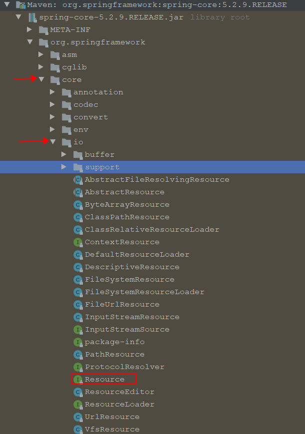

[本章](https://docs.spring.io/spring-framework/docs/current/reference/html/core.html#resources)介绍了Spring如何处理Resource 以及如何在Spring中使用Resource ，包括以下主题： 

- [Introduction](https://docs.spring.io/spring-framework/docs/current/reference/html/core.html#resources-introduction)
- [The Resource Interface](https://docs.spring.io/spring-framework/docs/current/reference/html/core.html#resources-resource)
- [Built-in Resource Implementations](https://docs.spring.io/spring-framework/docs/current/reference/html/core.html#resources-implementations)
- [The `ResourceLoader`](https://docs.spring.io/spring-framework/docs/current/reference/html/core.html#resources-resourceloader)
- [The `ResourceLoaderAware` interface](https://docs.spring.io/spring-framework/docs/current/reference/html/core.html#resources-resourceloaderaware)
- [Resources as Dependencies](https://docs.spring.io/spring-framework/docs/current/reference/html/core.html#resources-as-dependencies)
- [Application Contexts and Resource Paths](https://docs.spring.io/spring-framework/docs/current/reference/html/core.html#resources-app-ctx)



# 2.1 介绍

不幸的是，Java的标准java.net.URL类和各种URL前缀的标准Handler，对于所有访问低级资源的来说还不够充分。例如，没有标准化的URL实现可以用来访问需要从classpath或相对于ServletContext获取的资源。虽然可以为专门的URL前缀注册新的Handler（类似于http:等前缀的现有处理程序），但这通常是相当复杂的，URL接口仍然缺乏一些理想的功能，例如检查被指向的资源是否存在的方法。

# 2.2 Resource接口

Spring的Resource接口旨在成为一个能力更强的接口，用于抽象对低级资源的访问。下面的列表显示了Resource接口的定义：

```java
public interface Resource extends InputStreamSource {

    boolean exists();

    boolean isOpen();

    URL getURL() throws IOException;

    File getFile() throws IOException;

    Resource createRelative(String relativePath) throws IOException;

    String getFilename();

    String getDescription();
}
```

如上，Resource接口继承了InputStreamSource接口：

```java
public interface InputStreamSource {

    InputStream getInputStream() throws IOException;
}
```

Resource接口最重要的几个方法如下：

- `getInputStream()`: Locates and opens the resource, returning an `InputStream` for reading from the resource. It is expected that each invocation returns a fresh `InputStream`. It is the responsibility of the caller to close the stream.定位并打开资源，返回一个用于读取资源的InputStream。预计每次调用都会返回一个新的InputStream。关闭输入流是调用者的责任。
- `exists()`: 返回一个布尔值表示资源是否存在，以物理形式 in physical form.
- `isOpen()`: Returns a `boolean` indicating whether this resource represents a handle with an open stream. If `true`, the `InputStream` cannot be read multiple times and must be read once only and then closed to avoid resource leaks. Returns `false` for all usual resource implementations, with the exception of `InputStreamResource`.返回一个布尔值，表示该资源是否代表一个具有开放流的句柄。如果为真，则不能多次读取InputStream，必须只读取一次，然后关闭，以避免资源泄漏。除了InputStreamResource之外，所有通常的资源实现都返回false。
- `getDescription()`: Returns a description for this resource, to be used for error output when working with the resource. This is often the fully qualified file name or the actual URL of the resource.返回此资源的描述，用于处理资源时的错误输出。这通常是完全限定的文件名或资源的实际URL。

> Other methods let you obtain an actual `URL` or `File` object representing the resource (if the underlying implementation is compatible and supports that functionality).

其他方法可以让你获得一个实际的URL或代表资源的File对象（如果底层实现兼容并支持该功能）。

> Spring itself uses the `Resource` abstraction extensively, as an argument type in many method signatures when a resource is needed. Other methods in some Spring APIs (such as the constructors to various `ApplicationContext` implementations) take a `String` which in unadorned or simple form is used to create a `Resource` appropriate to that context implementation or, via special prefixes on the `String` path, let the caller specify that a specific `Resource` implementation must be created and used.
>
> While the `Resource` interface is used a lot with Spring and by Spring, it is actually very useful to use as a general utility class by itself in your own code, for access to resources, even when your code does not know or care about any other parts of Spring. While this couples your code to Spring, it really only couples it to this small set of utility classes, which serve as a more capable replacement for `URL` and can be considered equivalent to any other library you would use for this purpose.
>
> The `Resource` abstraction does not replace functionality. It wraps it where possible. For example, a `UrlResource` wraps a URL and uses the wrapped `URL` to do its work.

某些resource的实现类也实现了 [`WritableResource`](https://docs.spring.io/spring-framework/docs/5.3.9/javadoc-api/org/springframework/core/io/WritableResource.html) 接口，可以支持写入。

Spring本身广泛地使用了Resource抽象，当需要资源时，它可以作为许多方法签名中的参数类型。在一些Spring API中的其他方法（比如各种ApplicationContext实现的构造函数）会取一个String，这个String以不加修饰或简单的形式被用来创建一个适合该上下文实现的Resource，或者通过String路径上的特殊前缀，让调用者指定必须创建和使用一个特定的Resource实现。

虽然Resource接口在Spring中使用得很多，但实际上，在你自己的代码中，它本身作为一个通用的实用类来使用是非常有用的，用于访问资源，即使你的代码不知道或不关心Spring的任何其他部分。虽然这将你的代码与Spring耦合，但它实际上只是将它与这一小套实用类耦合，它作为URL的一个更有能力的替代品，可以被认为等同于你为此目的而使用的任何其他库。

`Resource` 抽象并不取代功能。它尽可能地包装了它。例如，一个`UrlResource` 包装了一个URL，并使用被包装的URL来完成它的工作。

# 2.3 内置的Resource实现

spring包含以下Resource实现：这里其实也是**策略模式**的体现！ApplicationContext 是策略模式中的决策者

- [`UrlResource`](https://docs.spring.io/spring-framework/docs/current/reference/html/core.html#resources-implementations-urlresource)
- [`ClassPathResource`](https://docs.spring.io/spring-framework/docs/current/reference/html/core.html#resources-implementations-classpathresource)
- [`FileSystemResource`](https://docs.spring.io/spring-framework/docs/current/reference/html/core.html#resources-implementations-filesystemresource)
- [`ServletContextResource`](https://docs.spring.io/spring-framework/docs/current/reference/html/core.html#resources-implementations-servletcontextresource)
- [`InputStreamResource`](https://docs.spring.io/spring-framework/docs/current/reference/html/core.html#resources-implementations-inputstreamresource)
- [`ByteArrayResource`](https://docs.spring.io/spring-framework/docs/current/reference/html/core.html#resources-implementations-bytearrayresource)

## 2.3.1 `UrlResource`

> `UrlResource` wraps a `java.net.URL` and can be used to access any object that is normally accessible with a URL, such as files, an HTTP target, an FTP target, and others. All URLs have a standardized `String` representation, such that appropriate standardized prefixes are used to indicate one URL type from another. This includes `file:` for accessing filesystem paths, `http:` for accessing resources through the HTTP protocol, `ftp:` for accessing resources through FTP, and others.

UrlResource包装了一个java.net.URL，可以用来访问任何通常可以用URL访问的对象，如**files, HTTP target, FTP target**等。所有的URL都有一个标准化的String表示法，比如用适当的标准化前缀来表示一种URL类型，包括`file：`用于访问文件系统路径，`http：`用于通过HTTP协议访问资源，`ftp：`用于通过FTP访问资源等。

> A `UrlResource` is created by Java code by explicitly using the `UrlResource` constructor but is often created implicitly when you call an API method that takes a `String` argument meant to represent a path. For the latter case, a JavaBeans `PropertyEditor` ultimately decides which type of `Resource` to create. If the path string contains well-known (to it, that is) prefix (such as `classpath:`), it creates an appropriate specialized `Resource` for that prefix. However, if it does not recognize the prefix, it assume the string is a standard URL string and creates a `UrlResource`.

UrlResource是通过Java代码显式使用UrlResource构造函数创建的，但通常在调用API方法时隐式创建，该方法使用一个代表路径的String参数。对于后一种情况，JavaBeans `PropertyEditor`最终决定创建哪种类型的Resource。如果路径字符串包含众所周知的（对它来说，就是）前缀（如`classpath:`），它就会为该前缀创建一个适当的专用资源。但是，如果它不识别前缀，它就会认为该字符串是标准的URL字符串，并创建一个UrlResource。

## 2.3.2 `ClassPathResource`

> This class represents a resource that should be obtained from the classpath. It uses either the thread context class loader, a given class loader, or a given class for loading resources.
>
> This `Resource` implementation supports resolution as `java.io.File` if the class path resource resides in the file system but not for classpath resources that reside in a jar and have not been expanded (by the servlet engine or whatever the environment is) to the filesystem. To address this, the various `Resource` implementations always support resolution as a `java.net.URL`.
>
> A `ClassPathResource` is created by Java code by explicitly using the `ClassPathResource` constructor but is often created implicitly when you call an API method that takes a `String` argument meant to represent a path. For the latter case, a JavaBeans `PropertyEditor` recognizes the special prefix, `classpath:`, on the string path and creates a `ClassPathResource` in that case.

这个类代表了一个应该从classpath中获取的资源。它使用线程上下文类加载器，一个给定类加载器或给定类来加载资源。

如果这个class path resource驻留在文件系统中，该Resource实现支持解析为java.io.File，但对于驻留在jar中且没有（被servlet引擎或任何环境）扩展到文件系统中的classpath资源则不支持。为了解决这个问题，各种资源实现总是支持解析为`java.net.URL`。

一个`ClassPathResource`是通过Java代码显式使用`ClassPathResource`构造函数来创建的，但是当你调用一个API方法时，通常是隐式创建的，该方法使用一个String参数来表示一个路径。对于后一种情况，JavaBeans PropertyEditor会识别字符串路径上的特殊前缀`classpath:`，并在这种情况下创建一个`ClassPathResource`。


相对于其他的 Resource 实现类，其主要优势是方便访问类加载路径里的资源，尤其对于 Web 应用，ClassPathResource 可自动搜索位于 WEB-INF/classes 下的资源文件，无须使用绝对路径访问。

## 2.3.3 `FileSystemResource`

这个Resource实现用来处理` java.io.File` 和` java.nio.file.Path` ，支持以File和URL的形式解析。

## 2.3.4 `ServletContextResource`

> This is a `Resource` implementation for `ServletContext` resources that interprets relative paths within the relevant web application’s root directory.
>
> It always supports stream access and URL access but allows `java.io.File` access only when the web application archive is expanded and the resource is physically on the filesystem. Whether or not it is expanded and on the filesystem or accessed directly from the JAR or somewhere else like a database (which is conceivable) is actually dependent on the Servlet container.

这是一个ServletContext资源的`Resource` 实现，它可以解释Web应用程序根目录内的相对路径。

它始终支持流访问和 URL 访问，但只有当 Web 应用程序存档被展开且资源实际在文件系统中时，才允许 java.io.File 访问。是否展开，在文件系统上还是直接从JAR或其他地方（如数据库）访问（这是可以想象的），实际上取决于Servlet容器。


## 2.3.5 `InputStreamResource`

> An `InputStreamResource` is a `Resource` implementation for a given `InputStream`. It should be used only if no specific `Resource` implementation is applicable. In particular, prefer `ByteArrayResource` or any of the file-based `Resource` implementations where possible.
>
> In contrast to other `Resource` implementations, this is a descriptor for an already-opened resource. Therefore, it returns `true` from `isOpen()`. Do not use it if you need to keep the resource descriptor somewhere or if you need to read a stream multiple times.

InputStreamResource是给定输入流的资源实现。只有在没有特定的Resource实现适用的情况下，才应该使用它。特别是，在可能的情况下，优先选择ByteArrayResource或任何基于文件的Resource实现。

与其他资源实现不同，这是一个已经打开的资源的描述符。因此，它从isOpen()返回true。如果您需要将资源描述符保存在某个地方，或者您需要多次读取一个流，请不要使用它。

## 2.3.6 `ByteArrayResource`

> This is a `Resource` implementation for a given byte array. It creates a `ByteArrayInputStream` for the given byte array.
>
> It is useful for loading content from any given byte array without having to resort to a single-use `InputStreamResource`.

这是一个针对给定字节数组的资源实现。它为给定的字节数组创建一个ByteArrayInputStream。

它对于从任何给定的字节数组中加载内容是非常有用的，而不需要求助于一个单一使用的InputStreamResource。


```java
@Service
public class ResourceHandler {
    @Autowired
    private ApplicationContext applicationContext;

    @Value("classpath:/application.properties")
    private Resource diResource;

    @PostConstruct
    public void testGetResource(){
        // ApplicationContext实现了ResourceLoader接口,所以下面可以getResource()

        // 可以直接注入Resource
        System.out.println(diResource.getDescription());

        // 从本地File System获取
        Resource resource = applicationContext.getResource("file:///E:/code/github/doc-for-spring/pages/spring/Overview.md");

        // 从classpath获取
         Resource classpathResource = applicationContext.getResource("classpath:/application.properties");

        // 从网络获取http
        Resource httpResource = applicationContext.getResource("https://docs.spring.io/spring-framework/docs/current/reference/html/images/container-magic.png");
        try {
            System.out.println(resource.contentLength());
        } catch (IOException e) {

        }
    }

}

```


# 2.4 `ResourceLoader`

ResourceLoader接口旨在返回（即加载）资源实例的对象。下面的列表显示了ResourceLoader接口定义:

```java
public interface ResourceLoader {

    Resource getResource(String location);
}
```

所有的application contexts都实现了ResourceLoader接口，因此所有的application contexts都可以用来获取Resource实例。

>  When you call `getResource()` on a specific application context, and the location path specified doesn’t have a specific prefix, you get back a `Resource` type that is appropriate to that particular application context. For example, assume the following snippet of code was run against a `ClassPathXmlApplicationContext` instance:

当您在特定的应用程序上下文上调用getResource()，并且指定的位置路径没有特定的前缀时，您会得到一个适合该特定应用程序上下文的资源类型。例如，假设下面这段代码是针对ClassPathXmlApplicationContext实例运行的:

```java
Resource template = ctx.getResource("some/resource/path/myTemplate.txt");
```

针对一个`ClassPathXmlApplicationContext`，该代码返回一个`ClassPathResource`.如果针对一个`FileSystemXmlApplicationContext`实例运行同样的方法，它将返回一个`FileSystemResource`。对于`WebApplicationContext`，它将返回一个`ServletContextResource`。它同样会为每个上下文返回适当的对象。

因此，你可以以适合特定应用上下文的方式来加载资源。


另一方面，你也可以通过指定特殊的classpath:前缀来强制使用ClassPathResource，不管应用上下文类型如何，如下例所示:

```java
Resource template = ctx.getResource("file:///some/resource/path/myTemplate.txt");
```

同样，你可以通过指定任何标准的java.net.URL前缀来强制使用UrlResource。下面一对例子使用了文件和http前缀:

```java
Resource template = ctx.getResource("file:///some/resource/path/myTemplate.txt");
```

```java
Resource template = ctx.getResource("https://myhost.com/resource/path/myTemplate.txt");
```

下表总结了将String对象转换为Resource对象的策略:

| Prefix     | Example                          | Explanation                                                  |
| :--------- | :------------------------------- | :----------------------------------------------------------- |
| classpath: | `classpath:com/myapp/config.xml` | 从 classpath加载                                             |
| file:      | `file:///data/config.xml`        | 从文件系统加载Loaded as a `URL`. See also [`FileSystemResource` Caveats](https://docs.spring.io/spring-framework/docs/current/reference/html/core.html#resources-filesystemresource-caveats). |
| http:      | `https://myserver/logo.png`      | Loaded as a `URL`.                                           |
| (none)     | `/data/config.xml`               | 依赖于底层的 `ApplicationContext`.                           |

# 2.5`ResourcePatternResolver`接口

`ResourcePatternResolver`接口是ResourceLoader接口的扩展，定义策略，用来解析location pattern为Resource对象。

```java
public interface ResourcePatternResolver extends ResourceLoader {

    String CLASSPATH_ALL_URL_PREFIX = "classpath*:";

    Resource[] getResources(String locationPattern) throws IOException;
}
```

从上面可以看出，这个接口还定义了一个特殊的`classpath*：`资源前缀，用于所有来自类路径的匹配资源。注意，在这种情况下，资源位置应该是一个没有占位符的路径--例如`classpath*:/config/beans.xml`。JAR文件或类路径中的不同目录可以包含具有相同路径和相同名称的多个文件。关于classpath*:资源前缀的通配符支持的进一步详情，请参见应用程序上下文构造器资源路径中的通配符及其分节。

可以检查传入的 ResourceLoader（例如，通过 ResourceLoaderAware 语义提供的）是否也实现了这个扩展接口。

PathMatchingResourcePatternResolver是一个独立的实现，可在ApplicationContext之外使用，也可由ResourceArrayPropertyEditor用于填充Resource[]bean属性。PathMatchingResourcePatternResolver能够将一个指定的资源位置路径解析为一个或多个匹配的资源对象。源路径可以是一个简单的路径，它与目标资源有一对一的映射，或者可以包含特殊的classpath*: 前缀和/或内部Ant风格的正则表达式（使用Spring的org.springframework.util.AntPathMatcher工具匹配）。后者都是有效的通配符。

任何标准ApplicationContext中的`ResourceLoader`实际上是PathMatchingResourcePatternResolver的一个实例，它实现了ResourcePatternResolver接口。ApplicationContext实例本身也是如此，它也实现了ResourcePatternResolver接口并委托给默认的PathMatchingResourcePatternResolver。

# 2.6 `ResourceLoaderAware` 接口

ResourceLoaderAware接口是一个特殊的回调接口，它标识一个组件，期望获得ResourceLoader引用。

```java
public interface ResourceLoaderAware {

    void setResourceLoader(ResourceLoader resourceLoader);
}
```

当一个类实现了ResourceLoaderAware并被部署到应用上下文中（作为Spring管理的Bean），它将被应用上下文识别为ResourceLoaderAware。然后application context调用setResourceLoader(ResourceLoader)，提供自己作为参数（记住，Spring中的所有应用上下文都实现了ResourceLoader接口）。

> Since an `ApplicationContext` is a `ResourceLoader`, the bean could also implement the `ApplicationContextAware` interface and use the supplied application context directly to load resources. However, in general, it is better to use the specialized `ResourceLoader` interface if that is all you need. The code would be coupled only to the resource loading interface (which can be considered a utility interface) and not to the whole Spring `ApplicationContext` interface.

由于ApplicationContext是一个`ResourceLoader`，所以你自定义的Bean也可以实现ApplicationContextAware接口，直接使用提供的应用上下文来加载资源。但是，一般来说，如果你只需要这个接口，最好使用专门的ResourceLoader接口。代码将只耦合到资源加载接口（可以认为是一个实用接口），而不是整个Spring ApplicationContext接口。

> In application components, you may also rely upon autowiring of the `ResourceLoader` as an alternative to implementing the `ResourceLoaderAware` interface. The “traditional” `constructor` and `byType` autowiring modes (as described in [Autowiring Collaborators](https://docs.spring.io/spring-framework/docs/current/reference/html/core.html#beans-factory-autowire)) are capable of providing a `ResourceLoader` for either a constructor argument or a setter method parameter, respectively. For more flexibility (including the ability to autowire fields and multiple parameter methods), consider using the annotation-based autowiring features. In that case, the `ResourceLoader` is autowired into a field, constructor argument, or method parameter that expects the `ResourceLoader` type as long as the field, constructor, or method in question carries the `@Autowired` annotation. For more information, see [Using `@Autowired`](https://docs.spring.io/spring-framework/docs/current/reference/html/core.html#beans-autowired-annotation).

在应用程序组件中，您也可以依赖 ResourceLoader 的自动注入来替代实现 ResourceLoaderAware 接口。传统的 "构造函数和byType自动配线模式（如Autowiring Collaborators中所述）能够分别为构造函数参数或setter方法参数提供ResourceLoader。为了获得更多的灵活性（包括自动装配字段和多个参数方法的能力），可以考虑使用基于注解的自动装配功能。在这种情况下，只要相关的字段、构造函数或方法携带`@Autowired`注解，资`ResourceLoader`就会自动装配到期望`ResourceLoader`类型的字段、构造函数参数或方法参数中。有关更多信息，请参见 [Using `@Autowired`](https://docs.spring.io/spring-framework/docs/current/reference/html/core.html#beans-autowired-annotation)。

# 2.7 Resources 作为依赖注入

> If the bean itself is going to determine and supply the resource path through some sort of dynamic process, it probably makes sense for the bean to use the ResourceLoader interface to load resources. For example, consider the loading of a template of some sort, where the specific resource that is needed depends on the role of the user. If the resources are static, it makes sense to eliminate the use of the ResourceLoader interface completely, have the bean expose the Resource properties it needs, and expect them to be injected into it.

如果bean本身要通过某种动态过程来确定和提供资源路径，那么bean使用ResourceLoader接口来加载资源可能是有意义的。例如，考虑加载某种模板，其中需要的具体资源取决于用户的角色。如果资源是静态的，那么完全取消使用ResourceLoader接口是有意义的，让Bean暴露它需要的Resource属性，并期望它们被注入进来。

> What makes it trivial to then inject these properties is that all application contexts register and use a special JavaBeans `PropertyEditor`, which can convert `String` paths to `Resource` objects. So, if `myBean` has a template property of type `Resource`, it can be configured with a simple string for that resource, as the following example shows:

然后注入这些属性，所有的应用都注册并使用一个特殊的JavaBeans `PropertyEditor`，它可以将String路径转换为`Resource`对象。因此，如果`ResourceHandler`有一个类型为`Resource`的diResource属性，就可以为该资源配置一个简单的字符串，如下例所示。

```java
@Service
public class ResourceHandler {

    @Value("/application.properties")
    private Resource diResource;
}
```

请注意，资源路径没有前缀。因此，由于应用程序上下文本身将被用作ResourceLoader，资源本身是通过ClassPathResource、FileSystemResource或ServletContextResource加载的，这取决于上下文的确切类型。

如果您需要强制使用特定的Resource类型，您可以使用前缀。下面的两个例子展示了如何强制使用ClassPathResource和UrlResource（后者用于访问文件系统文件）:

```java
@Service
public class ResourceHandler {

    @Value("classpath:/application.properties")
    private Resource diResource;
    
    @Value("file:///some/resource/path/myTemplate.txt")
    private Resource fileResource;
}
```

# 2.8 Application Contexts and Resource Paths

本节介绍了如何使用资源创建应用程序上下文，包括与XML配合的快捷键、如何使用通配符等细节。

## 2.8.1 构造Application Contexts

应用上下文构造函数（针对特定的应用上下文类型）一般采用一个字符串或字符串数组作为资源的位置路径，例如构成上下文定义的XML文件。

当这样的位置路径没有前缀时，从该路径构建并用于加载bean定义的特定资源类型取决于并适合特定的应用上下文。例如，考虑下面的例子，它创建了一个ClassPathXmlApplicationContext。

```java
ApplicationContext ctx = new ClassPathXmlApplicationContext("conf/appContext.xml");
```

因为使用了ClassPathResource，所以Bean定义是从classpath加载的。然而，考虑下面的例子，它创建了一个FileSystemXmlApplicationContext。

```java
ApplicationContext ctx =
    new FileSystemXmlApplicationContext("conf/appContext.xml");
```

现在，bean定义从文件系统加载（在本例中，相对于当前工作目录）。

请注意，在位置路径上使用特殊的 classpath 前缀或标准 URL 前缀会覆盖为加载定义而创建的资源的默认类型。考虑以下示例:

```java
ApplicationContext ctx =
    new FileSystemXmlApplicationContext("classpath:conf/appContext.xml");
```

使用FileSystemXmlApplicationContext从classpath加载bean定义。然而，它仍然是一个FileSystemXmlApplicationContext。如果它随后被用作资源加载器，任何未固定的路径仍然被视为文件系统路径。

**构造`ClassPathXmlApplicationContext`实例的快捷方式**

ClassPathXmlApplicationContext 暴露了许多构造函数以方便实例化。基本的思路是，你可以只提供一个字符串数组，其中只包含XML文件本身的文件名（不包含前导路径信息），并提供一个Class.这个`ClassPathXmlApplicationContext`会从所提供的类中获取路径信息。然后ClassPathXmlApplicationContext从提供的类中获取路径信息。

考虑以下目录结构：

```
com/
  foo/
    services.xml
    daos.xml
    MessengerService.class
```

以下示例显示如何实例化由在名为service.xml和daos.xml（位于类路径中）的文件中定义的bean组成的ClassPathXmlApplicationContext实例：

```java
ApplicationContext ctx = new ClassPathXmlApplicationContext(
    new String[] {"services.xml", "daos.xml"}, MessengerService.class);
```

## 2.8.2  Application Context 构造函数中资源路径的通配符

> The resource paths in application context constructor values may be simple paths (as shown earlier), each of which has a one-to-one mapping to a target `Resource` or, alternately, may contain the special "classpath*:" prefix or internal Ant-style regular expressions (matched by using Spring’s `PathMatcher` utility). Both of the latter are effectively wildcards.
>
> One use for this mechanism is when you need to do component-style application assembly. All components can 'publish' context definition fragments to a well-known location path, and, when the final application context is created using the same path prefixed with `classpath*:`, all component fragments are automatically picked up.
>
> Note that this wildcarding is specific to the use of resource paths in application context constructors (or when you use the `PathMatcher` utility class hierarchy directly) and is resolved at construction time. It has nothing to do with the `Resource` type itself. You cannot use the `classpath*:` prefix to construct an actual `Resource`, as a resource points to just one resource at a time.

应用上下文构造函数中的资源路径可以是简单的路径（如前所述），每个路径都有一个到目标`Resource`的一对一映射，或者也可以包含特殊的 "classpath*: "前缀或内部Ant风格的正则表达式（通过使用Spring的`PathMatcher`匹配）,两者都是有效的通配符。

这种机制的一个用途是当你需要做component-style的application组装时。所有组件都可以将应用定义代码 "发布 "到一个众所周知的路径位置上，这样，当最终的应用程序使用以`classpath*:`为前缀的相同路径创建上下文时，所有组件片段都会被自动拾取。

请注意，这种通配是特定于在应用上下文构造函数中使用资源路径的情况（或者直接使用PathMatcher实用类层次结构时），并在构造时解决。它与资源类型本身无关。您不能使用`classpath*:`前缀来构造一个实际的Resource，因为一个资源一次只指向一个资源。

`ResourcePatternResolver`在继承`ResourceLoader`的基础上，又引入了`Resource[] getResources(String)`的方法定义，以支持根据路径匹配模式返回多个Resource的功能。同时引入了一种的新的协议前缀`classpath*:`

PathMatchingResourcePatternResolver是`ResourcePatternResolver`的实现，


### Ant-style Patterns

Path locations可以包含Ant-style风格：

```
/WEB-INF/*-context.xml
com/mycompany/**/applicationContext.xml
file:C:/some/path/*-context.xml
classpath:com/mycompany/**/applicationContext.xml
```

> When the path location contains an Ant-style pattern, the resolver follows a more complex procedure to try to resolve the wildcard. It produces a `Resource` for the path up to the last non-wildcard segment and obtains a URL from it. If this URL is not a `jar:` URL or container-specific variant (such as `zip:` in WebLogic, `wsjar` in WebSphere, and so on), a `java.io.File` is obtained from it and used to resolve the wildcard by traversing the filesystem. In the case of a jar URL, the resolver either gets a `java.net.JarURLConnection` from it or manually parses the jar URL and then traverses the contents of the jar file to resolve the wildcards.

当路径位置包含Ant-style模式时，解析器会遵循一个更复杂的程序来尝试解析通配符。它为路径生成一个`Resource` ，直到最后一个非通配符段，并从中获取一个 URL。如果这个 URL 不是 `jar:` URL 或容器特定的变体（如 WebLogic 中的 zip:、WebSphere 中的 wsjar 等），则从中获取一个 `java.io.File`，并通过遍历文件系统来解析通配符。在jar URL的情况下，解析器要么从中获取一个java.net.JarURLConnection，要么手动解析jar URL，然后遍历jar文件的内容来解析通配符。


### 可移植性的含义

> If the specified path is already a file URL (either implicitly because the base `ResourceLoader` is a filesystem one or explicitly), wildcarding is guaranteed to work in a completely portable fashion.
>
> If the specified path is a classpath location, the resolver must obtain the last non-wildcard path segment URL by making a `Classloader.getResource()` call. Since this is just a node of the path (not the file at the end), it is actually undefined (in the `ClassLoader` javadoc) exactly what sort of a URL is returned in this case. In practice, it is always a `java.io.File` representing the directory (where the classpath resource resolves to a filesystem location) or a jar URL of some sort (where the classpath resource resolves to a jar location). Still, there is a portability concern on this operation.
>
> If a jar URL is obtained for the last non-wildcard segment, the resolver must be able to get a `java.net.JarURLConnection` from it or manually parse the jar URL, to be able to walk the contents of the jar and resolve the wildcard. This does work in most environments but fails in others, and we strongly recommend that the wildcard resolution of resources coming from jars be thoroughly tested in your specific environment before you rely on it.

如果指定的路径已经是一个文件 URL（因为基础 ResourceLoader 是文件系统的 URL，所以隐式地或显式地），则保证以完全可移植的方式进行通配。

如果指定的路径是一个classpath位置，解析器必须通过调用Classloader.getResource()来获取最后一个非通配的路径段URL。由于这只是路径的一个节点（而不是最后的文件），所以在这种情况下，究竟返回什么样的URL，实际上是没有定义的（在ClassLoader javadoc中）。在实践中，它总是一个代表目录的java.io.File(classpath资源解析到文件系统的位置)或某种类型的jar URL(classpath资源解析到jar的位置)。不过，在这个操作上还是有一个可移植性的问题。

如果获得了最后一个非通配符段的 jar URL，解析者必须能够从中获得 java.net.JarURLConnection 或手动解析 jar URL，才能走到 jar 的内容并解析通配符。这在大多数环境中确实可行，但在其他环境中却会失败，我们强烈建议在依赖来自jar的资源的通配符解析之前，先在特定环境中进行彻底测试。

###  `classpath*:` 前缀

当通过基于XML构造一个应用程序时

```java
ApplicationContext ctx =
    new ClassPathXmlApplicationContext("classpath*:conf/appContext.xml");
```

这个特殊的前缀指定必须获得所有与给定名称相匹配的classpath资源（在内部，这基本上是通过调用ClassLoader.getResources(...)来实现的），然后合并成最终的应用上下文定义。

>  The wildcard classpath relies on the `getResources()` method of the underlying classloader. As most application servers nowadays supply their own classloader implementation, the behavior might differ, especially when dealing with jar files. A simple test to check if `classpath*` works is to use the classloader to load a file from within a jar on the classpath: `getClass().getClassLoader().getResources("<someFileInsideTheJar>")`. Try this test with files that have the same name but are placed inside two different locations. In case an inappropriate result is returned, check the application server documentation for settings that might affect the classloader behavior.

通配符classpath依赖于底层classloader的getResources()方法。由于现在大多数应用服务器都提供了自己的classloader实现，因此行为可能会有所不同，特别是在处理jar文件时。检查classpath*是否工作的一个简单测试是使用classloader从classpath上的jar中加载一个文件：`getClass().getClassLoader().getResources("<someFileInsideTheJar>")`。用名称相同但放在两个不同位置内的文件来尝试这个测试。如果返回的结果不合适，请检查应用服务器文档中可能影响classloader行为的设置。

> You can also combine the `classpath*:` prefix with a `PathMatcher` pattern in the rest of the location path (for example, `classpath*:META-INF/*-beans.xml`). In this case, the resolution strategy is fairly simple: A `ClassLoader.getResources()` call is used on the last non-wildcard path segment to get all the matching resources in the class loader hierarchy and then, off each resource, the same `PathMatcher` resolution strategy described earlier is used for the wildcard subpath.

你也可以将`classpath*:`前缀与位置路径其余部分的PathMatcher模式结合起来（例如，`classpath*:META-INF/*-beans.xml`）。在这种情况下，解析策略相当简单。在最后一个非通配符路径段上使用ClassLoader.getResources()调用，以获取类加载器层次结构中所有匹配的资源，然后，在每个资源之外，对通配符子路径使用前面描述的相同PathMatcher解析策略。

> 也就是说Spring 将会搜索类加载路径下所有满足该规则的配置文件。如果不是采用 classpath*: 前缀，而是改为使用 classpath: 前缀，Spring 只加载第一份符合条件的 XML 文件，例如如下代码：

### 关于通配符其他注意点

请注意，classpath*:与Ant-style模式结合使用时，只有在模式启动前至少有一个根目录时才会可靠地工作，除非实际的目标文件位于文件系统中。这意味着，classpath*:*.xml这样的模式可能不会从jar文件的根目录中检索文件，而只能从扩展目录的根目录中检索。

Spring检索classpath条目的能力源于JDK的ClassLoader.getResources()方法，该方法只返回空字符串的文件系统位置（表示要搜索的潜在根）。Spring也会评估URLClassLoader运行时配置和jar文件中的java.class.path清单，但这并不能保证导致可移植行为。

对classpath包的扫描需要在classpath中存在相应的目录项。当你使用Ant构建JAR时，不要激活JAR任务的仅文件开关。另外，根据某些环境中的安全策略，classpath目录可能不会被暴露--例如，JDK 1.7.0_45及更高版本上的独立应用程序（需要在您的清单中设置'Trusted-Library'。参见https://stackoverflow.com/questions/19394570/java-jre-7u45-breaks-classloader-getresources）。)

在JDK 9的模块路径(Jigsaw)上，Spring的classpath扫描一般都能正常工作。这里也强烈建议把资源放到一个专门的目录中，避免了前面提到的搜索jar文件根级的可移植性问题。

Ant模式与classpath：如果要搜索的根包在多个类路径位置都有，则不能保证找到匹配的资源。考虑以下资源位置的例子。

```
com/mycompany/package1/service-context.xml
```

现在考虑一个Ant的路径，有人可能会用它来寻找这个文件。

```
classpath:com/mycompany/**/service-context.xml
```

这样的资源可能只存在于一个位置，但当使用前面的例子这样的路径试图解析它时，解析器会根据`getResource("com/mycompany");`返回的（第一个）URL工作。如果该基础包节点存在于多个 classloader 位置，则实际的终端资源可能不在那里。因此，在这种情况下，你应该更倾向于使用classpath*:，用同样的Ant风格模式，它搜索所有包含根包的类路径位置。

## 2.8.3 `FileSystemResource` 注意事项

> A `FileSystemResource` that is not attached to a `FileSystemApplicationContext` (that is, when a `FileSystemApplicationContext` is not the actual `ResourceLoader`) treats absolute and relative paths as you would expect. Relative paths are relative to the current working directory, while absolute paths are relative to the root of the filesystem.

未附加到FileSystemApplicationContext的FileSystemResource（也就是说，当FileSystemApplicationContext不是实际的ResourceLoader时）会像你期望的那样处理绝对路径和相对路径。**相对路径是相对于当前工作目录的，而绝对路径是相对于文件系统的根。**

> For backwards compatibility (historical) reasons however, this changes when the `FileSystemApplicationContext` is the `ResourceLoader`. The `FileSystemApplicationContext` forces all attached `FileSystemResource` instances to treat all location paths as relative, whether they start with a leading slash or not. In practice, this means the following examples are equivalent:

然而，出于向后兼容性（历史）的原因，当FileSystemApplicationContext是ResourceLoader时，这种情况会改变。FileSystemApplicationContext强制所有附加的FileSystemResource实例将所有位置路径视为相对路径，无论它们是否以前导斜线开始。在实践中，这意味着下面的例子是等价的:

```java
ApplicationContext ctx =
    new FileSystemXmlApplicationContext("conf/context.xml");
```

```java
ApplicationContext ctx =
    new FileSystemXmlApplicationContext("/conf/context.xml");
```

下面的例子也是等价的（尽管它们是不同的，因为一种情况是相对路径，另一种情况是绝对路径）。

```java
FileSystemXmlApplicationContext ctx = ...;
ctx.getResource("some/resource/path/myTemplate.txt");
```

```java
FileSystemXmlApplicationContext ctx = ...;
ctx.getResource("/some/resource/path/myTemplate.txt");
```

> In practice, if you need true absolute filesystem paths, you should avoid using absolute paths with `FileSystemResource` or `FileSystemXmlApplicationContext` and force the use of a `UrlResource` by using the `file:` URL prefix. The following examples show how to do so:

在实践中，如果需要真正的绝对文件系统路径，应该避免使用FileSystemResource或FileSystemXmlApplicationContext的绝对路径，而应该通过使用`file:`的URL前缀强制使用`UrlResource`。下面的例子展示了如何做到这一点：

```java
// 不管ApplicationContext的实际类型, the Resource will always be UrlResource
ctx.getResource("file:///some/resource/path/myTemplate.txt");
```

```java
// force this FileSystemXmlApplicationContext to load its definition via a UrlResource
ApplicationContext ctx =
    new FileSystemXmlApplicationContext("file:///conf/context.xml");
```

