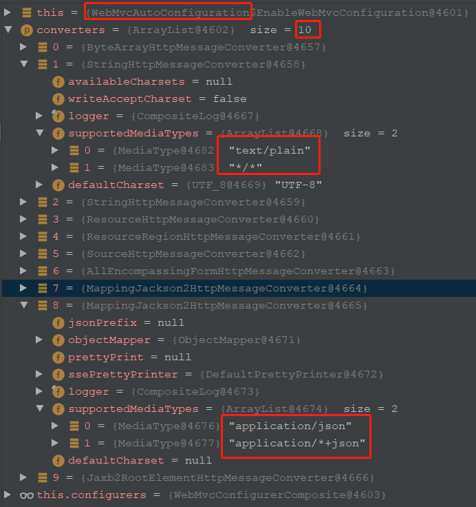

[https://docs.spring.io/spring-framework/docs/current/reference/html/web.html#mvc](https://docs.spring.io/spring-framework/docs/5.3.1/reference/html/web.html#mvc)

[w3cSchool spring-mvc中文文档](https://www.w3cschool.cn/spring_mvc_documentation_linesh_translation/spring_mvc_documentation_linesh_translation-dgcm27r3.htm)

# WebMvcConfigurer

*@EnableWebMvc会import导入*DelegatingWebMvcConfiguration类，这个类继承了WebMvcConfigurationSupport，并且持有WebMvcConfigurerComposite属性，

```java
class WebMvcConfigurerComposite implements WebMvcConfigurer {
    
    // 持有所有的WebMvcConfigurer实现，包括自定义的
    private final List<WebMvcConfigurer> delegates = new ArrayList<>();


    public void addWebMvcConfigurers(List<WebMvcConfigurer> configurers) {
        if (!CollectionUtils.isEmpty(configurers)) {
            this.delegates.addAll(configurers);
        }
    }
}
```

所以我们只需要实现自己的WebMvcConfigurer，去定义自己的配置即可。

接下来我们看下WebMvcConfigurer提供了哪些配置接口出来：

```java
public interface WebMvcConfigurer {
    
    /**
    * 用来配置HandlerMappings时的斜杠支持，后缀，路径匹配等等
    **/
    default void configurePathMatch(PathMatchConfigurer configurer) {
    }
    /**
     * 配置Convert和Formatter
     */
    default void addFormatters(FormatterRegistry registry) {
    }
    
    /**
     * 
     */
    default void addInterceptors(InterceptorRegistry registry) {
    }
    
    /**
    * 配置HttpMessageConverter用来解析request和responsede body的读和写。
    * 新的List会覆盖默认的，如果不想覆盖使用下面的extendMessageConverters   
    **/
    default void configureMessageConverters(List<HttpMessageConverter<?>> converters) {
    }
    default void extendMessageConverters(List<HttpMessageConverter<?>> converters) {
    }
}    
```


# RequestMappingHandlerAdapter

这个类主要实现了HandlerAdapter，InitializingBean和Order接口。用来服务支撑*@RequestMapping修饰的方法，*

*支持自定义参数解析器（**setCustomArgumentResolvers**）和返回值处理器（**setCustomReturnValueHandlers**），也可以重新配置，装饰已有的参数解析器和返回值处理器。*


## 1. 初始化所有的HandlerMethodArgumentResolver和HandlerMethodReturnValueHandler。

```java
@Override
public void afterPropertiesSet() {
    // Do this first, it may add ResponseBody advice beans
    initControllerAdviceCache();

    if (this.argumentResolvers == null) {
        List<HandlerMethodArgumentResolver> resolvers = getDefaultArgumentResolvers();
        this.argumentResolvers = new HandlerMethodArgumentResolverComposite().addResolvers(resolvers);
    }
    if (this.initBinderArgumentResolvers == null) {
        List<HandlerMethodArgumentResolver> resolvers = getDefaultInitBinderArgumentResolvers();
        this.initBinderArgumentResolvers = new HandlerMethodArgumentResolverComposite().addResolvers(resolvers);
    }
    if (this.returnValueHandlers == null) {
        List<HandlerMethodReturnValueHandler> handlers = getDefaultReturnValueHandlers();
        this.returnValueHandlers = new HandlerMethodReturnValueHandlerComposite().addHandlers(handlers);
    }
}
/**
* Return the list of return value handlers to use including built-in and
* custom handlers provided via {@link #setReturnValueHandlers}.
*/
private List<HandlerMethodReturnValueHandler> getDefaultReturnValueHandlers() {
    List<HandlerMethodReturnValueHandler> handlers = new ArrayList<>(20);

    // Single-purpose return value types
    handlers.add(new ModelAndViewMethodReturnValueHandler());
    handlers.add(new ModelMethodProcessor());
    handlers.add(new ViewMethodReturnValueHandler());
    handlers.add(new ResponseBodyEmitterReturnValueHandler(getMessageConverters(),
                                                           this.reactiveAdapterRegistry, this.taskExecutor, this.contentNegotiationManager));
    handlers.add(new StreamingResponseBodyReturnValueHandler());
    handlers.add(new HttpEntityMethodProcessor(getMessageConverters(),
                                               this.contentNegotiationManager, this.requestResponseBodyAdvice));
    handlers.add(new HttpHeadersReturnValueHandler());
    handlers.add(new CallableMethodReturnValueHandler());
    handlers.add(new DeferredResultMethodReturnValueHandler());
    handlers.add(new AsyncTaskMethodReturnValueHandler(this.beanFactory));

    // Annotation-based return value types
    handlers.add(new ModelAttributeMethodProcessor(false));
    handlers.add(new RequestResponseBodyMethodProcessor(getMessageConverters(),
                                                        this.contentNegotiationManager, this.requestResponseBodyAdvice));

    // Multi-purpose return value types
    handlers.add(new ViewNameMethodReturnValueHandler());
    handlers.add(new MapMethodProcessor());

    // Custom return value types
    if (getCustomReturnValueHandlers() != null) {
        handlers.addAll(getCustomReturnValueHandlers());
    }

    // Catch-all
    if (!CollectionUtils.isEmpty(getModelAndViewResolvers())) {
        handlers.add(new ModelAndViewResolverMethodReturnValueHandler(getModelAndViewResolvers()));
    }
    else {
        handlers.add(new ModelAttributeMethodProcessor(true));
    }

    return handlers;
}
/**
* Return the list of argument resolvers to use including built-in resolvers
* and custom resolvers provided via {@link #setCustomArgumentResolvers}.
*/
private List<HandlerMethodArgumentResolver> getDefaultArgumentResolvers() {
    List<HandlerMethodArgumentResolver> resolvers = new ArrayList<>(30);

    // Annotation-based argument resolution
    resolvers.add(new RequestParamMethodArgumentResolver(getBeanFactory(), false));
    resolvers.add(new RequestParamMapMethodArgumentResolver());
    resolvers.add(new PathVariableMethodArgumentResolver());
    resolvers.add(new PathVariableMapMethodArgumentResolver());
    resolvers.add(new MatrixVariableMethodArgumentResolver());
    resolvers.add(new MatrixVariableMapMethodArgumentResolver());
    resolvers.add(new ServletModelAttributeMethodProcessor(false));
    resolvers.add(new RequestResponseBodyMethodProcessor(getMessageConverters(), this.requestResponseBodyAdvice));
    resolvers.add(new RequestPartMethodArgumentResolver(getMessageConverters(), this.requestResponseBodyAdvice));
    resolvers.add(new RequestHeaderMethodArgumentResolver(getBeanFactory()));
    resolvers.add(new RequestHeaderMapMethodArgumentResolver());
    resolvers.add(new ServletCookieValueMethodArgumentResolver(getBeanFactory()));
    resolvers.add(new ExpressionValueMethodArgumentResolver(getBeanFactory()));
    resolvers.add(new SessionAttributeMethodArgumentResolver());
    resolvers.add(new RequestAttributeMethodArgumentResolver());

    // Type-based argument resolution
    resolvers.add(new ServletRequestMethodArgumentResolver());
    resolvers.add(new ServletResponseMethodArgumentResolver());
    resolvers.add(new HttpEntityMethodProcessor(getMessageConverters(), this.requestResponseBodyAdvice));
    resolvers.add(new RedirectAttributesMethodArgumentResolver());
    resolvers.add(new ModelMethodProcessor());
    resolvers.add(new MapMethodProcessor());
    resolvers.add(new ErrorsMethodArgumentResolver());
    resolvers.add(new SessionStatusMethodArgumentResolver());
    resolvers.add(new UriComponentsBuilderMethodArgumentResolver());

    // Custom arguments
    if (getCustomArgumentResolvers() != null) {
        resolvers.addAll(getCustomArgumentResolvers());
    }

    // Catch-all
    resolvers.add(new RequestParamMethodArgumentResolver(getBeanFactory(), true));
    resolvers.add(new ServletModelAttributeMethodProcessor(true));

    return resolvers;
}
```

## 2. 配置自定义的参数解析器和返回值处理器

```java
/**
* Provide resolvers for custom argument types. Custom resolvers are ordered
* after built-in ones. To override the built-in support for argument
* resolution use {@link #setArgumentResolvers} instead.
* 添加自定义的customArgumentResolvers，它的执行在内置的后面
*
**/
public void setCustomArgumentResolvers(@Nullable List<HandlerMethodArgumentResolver> argumentResolvers) {
    this.customArgumentResolvers = argumentResolvers;
}

/**
* 拿到内置的参数解析器列表，从而进行装饰加强，或覆盖
*/
public void setArgumentResolvers(@Nullable List<HandlerMethodArgumentResolver> argumentResolvers) {
    if (argumentResolvers == null) {
        this.argumentResolvers = null;
    }
    else {
        this.argumentResolvers = new HandlerMethodArgumentResolverComposite();
        this.argumentResolvers.addResolvers(argumentResolvers);
    }
}


/**
* 添加自定义的返回值处理器列表
*/
public void setCustomReturnValueHandlers(@Nullable List<HandlerMethodReturnValueHandler> returnValueHandlers) {
    this.customReturnValueHandlers = returnValueHandlers;
}

/**
* 拿到内置的返回值处理器列表，从而进行装饰加强，或覆盖
*/
public void setReturnValueHandlers(@Nullable List<HandlerMethodReturnValueHandler> returnValueHandlers) {
    if (returnValueHandlers == null) {
        this.returnValueHandlers = null;
    }
    else {
        this.returnValueHandlers = new HandlerMethodReturnValueHandlerComposite();
        this.returnValueHandlers.addHandlers(returnValueHandlers);
    }
}
```

## 3. 设置setRequestBodyAdvice和setResponseBodyAdvice

用来在responseBody转换之前的拦截通知。比如添加统一的返回对象

```java
/**
* Add one or more {@code RequestBodyAdvice} instances to intercept the
* request before it is read and converted for {@code @RequestBody} and
* {@code HttpEntity} method arguments.
*/
public void setRequestBodyAdvice(@Nullable List<RequestBodyAdvice> requestBodyAdvice) {
    if (requestBodyAdvice != null) {
        this.requestResponseBodyAdvice.addAll(requestBodyAdvice);
    }
}

/**
* Add one or more {@code ResponseBodyAdvice} instances to intercept the
* response before {@code @ResponseBody} or {@code ResponseEntity} return
* values are written to the response body.
*/
public void setResponseBodyAdvice(@Nullable List<ResponseBodyAdvice<?>> responseBodyAdvice) {
    if (responseBodyAdvice != null) {
        this.requestResponseBodyAdvice.addAll(responseBodyAdvice);
    }
}
```


# 1. filter

spring-web提供了几个有用的filter：

#### FormContentFilter

浏览器只能提交GET，POST方式的请求，非浏览器端可以使用如PUT，PATCH，DELETE等方式的请求。但是 Servlet API 的ServletRequest.getParameter*()方法只能支持POST HTTP。

spring web提供了FormContentFilter，拦截content type为application/x-www-form-urlencodedPUT,PATCH，DELETE请求，从request body中读取数据，封装起来，使得 Servlet API 的ServletRequest.getParameter*()方法可以使用。

#### Forwarded Headers

一个请求经过代理如负载均衡后，他的host，post等可能发生改变，这时想要获取正确的原始地址就十分困难。

所以定义了forward header来存放原始的请求信息，如`X-Forwarded-Host`, `X-Forwarded-Port`, `X-Forwarded-Proto`, `X-Forwarded-Ssl`, and `X-Forwarded-Prefix。`

ForwardedHeaderFilter可以基于forward header修改请求的host，port，schema,并且去除这些header。这个filter会包装request，所以他必须在其他filter之前，如RequestContextFilter。

#### ShallowEtagHeaderFilter

通过Etag，如果请求的内容没有发生改变，返回304。

#### CorsFilter

spring mvc提供了细粒度 的CORS支持，可以在controller方法上添加注解的方式。

注意如果使用Spring Security框架，注意CorsFilter保持在spring security的filter前面


另外，spring mvc中的过滤器基本都继承自OncePerRequestFilter，这个接口好好看看。自己写的filter也可以继承这个类


# 2. HttpMessageConverter

这篇文章介绍springmvc中的HttpMessageConverter，它负责将http请求中进行java object和json,xml之间的转换。

***client和server之间的通信***：

每个HttpMessageConverter实现类都有支持的MIME Types。当接收到一个http请求时，spring会根据request header里的accept决定返回什么格式的内容。然后寻找MIME Type对应的HttpMessageConverter，利用它将entity进行转换返回。

如果请求的body里是json数据，spring会根据Content-Type的application/json，来寻找一个*HttpMessageConverter来*解析request body的json反序列化为java object。


默认启用的HttpMessageConverter有10个：



# 传输json

@*ResponseBody* 会将controller方法的返回值序列化为json写入到response。

MappingJackson2HttpMessageConverter是我们最常用的，*主要用来json的转换，可以是指定的类型，也可以是无类型的如map。默认支持的**MediaType是**application/json*  *application/\*+json with* *UTF-8，可以进行修改配置。*

*其他的MediaType由其他默认的HttpMessageConverter负责转换：*

*


*使用的json转换是利用*`com.fasterxml.jackson.databind.ObjectMapper`，通常我们能做的也就是定义自己的ObjectMapper，来配置我们自己的特殊的json转换。比如定义自己的JavaTimeModule。spring5.0已经支持LocalDateTime，所有RequestBody里的LocalDateTime可以正常反序列化。

所以，*HttpMessageConverter作用的范围也就是@RequestBody和@ResponseBody这两个需要json序列化和反序列化的地方??*

