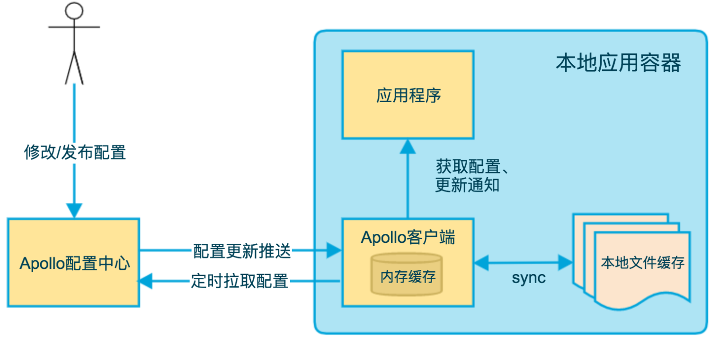
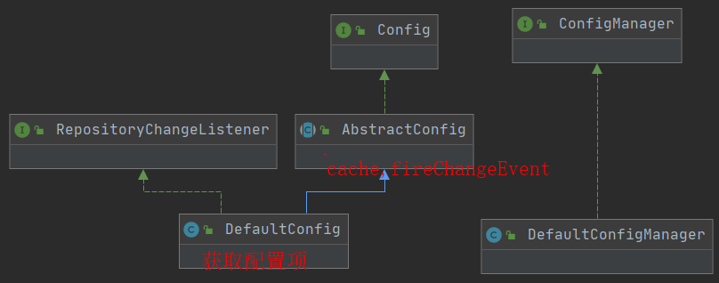

Apollo是目前比较流行的分布式配置中心解决方案，韵达，掌门，携程都在使用。其他的解决方案还有Springcloud config , nacos等。

Apollo相比于其他解决方案，特有的优点是支持灰度发布，权限控制完善(修改和发布权限分离)，适合公司项目和人数较多的情况。


# 1. 部署使用

**安装启动**

Apollo分为服务端和客户端。

服务端只需要依赖mysql，导入portalDB和ConfigDB两个数据库脚本。然后分别启动configService，adminService, Portal三个服务。[安装指南](https://www.apolloconfig.com/#/zh/deployment/quick-start?id=%e4%ba%8c%e3%80%81%e5%ae%89%e8%a3%85%e6%ad%a5%e9%aa%a4)


configView.memberOnly.env设置为pro，可以配置只有项目管理员和具有发布修改的人才能查看私有的namespace。对敏感配置可以考虑开启[访问秘钥](https://github.com/ctripcorp/apollo/wiki/Apollo使用指南#62-配置访问秘钥)，从而只有经过身份验证的客户端才能访问敏感配置

>dev,test,uat,prod四套环境因为物理环境分隔，所以部署了四套。都还是注册到eureka上，每个服务配置文件apollo-env.properties`里配置也都是fat.meta=http://fat-apollo-config.com
>uat.meta=http://uat.apollo-config.com`等，这个地址也就是config Service服务域名，也可以直接访问到eureka的。


# 2. 总体设计

配置是独立应用程序的只读变量，伴随应用的整个生命周期，应该有多个加载方式，并需要进行权限和不同环境集群的管理

application ：应用

environment： 不同的环境env：如prod，uat，staging，dev

cluster：一般用在不同数据中心，一个environment可以包含多个cluster

namespace：是配置项的集合，也就是对应一个个的配置文件。 分为私有配置和公有配置，如db-conn，Redis-conn。默认的名字是application。


apollo的总体设计如下图：


- Config Service提供配置的读取、推送等功能，服务对象是Apollo客户端
- Admin Service提供配置的修改、发布等功能，服务对象是Apollo Portal（管理界面）
- Config Service和Admin Service都是多实例、无状态部署，所以需要将自己注册到Eureka中并保持心跳
- 在Eureka之上我们架了一层Meta Server用于封装Eureka的服务发现接口，Client通过域名访问Meta Server获取Config Service服务列表（IP+Port），而后直接通过IP+Port访问服务，同时在Client侧会做load balance、错误重试。Portal通过域名访问Meta Server获取Admin Service服务列表（IP+Port），而后直接通过IP+Port访问服务，同时在Portal侧会做load balance、错误重试。为了简化部署，我们实际上会把Config Service、Eureka和Meta Server三个逻辑角色部署在同一个JVM进程中

### Config Service

- 提供配置获取接口
- 提供配置更新推送接口（基于Http long polling 长连接轮询）

- - 服务端使用[Spring DeferredResult](http://docs.spring.io/spring/docs/current/javadoc-api/org/springframework/web/context/request/async/DeferredResult.html)实现异步化，从而大大增加长连接数量
  - 目前使用的tomcat embed默认配置是最多10000个连接（可以调整），使用了4C8G的虚拟机实测可以支撑10000个连接，所以满足需求（一个应用实例只会发起一个长连接）。

- 接口服务对象为Apollo客户端

### Admin Service

- 提供配置管理接口
- 提供配置修改、发布等接口
- 接口服务对象为Portal

### Meta Server

- Portal通过域名访问Meta Server获取Admin Service服务列表（IP+Port）
- Client通过域名访问Meta Server获取Config Service服务列表（IP+Port）
- Meta Server从Eureka获取Config Service和Admin Service的服务信息，相当于是一个Eureka Client
- **增设一个Meta Server的角色主要是为了封装服务发现的细节，对Portal和Client而言，永远通过一个Http接口获取Admin Service和Config Service的服务信息，而不需要关心背后实际的服务注册和发现组件**
- Meta Server只是一个逻辑角色，在部署时和Config Service是在一个JVM进程中的，所以IP、端口和Config Service一致

### Eureka

- 基于[Eureka](https://github.com/Netflix/eureka)和[Spring Cloud Netflix](https://cloud.spring.io/spring-cloud-netflix/)提供服务注册和发现
- Config Service和Admin Service会向Eureka注册服务，并保持心跳
- 为了简单起见，目前Eureka在部署时和Config Service是在一个JVM进程中的（通过Spring Cloud Netflix）

### Portal

- 提供Web界面供用户管理配置
- 通过Meta Server获取Admin Service服务列表（IP+Port），通过IP+Port访问服务
- 在Portal侧做load balance、错误重试

### Client

- Apollo提供的客户端程序，为应用提供配置获取、实时更新等功能
- 通过Meta Server获取Config Service服务列表（IP+Port），通过IP+Port访问服务
- 在Client侧做load balance、错误重试


模块划分：


##  其他设计


Audit是操作记录的模型，可以进行操作的审计


## apollo的高可用设计

分布式配置中心是微服务中非常重要的服务，必须要保证高可用性，Apollo是如何保证高可用的呢？

configService多实例无状态部署，某台下线没有影响，所有的configService都下线会造成客户端无法读取最新配置，不过可以去本地缓存获取配置。

aadminService多实例无状态部署，某台下线没有影响，所有都下线会造成portal无法更新配置。同理所有portal服务下线也会造成用户无法更新配置。

数据库宕机，用户无法修改配置，configService配置有缓存，客户端仍可以来查询配置。

## Apollo的监控

Apollo内置支持cat，但是只有在classpath扫描到cat的依赖才会启用。

可以定制扩展接入时序数据库，如InfluxDB等。

可以自己定制开发，记录一些关键指标，如接入应用数量，配置项数量，变更和发布数量，推送拉取次数，ConfigService服务的接口性能，GC，CPU等

# 3. 配置发布通知流程


>Admin Service 在配置发布后，需要通知所有的 Config Service 有配置发布，从而 Config Service 可以通知对应的客户端来拉取最新的配置。
>
>从概念上来看，这是一个典型的**消息使用场景**，Admin Service 作为 **producer** 发出消息，各个Config Service 作为 **consumer** 消费消息。通过一个**消息组件**（Message Queue）就能很好的实现 Admin Service 和 Config Service 的解耦。
>
>在实现上，考虑到 Apollo 的实际使用场景，以及为了**尽可能减少外部依赖**，我们没有采用外部的消息中间件，而是通过**数据库实现了一个简单的消息队列**。
>
>实现方式如下：
>
>1. Admin Service 在配置发布后会往 ReleaseMessage 表插入一条消息记录，消息内容就是配置发布的 AppId+Cluster+Namespace ，参见 DatabaseMessageSender 。
>2. Config Service 有一个线程会每秒扫描一次 ReleaseMessage 表，看看是否有新的消息记录，参见 ReleaseMessageScanner 。
>3. Config Service 如果发现有新的消息记录，那么就会通知到所有的消息监听器（ReleaseMessageListener），如 NotificationControllerV2 ，消息监听器的注册过程参见 ConfigServiceAutoConfiguration 。
>4. NotificationControllerV2 得到配置发布的 **AppId+Cluster+Namespace** 后，会通知对应的客户端。

## 1. 配置发布，ReleaseMessage表插入一条记录

1. 用户在页面修改配置后，会通过portal服务调用adminService服务的ItemController.create()接口，保存修改后最新的配置项到item表

2. 然后点击发布，会调用portal里的`ReleaseController.createRelease()`方法，里面先调用adminService服务的ReleaseController，然后会发布event出去，方便做些hook如发邮件，发个MQ消息。
   
3. adminService服务的`ReleaseController.publish()`接口：

   1. 先去检查namespace对应的锁是否被锁住（数据库namespacelock表实现的)，把对应的items转成json，保存到Release和releaseHistory表，这其中涉及到父namespace和子namespace灰度发布稍微复杂点。
   2. 然后调用`DatabaseMessageSender.sendMessage()`发送配置变更消息，也就是在ReleaseMessage表添加一条记录，如下表。利用id字段可以唯一表示这个nameSpace是否发生变更，client可以在请求时使用这个id作为版本号来判断是否发生了配置变更。

   | Id   | Message                  | DataChange_LastTime |
   | ---- | ------------------------ | ------------------- |
   | 29   | 1212+default+application | 2020-10-02 06:00:38 |

   另外为了防止ReleaseMessage表无限增长，会插一条记录到阻塞队列BlockingQueue里，后台线程会去轮询取出判断清空表。

## 2. 定时扫描ReleaseMessage表，发布变更消息给listener

ReleaseMessageScanner初始化了一个定时任务线程池，每隔1秒去获取最新的500条数据，然后循环发送ReleaseMessage给每个 ReleaseMessageListener处理。

```java
@Bean
public ReleaseMessageScanner releaseMessageScanner() {
    ReleaseMessageScanner releaseMessageScanner = new ReleaseMessageScanner();
    //0. handle release message cache 缓存Map<message, releaseMessage>
  			      releaseMessageScanner.addMessageListener(releaseMessageServiceWithCache);
    //1. handle gray release rule
    releaseMessageScanner.addMessageListener(grayReleaseRulesHolder);
    //2. handle server cache
    releaseMessageScanner.addMessageListener(configService);
    releaseMessageScanner.addMessageListener(configFileController);
    //3. notify clients
    releaseMessageScanner.addMessageListener(notificationControllerV2);
    releaseMessageScanner.addMessageListener(notificationController);
    return releaseMessageScanner;
}
```

## 3.服务端挂起请求，异步返回response

客户端每60秒来调用NotificationControllerV2.pollNotification()接口，服务端利用DeferredResult把请求挂起60秒，不立即返回response而是保存到一个map里。在listener的handMessage中有另外的线程中会在接收到相应的变更消息后,调用对应的DeferredResult.setResult()，立即返回response。


# 4. Apollo-client解析

## Apollo-client启动流程

spring.factories文件里指定了两个Spring的配置类：

```java
org.springframework.boot.autoconfigure.EnableAutoConfiguration=\
com.ctrip.framework.apollo.spring.boot.ApolloAutoConfiguration
org.springframework.context.ApplicationContextInitializer=\
com.ctrip.framework.apollo.spring.boot.ApolloApplicationContextInitializer
org.springframework.boot.env.EnvironmentPostProcessor=\
com.ctrip.framework.apollo.spring.boot.ApolloApplicationContextInitializer
```


### 1. 在Environment阶段注入apollo重要属性

​	ApolloApplicationContextInitializer implements EnvironmentPostProcessor接口，它的postProcessEnvironment()方法把apollo系统属性（如appId）从环境变量中加载到系统属性里。

​	还提供了一个功能，如果开启了apollo.bootstrap.eagerLoad.enabled，就去急切的初始化namespace（即下面提到的），在日志系统加载前先读取Apollo配置。

```java
@Override
public void postProcessEnvironment(ConfigurableEnvironment configurableEnvironment, SpringApplication springApplication) {
    // 先把一些apollo必需的属性先加载进来,这个方法不管什么配置方式都会执行，此时容器还没启动
    // should always initialize system properties like app.id in the first place
    initializeSystemProperty(configurableEnvironment);

    // 如果开启了apollo.bootstrap.eagerLoad.enabled = true
    if (bootstrapEnabled && eagerLoadEnabled) {
        // 先去执行initialize方法初始化apollo配置，（可实现在日志系统加载之前就注入属性值）
        initialize(configurableEnvironment);
    }
}

void initializeSystemProperty(ConfigurableEnvironment environment) {
    for (String propertyName : APOLLO_SYSTEM_PROPERTIES) {
        // 从环境变量environment中把值填充进SystemProperty，直接从environment获取不好吗
        String propertyValue = environment.getProperty(propertyName);
        System.setProperty(propertyName, propertyValue);
    }
}
```

### 2. 在容器ApplicationContextInitializer阶段注册property sources

> ApplicationContextInitializer名为初始化ApplicationContext，在ConfigurableApplicationContext.refresh()之前执行，一般用于注册property sources或者激活profiles

ApplicationContextInitializer.initialize()方法中，如果配置文件配置了apollo.bootstrap.enabled=true，会把配置文件`apollo.bootstrap.namespaces=application,mq`里指定的所有namespace—>config—>ConfigPropertySource添加到environment的PropertySources中（name为ApolloBootstrapPropertySources，顺序为第一个）。

如果没有通过配置文件的方式指定`apollo.bootstrap.namespaces=application,mq`，而是通过@EnableApolloConfig(value="application")，则下面的@EnableApolloConfig会进行处理。也就是支持两种方式配置namespaces


### 3. 注册各种BeanDefinitions

ApolloAutoConfiguration负责自动配置，条件为apollo.bootstrap.enabled=true且@ConditionalOnMissingBean(PropertySourcesProcessor.class)

```java
@Configuration
@ConditionalOnProperty(PropertySourcesConstants.APOLLO_BOOTSTRAP_ENABLED) // 开启apollo.bootstrap.enabled=true
@ConditionalOnMissingBean(PropertySourcesProcessor.class) // 只有没有配置PropertySourcesProcessor时，才会开启自动配置
public class ApolloAutoConfiguration {
  @Bean
  public ConfigPropertySourcesProcessor configPropertySourcesProcessor() {
    return new ConfigPropertySourcesProcessor();
  }
}
```

它会生成一个Bean即ConfigPropertySourcesProcessor ，它委托ConfigPropertySourcesProcessorHelper注册多个BeanDefinition，比下面提到的DefaultApolloConfigRegistrarHelper少注册了个PropertySourcesProcessor。因为ConfigPropertySourcesProcessor extends PropertySourcesProcessor，本身就已经是个PropertySourcesProcessor了。

```java
public class ConfigPropertySourcesProcessor extends PropertySourcesProcessor
    implements BeanDefinitionRegistryPostProcessor {

  private ConfigPropertySourcesProcessorHelper helper = ServiceBootstrap.loadPrimary(ConfigPropertySourcesProcessorHelper.class);

  @Override
  public void postProcessBeanDefinitionRegistry(BeanDefinitionRegistry registry) throws BeansException {
    helper.postProcessBeanDefinitionRegistry(registry);
  }
}
```

**注解配置**

如果使用了@EnableApolloConfig注解，上面的自动配置就会失效。它Import 实现了ImportBeanDefinitionRegistrar接口的ApolloConfigRegistrar，里面委托DefaultApolloConfigRegistrarHelper注册多个BeanDefinition，如下：

```java
@Override
public void registerBeanDefinitions(AnnotationMetadata importingClassMetadata, BeanDefinitionRegistry registry) {
    AnnotationAttributes attributes = AnnotationAttributes
        .fromMap(importingClassMetadata.getAnnotationAttributes(EnableApolloConfig.class.getName()));
    // 解析EnableApolloConfig注解里配置的namespaces。生产中一般是在配置文件里指定要获取的namespaces
    String[] namespaces = attributes.getStringArray("value");
    int order = attributes.getNumber("order");
 PropertySourcesProcessor.addNamespaces(Lists.newArrayList(namespaces), order);

    // PropertySourcesPlaceholderConfigurer负责替换PlaceHolder为对应的属性值，要确保先执行
    Map<String, Object> propertySourcesPlaceholderPropertyValues = new HashMap<>();
    // to make sure the default PropertySourcesPlaceholderConfigurer's priority is higher than PropertyPlaceholderConfigurer
    propertySourcesPlaceholderPropertyValues.put("order", 0);
    BeanRegistrationUtil.registerBeanDefinitionIfNotExists(registry, PropertySourcesPlaceholderConfigurer.class.getName(),
        PropertySourcesPlaceholderConfigurer.class, propertySourcesPlaceholderPropertyValues);

    // 注册PropertySourcesProcessor，将@EnableApolloConfig注解里配置的namespaces集成到Spring的PropertySources里
    BeanRegistrationUtil.registerBeanDefinitionIfNotExists(registry, PropertySourcesProcessor.class.getName(), PropertySourcesProcessor.class);

    // 注册ApolloAnnotationProcessor，它负责解析@ApolloConfigChangeListener和@ApolloConfig
    BeanRegistrationUtil.registerBeanDefinitionIfNotExists(registry, ApolloAnnotationProcessor.class.getName(), ApolloAnnotationProcessor.class);

    // 注册SpringValueProcessor 它负责加载所有的SpringValue，解析@Value
    BeanRegistrationUtil.registerBeanDefinitionIfNotExists(registry, SpringValueProcessor.class.getName(),
        SpringValueProcessor.class);

    // 注册SpringValueDefinitionProcessor，用于xml配置的bean
    BeanRegistrationUtil.registerBeanDefinitionIfNotExists(registry, SpringValueDefinitionProcessor.class.getName(), SpringValueDefinitionProcessor.class);

    // 注册ApolloJsonValueProcessor，解析@ApolloJsonValue
    BeanRegistrationUtil.registerBeanDefinitionIfNotExists(registry, ApolloJsonValueProcessor.class.getName(), ApolloJsonValueProcessor.class);
}
```

> 以上的流程说明了同时支持xml配置和java配置两种配置方式。
>
> 如果是xml配置，则ApolloApplicationContextInitializer和ApolloAutoConfiguration生效；
>
> 如果是java配置即使用@EnableApolloConfig，则ApolloAutoConfiguration不再发挥作用，当然如果同时在xml和java中都指定了namespace，也没问题。




## 获取最新配置

客户端通过长轮询和定时拉取两种方式去服务端获取配置：


> 为什么不在推送时就返回具体配置信息？.
>
> 这样可以保持实时和设计上的简单。如果在推送中直接返回配置信息，会造成幂等性问题，消息丢失的问题（目前是单http连接，暂不用考虑顺序，但给以后设计如webSocket埋坑）；计算也比较复杂，还可能和定时轮询产生冲突造成双写。

**客户端和服务端保持长连接，实现配置更新的推送**

其中长连接实际上是通过Http Long Polling实现的，具体而言：

- RemoteConfigLongPollService发起一个Http请求到服务端，超时90秒
- 服务端不会立即返回结果，而是通过[Spring DeferredResult](http://docs.spring.io/spring/docs/current/javadoc-api/org/springframework/web/context/request/async/DeferredResult.html)把请求挂起60秒

  - 如果在60秒内有客户端关心的配置变化，实现了ReleaseMessageListener接口的NotificationControllerV2会调用对应的DeferredResult的[setResult](http://docs.spring.io/spring/docs/current/javadoc-api/org/springframework/web/context/request/async/DeferredResult.html#setResult-T-)方法，返回response。客户端从返回的结果中获取到配置变化的namespace后，会立即通知对应的RemoteConfigRepository请求服务端获取该namespace的最新配置。

  - 如果在60秒内没有客户端关心的配置变化，那么会返回Http状态码304给客户端
- 客户端在收到服务端请求后会立即重新发起连接，回到第一步

```java
// 开启长轮询线程任务
m_longPollingService.submit(new Runnable() {
    @Override
    public void run() {
        // 在上面延迟一定时候后，开启轮询
        doLongPollingRefresh(appId, cluster, dataCenter, secret);
    }
});

private void doLongPollingRefresh(String appId, String cluster, String dataCenter, String secret) {
    final Random random = new Random();
    ServiceDTO lastServiceDto = null;
    // 循环不停执行，发出长轮询请求
    while (!m_longPollingStopped.get() && !Thread.currentThread().isInterrupted()) {
        if (!m_longPollRateLimiter.tryAcquire(5, TimeUnit.SECONDS)) {
            //wait at most 5 seconds
            try {
                TimeUnit.SECONDS.sleep(5);
            } catch (InterruptedException e) {
            }
        }
        String url = null;
        try {
            // 如果lastServiceDto不为空，就用上次的config服务地址。否则随机选取一个，实现负载均衡
            if (lastServiceDto == null) {
                List<ServiceDTO> configServices = getConfigServices();
                // list中随机取一个 random.nextInt
                lastServiceDto = configServices.get(random.nextInt(configServices.size()));
            }

            url = assembleLongPollRefreshUrl(lastServiceDto.getHomepageUrl(), appId, cluster, dataCenter,
                                             m_notifications);
            logger.debug("Long polling from {}", url);

            HttpRequest request = new HttpRequest(url);
            // 设置客户端的过期时间 90秒。服务端会60内返回。这里也是服务端不能超过90秒的原因
            request.setReadTimeout(LONG_POLLING_READ_TIMEOUT);

            // 这里发出了请求，得到response
            final HttpResponse<List<ApolloConfigNotification>> response = m_httpUtil.doGet(request, m_responseType);
            logger.debug("Long polling response: {}, url: {}", response.getStatusCode(), url);
            if (response.getStatusCode() == 200 && response.getBody() != null) {
                // 去通知变更
                notify(lastServiceDto, response.getBody());
            }

            //try to load balance 随机重置lastServiceDto，
            if (response.getStatusCode() == 304 && random.nextBoolean()) {
                lastServiceDto = null;
            }
            m_longPollFailSchedulePolicyInSecond.success();
        } catch (Throwable ex) {
            try {
                TimeUnit.SECONDS.sleep(sleepTimeInSecond);
            } catch (InterruptedException ie) {
            }
        }
    }
}
```

**客户端定时拉取最新配置**

这是一个fallback机制，为了防止推送机制失效导致配置不更新

客户端定时拉取并上报本地版本，一般情况下，对于定时拉取的操作，服务端都会返回304 - Not Modified。定时频率默认为每5分钟拉取一次，也可以通过指定System Property: `apollo.refreshInterval`来覆盖，单位为分钟。

```java
// 每5分钟执行，去拉取apollo最新配置
m_executorService.scheduleAtFixedRate(
    new Runnable() {
        @Override
        public void run() {
            trySync();
        }
    }, m_configUtil.getRefreshInterval(), m_configUtil.getRefreshInterval(),
    m_configUtil.getRefreshIntervalTimeUnit());
```

## 实时更新配置

先来了解下面几个概念：

我们在使用apollo时，经常使用到下面方式获取config：

```java
Config config = ConfigService.getAppConfig(); // 这个就是去获取默认的getConfig("application")
Config config = ConfigService.getConfig(namespace);

// 或者属性注入的方式获取
@ApolloConfig
private Config config;
```

ConfigService相当于工具类，主要提供了getConfig(String namespace)和getAppConfig()方法。

它委托ConfigManager的实现类DefaultConfigManager.Map<namespace, Config>保存了所有namespace及其对应的Config，可以根据namespace返回对应的Config实例。为空则会利用ConfigFactoryManager找到对应的ConfigFactory去创建namespace对应的Config。

```java
public class DefaultConfigManager implements ConfigManager {
  private ConfigFactoryManager m_factoryManager;

  // 保存所有namespace及其对应的Config
  private Map<String, Config> m_configs = Maps.newConcurrentMap();
  private Map<String, ConfigFile> m_configFiles = Maps.newConcurrentMap();
    
  /**
	* ConfigService.getConfig()会委托这个类来寻找namespace对应的Config，
	*/
    @Override
    public Config getConfig(String namespace) {
        Config config = m_configs.get(namespace);

        if (config == null) {
            synchronized (this) {
                // 双重检查锁
                config = m_configs.get(namespace);

                if (config == null) {
                    ConfigFactory factory = m_factoryManager.getFactory(namespace);

                    config = factory.create(namespace);
                    m_configs.put(namespace, config);
                }
            }
        }

        return config;
    }
}

```


> SPI机制 (Service Provider Interface)，便于第三方或插件进项扩展添加自己的实现，提高扩展性。
>
> 相关接口为ConfigFactory，ConfigFactoryManager，ConfigRegistry，通过ConfigService类提供外部接口，具体来说是为指定namespace创建Config。

DefaultConfigFactory负责为指定namespace创建DefaultConfig，为其创建对应的configRepository，一般是upstream关联了RemoteConfigRepository的LocalFileConfigRepository。

```java
public class DefaultConfigFactory implements ConfigFactory {
  /**
   * 给指定namespace创建Config
   */
  @Override
  public Config create(String namespace) {
    ConfigFileFormat format = determineFileFormat(namespace);
    if (ConfigFileFormat.isPropertiesCompatible(format)) {
      return new DefaultConfig(namespace, createPropertiesCompatibleFileConfigRepository(namespace, format));
    }
    // 创建一个关联了RemoteConfigRepository的LocalFileConfigRepository
    return new DefaultConfig(namespace, new LocalFileConfigRepository(namespace, createRemoteConfigRepository(namespace)));
  }
}
```


实体映射关系为：

每个配置文件 —> namespace —> config  —> DefaultConfig —> LocalFileConfigRepository —> RemoteConfigRepository


**ConfigRepository**

是配置项来源的抽象，负责获取配置，并在配置更新时发出通知。


创建config时会创建对应的RemoteConfigRepository，在为指定namespace创建RemoteConfigRepository时，会初始化以下动作：

```java
public RemoteConfigRepository(String namespace) {
    // 初始化时先去拉取一次配置
    this.trySync();
    // 每隔5分钟去定时拉取
    this.schedulePeriodicRefresh();
    // 注册到RemoteConfigLongPollService进行长轮询
    this.scheduleLongPollingRefresh();
}
```


其中长轮询是委托给RemoteConfigLongPollService统一进行管理，长轮询接收到配置变更后（返回200表示有变化）去通知关心该namespace的RemoteConfigRepository.onLongPollNotified()。然后RemoteConfigRepository立即重新去trySync()拉取配置，在sync()获取到变化的配置后，会依次通知各个RepositoryChangeListener，listener目前只有LocalFileConfigRepository。

LocalFileConfigRepository在接收到RepositoryChange时，会替换掉缓存并持久到本地文件系统里，并也发出fireRepositoryChange，listener为下面提到的DefaultConfig。

**Config**

Config是配置文件的抽象，对应一个namespace，负责配置的读取查询和变更通知。configFile类似，只不过是文件级别的，用的不多不再赘述。



Config接口的抽象类AbstractConfig暴露了许多获取属性的方法，并做了缓存，还统一收口管理了ConfigChangeListener接口的实现类，在变更时进行通知。

AbstractConfig目前只有一个子类DefaultConfig，主要负责两件事情：一是实现了RepositoryChangeListener接口，在onRepositoryChange时来更新属性；二是实际负责获取属性（按照优先级去不同地方）


总结来说主要流程如下图：


其中DefaultConfig收到RepositoryChange消息，计算出来更新的配置，然后fireConfigChange发出ConfigChangeEvent事件，通知各个listener。这里的listener包含添加@ApolloConfigChangeListener注解的；用户自己实现ConfigChangeListener接口的；还有负责处理@Value属性的AutoUpdateConfigChangeListener。


**apollo是如何自动更新Spring Placeholder的@value的属性的呢**？

apollo在启动时，注册了一个SpringValueProcessor，它的父类abstract class ApolloProcessor实现了BeanPostProcessor，获取每个bean所有的Filed和Method属性。然后由子类SpringValueProcessor，遍历每个Field上是否有Value注解，获取placeholder里面的key，每个key对应一个SpringValue对象，然后注册到springValueRegistry，也就是说springValueRegistry持有了所有的SpringValue。

然后AutoUpdateConfigChangeListener实现了ConfigChangeListener接口，并持有springValueRegistry，所以在接收到DefaultConfig发布的配置变更后，循环遍历key，找到key对应的SpringValue，然后利用反射更新其值。

```java
public void update(Object newVal)  {
    if (isField()) {
      injectField(newVal);
    } else {
      injectMethod(newVal);
    }
  }

  private void injectField(Object newVal) throws IllegalAccessException {
    Object bean = beanRef.get();
    if (bean == null) {
      return;
    }
    // 通过反射的方式直接更新值。Accessible先设为true，再改回去
    boolean accessible = field.isAccessible();
    field.setAccessible(true);
    field.set(bean, newVal);
    field.setAccessible(accessible);
  }

  private void injectMethod(Object newVal)
      throws InvocationTargetException, IllegalAccessException {
    Object bean = beanRef.get();
    if (bean == null) {
      return;
    }
    methodParameter.getMethod().invoke(bean, newVal);
  }
```

> 但是这种方式有一个问题啊，apollo在初始化时是把配置属性集成到Spring的PropertySource 体系中的，但是上面的方式它是直接更新bean的属性值，并没有去更新PropertySource 体系中的值，也就是这时通过applicationContext.getEnvironment().getProperty(key)拿到的还是旧值（已验证确认）
>
> 不过springcloud提供了ContextRefresher.refresh()方法，里面`this.context.publishEvent(new EnvironmentChangeEvent(this.context, keys));`，spring会去重新加载配置

**Apollo config如何集成到Spring PropertySource 体系中**？

ConfigPropertySource继承了EnumerablePropertySource接口，是连接config和PropertySource接口的桥梁（PropertySource接口就是要求实现其getProperty()获取属性方法即可）。

一个ConfigPropertySource对应一个config，ConfigPropertySourceFactory注册了所有的ConfigPropertySource。在系统初始化时，ApolloApplicationContextInitializer和PropertySourcesProcessor会根据ConfigPropertySourceFactory拿到所有的ConfigPropertySource，然后注册到Spring的PropertySource 里`environment.getPropertySources().addFirst(composite)`。


# 从apollo源码可以学习借鉴什么？

集成Spring boot，如何读取配置文件，和@EnableApollo，如何动态注册Bean，如何使用BeanPostProcessor，如何动态修改Bean的属性值。

## Spring相关

- 如何利用注解赋予当前字段值

  ```java
  @Override
  protected void processField(Object bean, String beanName, Field field) {
      ApolloConfig annotation = AnnotationUtils.getAnnotation(field, ApolloConfig.class);
      Preconditions.checkArgument(Config.class.isAssignableFrom(field.getType()),
                                  "Invalid type: %s for field: %s, should be Config", field.getType(), field);
  
      // 将自定义注解中的值解析，注入对应字段
      String namespace = annotation.value();
      Config config = ConfigService.getConfig(namespace);
  
      // 通过反射工具将值赋予字段
      ReflectionUtils.makeAccessible(field);
      ReflectionUtils.setField(field, bean, config);
  }
  ```

- 在方法上添加的注解，监听到变更后执行本方法。类似@EventListener

  ```java
  // 示例
  @ApolloConfigChangeListener
  private void onChange1(ConfigChangeEvent changeEvent) {
      this.changeEvent1 = changeEvent;
  }
  
  @Override
  protected void processMethod(final Object bean, String beanName, final Method method) {
      ConfigChangeListener configChangeListener = new ConfigChangeListener() {
        @Override
        public void onChange(ConfigChangeEvent changeEvent) {
          // 也就是说onChange时会调用method
          ReflectionUtils.invokeMethod(method, bean, changeEvent);
        }
      }; 
  }
  ```

  

## 设计模式

- 观察者模式

  代码中使用到了大量的观察者模式，用以代码解耦。ReleaseMessageScanner扫描到releaseMessage变更后，发出event。DefaultConfig在判断configChange后，发出event，等等。

- 模板设计模式
    如config接口，在抽象类AbstractConfig定义一些通用的方法，中间某些关键的具体逻辑交给具体子类DefaultConfig来实现

- 工厂模式

    

    
    
    
## 编码技巧

- 使用java底层的http发出HTTP请求
- Spring的DeferredResult,实现将请求挂起，异步返回response。也是长轮询如何实现的例子！


部门OSS ak之前一直是明文配置在apollo上，管理不规范，一些开发甚至测试可能不小心造成泄漏。所以需要将其加密管理起来，利用jasypt，将密文ENC(密文)写在apollo里，将秘钥jasypt.encryptor.password在程序初始化时添加到environment的PropertySource中，第一位。这样程序就可以直接获取到明文了。

# 参考资料

[Apollo源码解析-芋道源码](https://www.iocoder.cn/categories/Apollo/)