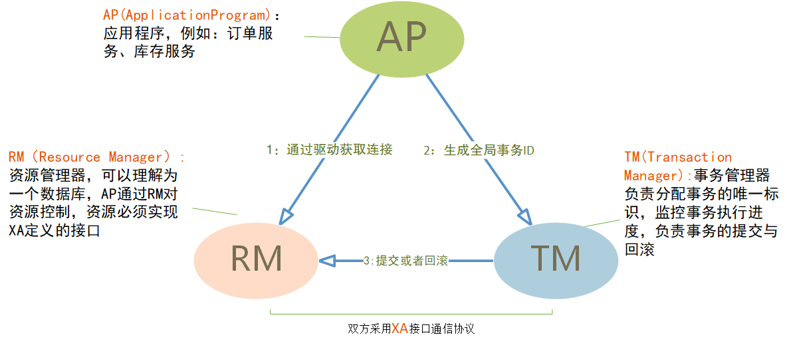

[IaaS，PaaS，SaaS 的区别](https://www.ruanyifeng.com/blog/2017/07/iaas-paas-saas.html)

- **IaaS**：基础设施服务，Infrastructure-as-a-service
- **PaaS**：平台服务，Platform-as-a-service
- **SaaS**：软件服务，Software-as-a-service

# 分布式系统

集中式系统是进行单机部署，难以维护，扩展性差，硬件能力受限。

分布式系统是一个硬件或软件组件分布在不同的网络计算机上，彼此之间仅仅通过消息传递进行通信和协调的系统。

**分布式和微服务**

现在流行的微服务是拆分成一个个独立的较小单元。分布式是部署分散在不同的机器上，一个服务可能负责好几个功能。生产环境下的微服务肯定是分布式部署的，但是分布式部署的应用不一定是微服务架构的，比如集群部署，它是把相同应用复制到不同服务器上，但是逻辑功能上还是单体应用。

微服务重在解耦合，使每个模块都独立，便于快速迭代和扩展。分布式重在降低对单个应用的硬件资源压力。分布式服务最后都会向微服务架构演化，这是一种趋势。

现在的网站服务基本都是分布式部署，采用一组计算机共同对外提供服务，将应用或服务进行分割，进行分布式部署，并且复用一些通用的服务模块，服务之间通过HTTP/MQ调用来实现通信。这样的好处是可以利用新的硬件提高并发能力，扩展性强。

分布式会带来很多问题：如分布式存储会比较麻烦，需要搭建分布式数据库，读写分离等

# CAP理论

CAP理论是开发或设计分布式系统时离不开的概念，一个分布式系统最多只能同时满足下面三项中的两项

强一致性Consistency

可用性Availability

分区容错性Partition tolerance

网络中有两个节点N1和N2，可以简单的理解N1和N2分别是两台计算机，他们之间网络可以连通，N1中有一个应用程序A，和一个数据库V，N2也有一个应用程序B和一个数据库V。现在，A和B是分布式系统的两个部分，V是分布式系统的数据存储的两个子数据库。

- 在满足一致性的时候，N1和N2中的数据是一样的，V0=V0。
- 在满足可用性的时候，用户不管是请求N1或者N2，都会得到立即响应。
- 在满足分区容错性的情况下，N1和N2有任何一方宕机，或者网络不通的时候，都不会影响N1和N2彼此之间的正常运作。

## 强一致性C

一致性指“all nodes see the same data at the same time”，即更新操作成功并返回客户端完成后，所有节点在同一时间的数据完全一致。**CAP里的一致性指的是强一致性**。

分布式的一致性

对于一致性，可以分为从客户端和服务端两个不同的视角。从客户端来看，一致性主要指的是多并发访问时更新过的数据如何获取的问题。从服务端来看，则是更新如何复制分布到整个系统，以保证数据最终一致。

一致性是因为有并发读写才有的问题，因此在理解一致性的问题时，一定要注意结合考虑并发读写的场景。

从客户端角度，多进程并发访问时，更新过的数据在不同进程如何获取的不同策略，决定了不同的一致性。

**三种一致性策略**

对于关系型数据库，要求更新过的数据能被后续的访问都能看到，这是强一致性。

如果能容忍后续的部分或者全部访问不到，则是弱一致性。

如果经过一段时间后要求能访问到更新后的数据，则是最终一致性。

## 可用性A

可用性指“Reads and writes always succeed”，即服务一直可用，而且是正常响应时间。

对于一个可用性的分布式系统，每一个非故障的节点必须对每一个请求作出响应。所以，一般我们在衡量一个系统的可用性的时候，都是通过停机时间来计算的。

| 可用性分类                   | 可用水平（%） | 年可容忍停机时间 |
| ---------------------------- | ------------- | ---------------- |
| 容错可用性                   | 99.9999       | <1 min           |
| 极高可用性                   | 99.999        | <5 min           |
| 具有故障自动恢复能力的可用性 | 99.99         | <53 min          |
| 高可用性                     | 99.9          | <8.8h            |
| 商品可用性                   | 99            | <43.8 min        |

通常我们描述一个系统的可用性时，我们说淘宝的系统可用性可以达到5个9，意思就是说他的可用水平是99.999%，即全年停机时间不超过 `(1-0.99999)*365*24*60 = 5.256 min`，这是一个极高的要求。

好的可用性主要是指系统能够很好的为用户服务，不出现用户操作失败或者访问超时等用户体验不好的情况。一个分布式系统，上下游设计很多系统如负载均衡、WEB服务器、应用代码、数据库服务器等，任何一个节点的不稳定都可以影响可用性。

## 分区容错性P

分区容错性指“the system continues to operate despite arbitrary message loss or failure of part of the system”，即尽管任意丢失信息或系统的一部分发生故障，系统仍能继续运行。

分区容错性和扩展性紧密相关。在分布式应用中，可能因为一些分布式的原因导致系统无法正常运转。好的分区容错性要求能够使应用虽然是一个分布式系统，而看上去却好像是在一个可以运转正常的整体。比如现在的分布式系统中有某个或者几个机器宕掉了，其他剩下的机器还能够正常运转满足系统需求，或者是机器之间有网络异常，将分布式系统分隔未独立的几个部分，各个部分还能维持分布式系统的运作，这样就具有好的分区容错性。

简单点说，就是在网络中断，消息丢失的情况下，系统如果还能正常工作，就是有比较好的分区容错性。

[CAP理论](https://mp.weixin.qq.com/s/DUOsYUTuKM6mhahqiaWXCA)

通过CAP理论及前面的证明，我们知道无法同时满足一致性、可用性和分区容错性这三个特性，那要舍弃哪个呢？

我们分三种情况来阐述一下。

### CA without P

这种情况在分布式系统中几乎是不存在的。首先在分布式环境下，网络分区是一个自然的事实。因为分区是必然的，所以如果舍弃P，意味着要舍弃分布式系统。那也就没有必要再讨论CAP理论了。这也是为什么在前面的CAP证明中，我们以系统满足P为前提论述了无法同时满足C和A。

比如我们熟知的关系型数据库，如My Sql和Oracle就是保证了可用性和数据一致性，但是他并不是个分布式系统。一旦关系型数据库要考虑主备同步、集群部署等就必须要把P也考虑进来。

Google的经验中得到的结论是，无法通过降低CA来提升P。要想提升系统的分区容错性，需要通过提升基础设施的稳定性来保障。所以，对于一个分布式系统来说。P是一个基本要求，只能在CA两者之间做权衡，并且要想尽办法提升P。

### CP without A

如果一个分布式系统不要求强的可用性，即容许系统停机或者长时间无响应的话，就可以在CAP三者中保障CP而舍弃A。一个保证了CP而一个舍弃了A的分布式系统，一旦发生网络故障或者消息丢失等情况，就要牺牲用户的体验，等待所有数据全部一致了之后再让用户访问系统。

设计成CP的系统其实也不少，其中最典型的就是很多分布式数据库，如Redis、HBase等，还有分布式系统中常用的Zookeeper，他们都是设计成CP的。在发生极端情况时，优先保证数据的强一致性，代价就是舍弃系统的可用性。

无论是像Redis、HBase这种分布式存储系统，还是像Zookeeper这种分布式协调组件。数据的一致性是他们最最基本的要求。一个连数据一致性都保证不了的分布式存储要他有何用？

ZooKeeper是个CP（一致性+分区容错性）的，即任何时刻对ZooKeeper的访问请求能得到一致的数据结果，同时系统对网络分割具备容错性。但是它不能保证每次服务请求的可用性，也就是在极端环境下，ZooKeeper可能会丢弃一些请求，消费者程序需要重新请求才能获得结果。ZooKeeper是分布式协调服务，它的职责是保证数据在其管辖下的所有服务之间保持同步、一致。所以就不难理解为什么ZooKeeper被设计成CP而不是AP特性的了。

### AP wihtout C

要高可用并允许分区，则需放弃一致性。一旦网络问题发生，节点之间可能会失去联系。为了保证高可用，需要在用户访问时可以马上得到返回，则每个节点只能用本地数据提供服务，而这样会导致全局数据的不一致性。

这种舍弃强一致性而保证系统的分区容错性和可用性的场景和案例非常多。前面我们介绍可用性的时候说到过，很多系统在可用性方面会做很多事情来保证系统的全年可用性可以达到N个9，所以，对于很多业务系统来说，比如淘宝的购物，12306的买票。都是在可用性和一致性之间舍弃了一致性而选择可用性。

你在12306买票的时候肯定遇到过这种场景，当你购买的时候提示你是有票的（但是可能实际已经没票了），你也正常的去输入验证码，下单了。但是过了一会系统提示你下单失败，余票不足。这其实就是先在可用性方面保证系统可以正常的服务，然后在数据的一致性方面做了些牺牲，会影响一些用户体验，但是也不至于造成用户流程的严重阻塞。

但是，我们说很多网站牺牲了一致性，选择了可用性，这其实也不准确的。就比如上面的买票的例子，其实舍弃的只是强一致性。**退而求其次保证了最终一致性**。也就是说，虽然下单的瞬间，关于车票的库存可能存在数据不一致的情况，但是过了一段时间，还是要保证最终一致性的。

对于多数大型互联网应用的场景，主机众多、部署分散，而且现在的集群规模越来越大，所以节点故障、网络故障是常态，而且要保证服务可用性达到N个9，即保证P和A，舍弃C（退而求其次保证最终一致性）。虽然某些地方会影响客户体验，但没达到造成用户流程的严重程度。

### 适合的才是最好的

上面介绍了如何CAP中权衡及取舍以及典型的案例。孰优孰略，没有定论，只能根据场景定夺，适合的才是最好的。

对于涉及到钱财这样不能有一丝让步的场景，C必须保证。网络发生故障宁可停止服务，舍弃A。比如前几年支付宝光缆被挖断的事件，在网络出现故障的时候，支付宝就在可用性和数据一致性之间选择了数据一致性，用户感受到的是支付宝系统长时间宕机，但是其实背后是无数的工程师在恢复数据，保证数据的一致性。

对于其他场景，比较普遍的做法是选择可用性和分区容错性，舍弃强一致性，退而求其次使用最终一致性来保证数据的安全。这其实是分布式领域的另外一个理论——BASE理论。

# BASE理论

> eBay的架构师Dan Pritchett源于对大规模分布式系统的实践总结，在ACM上发表文章提出BASE理论，BASE理论是对CAP理论的延伸，核心思想是即使无法做到强一致性（Strong Consistency，CAP的一致性就是强一致性），但应用可以采用适合的方式达到最终一致性（Eventual Consitency）。

BASE是指基本可用（Basically Available）、软状态（ Soft State）、最终一致性（ Eventual Consistency）。

### 基本可用（Basically Available）

基本可用是指分布式系统在出现故障的时候，允许损失部分可用性，即保证核心可用。

电商大促时，为了应对访问量激增，部分用户可能会被引导到降级页面，服务层也可能只提供降级服务。这就是损失部分可用性的体现。

### 软状态（ Soft State）

软状态是指允许系统存在中间状态，而该中间状态不会影响系统整体可用性。分布式存储中一般一份数据至少会有三个副本，允许不同节点间副本同步的延时就是软状态的体现。mysql replication的异步复制也是一种体现。

### 最终一致性（ Eventual Consistency）

最终一致性是指系统中的所有数据副本经过一定时间后，最终能够达到一致的状态。弱一致性和强一致性相反，最终一致性是弱一致性的一种特殊情况。

# 分布式事务解决方案

分布式一致性基本是指数据的一致性，单机系统可以通过事务和锁保证数据的ACID。而在分布式系统中，多个节点系统为了保持数据的一致和高可用，会将数据保留在不同机器上的多个副本。由于网络延时,被调用方出错等原因很容易存在数据不一致的情况。

CAP理论告诉我们任何分布式系统都无法同时满足CAP三个基本需求，但是无论如何取舍，都不能彻底放弃一致性，不然数据就是不可信的，这个系统也就没啥意义和价值了。CAP理论中的一致性指的是强一致性，还有弱一致性，最终一致性是弱一致性的特例。

为了解决这种分布式一致性问题，前人在性能和数据一致性的反反复复权衡过程中总结了许多典型的协议和算法。

## XA规范

XA是由X/Open组织提出的分布式事务的规范。XA规范主要定义了（全局）事务管理器（Transaction Manager）和（局部）资源管理器（Resource Manager）之间的接口，由数据库厂商提供。它包括以下几个角色：应用程序AP，事务管理器TM，资源管理器RM（数据库）。

基于定义的XA接口规范，衍生出两阶段提交和三阶段提交协议，是实现XA分布式事务的关键，保证了分布式事务的原子性，要么都成功要么都失败。

### 两阶段提交2PC

两阶段提交的算法基本思路是：

- 准备阶段
  1. 协调者向所有的参与者发送事务执行请求，并等待参与者反馈事务执行结果；
  2. 事务参与者收到请求之后，执行事务但不提交，并记录事务日志；
  3. 参与者将自己事务执行情况反馈给协调者，同时阻塞等待协调者的后续指令。

- 提交

  所有的参与者都回复能够正常执行事务：协调者将向所有的参与者发出提交通知；

  

  一个或多个参与者回复事务执行失败或者协调者等待超时：协调者发出回滚通知。

  

两阶段提交原理简单，但是存在很多缺点：

- **协调者单点故障**

- 参与者同步阻塞

  执行过程中，参与者在准备阶段执行并回复结果给协调者后就要等待协调者的最终决策，期间处于阻塞状态而不能从事其他操作，这样效率极其低下。

- 可能数据不一致

  例如TM发出commit通知后，前两个RM执行成功，第三个RM由于网络错误或者本身错误没有收到commit通知，就会一直阻塞并导致数据不一致。

所以在此基础上作了改进，引入了三阶段提交

### 三阶段提交3PC

三阶段提交有两个改动点 1.**引入参与者超时机制**，2.增加一个阶段

1. canCommit: 

   协调者会去询问各个参与者是否能够正常执行事务，参与者根据自身情况回复一个预估值，相对于真正的执行事务，这个过程是轻量的

2. preCommit: 

   如果参与者canCommit都返回Yes：协调者就向所有参与者发出事务执行的通知，参与者执行事务但并不提交，将执行情况返回协调者；

   如果存在参与者canCommit返回否定消息或者协调者等待超时：协调者就会认为事务无法正常执行，于是发出abort通知。

   

3. doCommit:  

   如果第二阶段事务未中断，那么本阶段协调者将会依据各个参与者的返回的事务执行结果来决定提交或回滚事务：

   如果所有参与者都返回能正常执行事务：协调者就发出commit通知，参与者提交事务，释放资源；

   如果一个或多个参与者返回执行事务失败或者协调者等待超时：协调者认为事务无法成功执行，于是发出回滚通知

   

​			如果本阶段参与者迟迟收不到协调者的消息，不会陷入阻塞，而是在等待超时后执行			commit。

**3PC相对于2PC有什么不同？**

多了can_commit阶段，先进行预检查（如果有不满足就不占用资源），减少了不必要的资源浪费（2PC是直接占用）；

2PC只有协调者超时，发出回滚指令；3PC引入参与者超时，参与者在do_commit阶段超时默认提交，解决了协调者单点故障的问题，

但是3PC仍然存在缺点：

- 也可能存在数据不一致问题：

  由于网络原因，协调者发送的rollback响应没有及时被参与者接收到，那么参与者在等待超时之后执行了commit操作。这样就和其他接到rollback命令并执行回滚的参与者之间存在数据不一致的情况

我们可以发现，无论是二阶段提交还是三阶段提交都无法彻底解决分布式的一致性问题。Google Chubby的作者Mike Burrows说过， `there is only one consensus protocol, and that’s Paxos” – all other approaches are just broken versions of Paxos.` 意即**世上只有一种一致性算法，那就是Paxos**，所有其他一致性算法都是Paxos算法的不完整版。后面的文章会介绍这个公认为难于理解但是行之有效的Paxos算法。

2阶段提交和3阶段提交实际在业界用的并不多，实现复杂，对业务侵入大。而且更多的是针对的跨数据库的？？

## 业界成熟的分布式事务方案

目前业内，主要用来解决分布式事务的方案就是使用柔性事务。相对于ACID，保证的是基本可用，最终一致。

- 原子性：严格遵循
- 一致性：事务完成后的一致性严格遵循；事务中的一致性可适当放宽
- 隔离性：并行事务间不可影响；事务中间结果可见性允许安全放宽
- 持久性：严格遵循

柔性事务最主要的有以下三种类型：异步确保型、补偿型、最大努力通知型。这三种类型都有对应的实现，适用于不同的场景，都依赖于一些基本的接口。

幂等操作、可补偿操作、可查询操作和TCC操作

## TCC解决方案

TCC（try-confirm-cancel），先执行try操作，各个参与者进行资源的预留，如果都成功就进行confirm，如果有失败的就cancel。如果发送confirm或者cancel超时，	要进行不断重试。

感觉TCC类似于2PC，只不过2PC更加针对于两个数据库层面的，规定数据库要实现协议接口，而TCC属于应用层面。

## 最终一致性（消息中间件）

也就是某应用执行本地事务，然后发送消息出去。其他系统消费消息执行事务。

如何保证本地事务和发送消息成功原子性呢？

- 本地事务执行成功，然后写入消息表，这两个表可以本地事务控制。定时任务扫描消息表发送消息，失败就进行重试。消费方要注意幂等。
- 利用rocketMQ的事务消息。其实就是在mq服务方实现了消息的扫描，

特点：异步的

