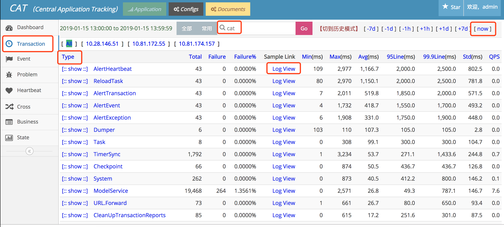

APM(Application Performance Management)应用性能管理平台

它有很多的实现，包括pinpoint，Zipkin，Skywalking，cat。

谷歌刚开始提出一个规范，即Open Tracing，主要有两个概念，trace和span。一个trace由多个span顺序和嵌套构成，就是那个执行过程色块图。span是一个执行逻辑单元，包含一些属性：多个key-value的tags，logs，开始时间和结束时间，这些属性可以展示执行逻辑中的丰富信息。


# 1. cat

zm集成了 cat和Skywalking，cat的优势就是报表强大，且实时性好，每小时统计一次报表。

但是cat需要在代码中埋点，侵入性大，埋点支持范围：①支持URL()http)、mybatis、logback、@Service注解类、feign、restTemplate埋点； ②支持springboot1.x和2.x版本； ③增加@CatTracing、@IgnoreCatTracing注解，用于cat的aop日志。

- Transaction 适合记录跨越系统边界的程序访问行为,比如远程调用，数据库调用，也适合执行时间较长的业务逻辑监控，Transaction用来记录一段代码的执行时间和次数。可以看到按类型查看调用次数，调用时长，95线，99线，QPS等信息，点击logview查看详细信息，

  常用Transaction类型: 1.System:系统，JVM等数据；2.URL:Controller层调用；3.Service:使用@Service注解的类的调用 ；4.SQL:使用mybatis框架的调用 ；5.Cache.Redis:redis调用；6.RemoteCall:服务间调用；7.ServiceProvider:服务提供方被调用

  

- Event 用来记录一件事发生的次数，比如记录系统异常，它和transaction相比缺少了时间的统计，开销比transaction要小。和Transaction类似，但是行级代码的调用情况

  

- Heartbeat 表示程序内定期产生的统计信息, 如CPU利用率, 内存利用率, 连接池状态, 系统负载等。

  

- 点击Problem，查看异常报错信息

  

  

# 2. Skywalking

SkyWalking是一个针对分布式系统的应用性能监控（Application Performance Monitor，APM）和可观测性分析平台（Observability Analysis Platform，OAP）。它提供了多维度应用性能分析手段，从分布式拓扑图到应用性能指标、Trace、日志的关联分析与告警。

这里首先要强调的是，SkyWalking针对的是微服务和分布式服务，包括现在的容器化。在这样的环境中，应用间依赖关系复杂多变，无论是设计、开发还是运维团队，都不具备对系统实际关系和运行情况的理解能力。主流大型企业的内部系统都有几十个子系统，其中有上百个服务和上千个实例在运行，理解这套系统的依赖关系是SkyWalking要解决的第一大问题。

同时，随着技术的革新和进步，分布式框架层出不穷，以Spring Cloud、gRPC、Dubbo为代表的多语言RPC框架是当今的主流，以Istio+Envoy为代表的Service Mesh是未来发展的方向。统一的监控平台，对于用户理解复杂的分布式架构会起到至关重要的作用。

最重要的是，SkyWalking保证了在生产环境中高压力情况下的可用性。常规百亿级别的处理能力、轻量级、可插拔、方便定制，是SkyWalking在短短3年时间内得到广泛应用的主要原因。


## javaagent简介

SkyWalking探针在使用上是无代码侵入的，而这种无侵入的自动埋点基于Java的JavaAgent技术。 启动时加载的JavaAgent（以下所说的JavaAgent均代表启动时加载的JavaAgent）是JDK1.5之后引入的新特性，此特性为用户提供了在JVM将字节码文件读入内存之后，使用对应的字节流在Java堆中生成一个Class对象之前，对其字节码进行修改的能力，而JVM也会使用用户修改过的字节码进行Class对象的创建。 SkyWalking探针依赖于JavaAgent在一些特殊点（某个类的某些方法）拦截对应的字节码数据并进行AOP修改。当某个调用链路运行至已经被SkyWalking代理过的方法时，SkyWalking会通过代理逻辑进行这些关键节点信息的收集、传递和上报，从而还原出整个分布式链路。


当某个类的字节码被JVM载入内存之后，JVM会触发一个ClassFileLoadHook事件，JVM会依次遍历所有的instrumentation实例并执行其中所有的ClassFileTransformer的transform方法。这些instrumentation实例中的ClassFileTransformer就是我们在JavaAgent中添加的自定义逻辑。

## 更新日志

- Agent新增阿里云OSS插件、RocketMQ插件

- Agent新增XXL-JOB插件
- 指标及链路查询速度优化
- 支持Agent异常日志告警
- s对REST风格的URL进行格式化
- Java Agent使用Kafka进行Segment数据上报
- 简化Agent，移除公司用不到的Agent插件
- Agent新增Beacon插件
- OAP采样逻辑优化
- UI支持服务收藏
- 新增排行榜页面
- 支持主动告警
- 支持NodeJS服务接入

# 3. Bistoury 

可以在线调试，太牛了！


https://github.com/qunarcorp/bistoury/blob/master/docs/cn/debug.md

# 4. async-profiler 

async-profiler 是一款 Java **性能分析工具**，原理是基于 HotSpot 的 API，以**微乎其微的性能开销**收集程序运行中的堆栈信息、内存分配等信息进行分析。

async-profile 目前支持 Linux 和 macOS 平台（macOS 下只能分析用户空间的代码）。

async-profiler 工具在采样后可以生成采样结果的日志报告，也可以生成 SVG 格式的**火焰图**。

## 如何安装

```
# 切换到 root 用户
sudo su

# 进入 /usr/local 目录（☆☆☆这一步很重要，建议大家都安装在这个目录下☆☆☆）
cd /usr/local

# 从 OSS 下载资源
wget https://zm-web-data.oss-cn-hangzhou-internal.aliyuncs.com/doc/xdE7WFSyFX1qQpzjWSYXFX/async-profiler-1.8.3-linux-x64.tar.gz

# 解压资源到当前目录
tar -zxvf async-profiler-1.8.3-linux-x64.tar.gz

# 进入工作目录
cd async-profiler-1.8.3-linux-x64
```

## 使用：

jps查看PID


然后CPU性能分析：

```
# 对 CPU 进行 30s 的性能分析，并在 tmp 目录（调整目录位置会导致无法生成结果文件）下生成采样结果的日志报告 cpu1.txt
sh profiler.sh -e cpu -d 30 -f /tmp/cpu1.txt PID

# 对 CPU 进行 60s 的性能分析，并在 tmp 目录（调整目录位置会导致无法生成结果文件）下生成采样结果的火焰图 cpu1.svg（下载到本地电脑，并拖拽到 Chrome 浏览器中即可打开）
sh profiler.sh -e cpu -d 60 -f /tmp/cpu1.svg PID

# 下载到本地电脑，用 Chrome 浏览器查看
sz /tmp/cpu1.svg
```

**火焰图里，横条越长，代表使用的越多，从下到上是调用堆栈信息**。


HEAP内存分析：

```
# 对 Heap 内存进行 30s 分析，并在 tmp 目录（调整目录位置会导致无法生成结果文件）下生成采样结果的日志报告 heap1.txt
sh profiler.sh -e alloc -d 30 -f /tmp/heap1.txt PID

# 直接在服务器上查看结果
vi heap1.txt

# 对 Heap 内存进行 60s 分析，并在 tmp 目录（调整目录位置会导致无法生成结果文件）下生成采样结果的火焰图 heap1.svg（下载到本地电脑，并拖拽到 Chrome 浏览器中即可打开）
sh profiler.sh -e alloc -d 60 -f /tmp/heap1.svg PID

# 下载到本地电脑，用 Chrome 浏览器查看
sz /tmp/heap1.svg
```

依旧是横条越长，代表使用的越多，从下到上是调用堆栈信息