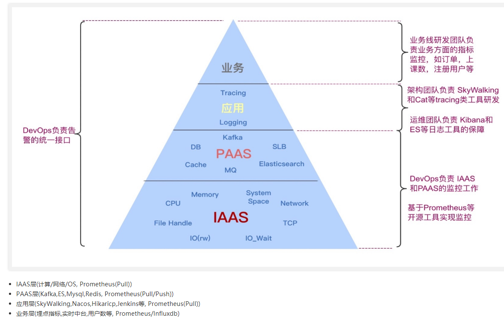
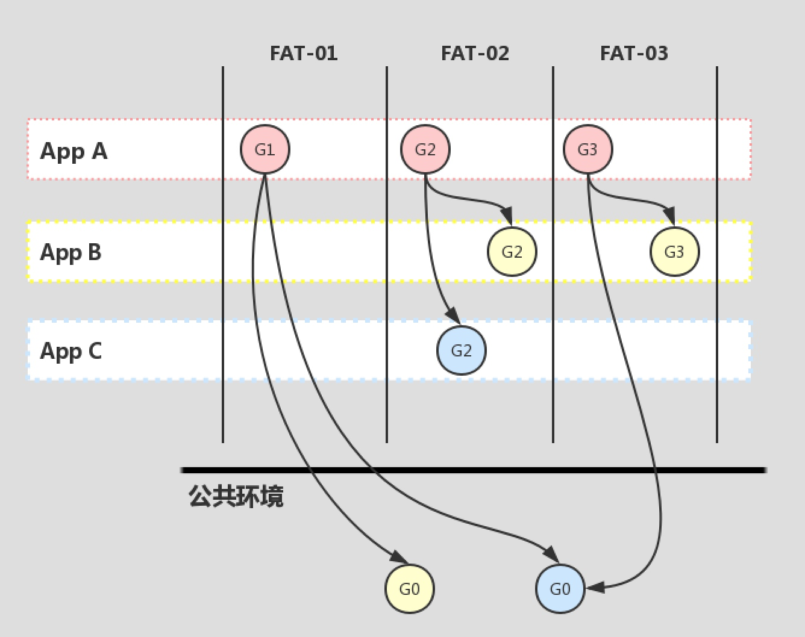

系统架构图如下：


# 基础架构Solar

Solar作为下一代基础微服务体系，2019年11月开始筹划，2020年1月4日推出第一版，2020年4月15日发布1.2.0 & 2.2.0里程碑稳定版，兼容Spring Cloud Edgware版、Finchley版、Greenwich版、Hoxton版本。

基于三层体系而构建

- 基础公共组件。Solar的基础组件，基础公共组件一般呈原子层面的独立存在，组件间也可适当耦合，基本上可达到一个组件被移除，不影响另外一个组件的运行的特征
- 基础公共框架。Solar的基础框架，依托Spring     Cloud服务体系，以框架形式对外暴露。它的另外一个重要特征，是对基础公共组件的聚合，一种“搭积木”的方式进行构建
- 基础公共服务。Solar的基础服务，以公共服务形式对外暴露。它的另外一个重要特征，是对基础公共组件的使用，它是Solar框架卫星环绕式的组成部分


Solar基于Spring Cloud技术栈，支持Eureka注册中心、Apollo配置中心、Zuul网关、2个限流熔断降级组件（Sentinel、Hystrix）等，Skywalking + Opentracing和CAT的APM调用链监控，Prometheus + Grafana指标监控，Kibana日志监控等，具有企业级的插件引入、开箱即用特征。它包含几大核心模块：

- 全链路灰度蓝绿发布智能化&DevOps发布平台集成
- Zuul网关动态过滤转发灰度蓝绿& Furion 统一控制台
- Sentinel全链路熔断限流降级权限和自研功能
- Apollo & Eureka & VI & Sensitive & EventBus & Agent &XXL-Job等中间件和组件
- Docker CI & 自动化测试
- 服务和网关一键脚手架
- 监控三要素，Tracer（Skywalking     & CAT），Metrics （多维度的业务指标监控），Logger（MDC，Kibana & ES & GOHANGOUT等的ELK日志集群）
- 打通基础数据中间件，MySQL（ShardingSphere）&     RocketMQ & MongoDB & Redis
- 支持大数据平台，Kafka& Elastic Search & InfluxDB
- 接入GPM监控平台，Prometheus     & Grafana & InfluxDB & AlarmCenter （运维、邮件、钉钉机器人和掌控APP告警）
- 接入阿里云，OSS支撑

## SolarV2.3.1

Solar Foundation基于Spring Cloud Edgware和Greenwich版而打造的微服务体系，它集成Nacos/Eureka双注册中心、Apollo配置中心、Sentinel/Hystrix双限流熔断、SkyWalking + OpenTracing/CAT双埋点监控、Prometheus + Grafana指标监控、Kibana日志监控、Metrics业务监控等组件，整合DevOps发布平台，基于Zuul网关实施蓝绿灰度发布、子环境隔离、动态过滤转发路由等功能，基于掌控和钉钉机器人实施告警功能，提供Dev CI自动化一键部署和测试工具，提供网关和微服务脚手架一键生成工具

平滑改造和迁移微服务到Nacos注册中心，截止2020-07-23，在生产环境中接入Solar微服务体系（Nacos SDK + Eureka SDK），业务服务数达到达到131个，实例数287个（其中Nacos SDK到达183个）


## 监控体系




SaaS（软件即服务），PaaS（平台即服务）和IaaS（基础架构即服务）


## Chaos网关

Chaos网关，混沌测试1.0版本，实现了网关和服务接口层面故障注入，可以有效验证1v1核心和非核心依赖服务的容错能力，测试核心业务是否健壮，能有效验证核心和非核心业务兜底策略是否生效，能大幅度提升了系统的稳定性。

2.0将会和chaosblade结合进一步扩展故障注入的类型，覆盖例如CPU满载，磁盘IO高，网络延迟超时等线上重要节点Paas层的容错能力，并且能够进行线上全节点的故障演练，对监控告警的及时性，对员工重大线上故障的处理能力进行锻炼，从而进一步减少线上重大故障的发生。


# 发布系统

公司分为容器和虚拟机发布。

容器发布的运行环境包括jar包版本，外网权限，实例规格，JVM启动参数，每次重启，扩容，这些都不会改变，但不包括Apollo配置。

容器可以方便的扩缩容，申请外网权限，修改实例配置。特殊情况可以申请域名给其他服务调用（通常走nacos）；也提供了web terminal方便进入容器，用来导出文件等；还可以使用Bistoury进行线上问题诊断。

容器运行时不能绑定固定IP，但是通常可以绑定域名来解决。


## 发布过程

在 TARS 的生产发布模式采用金丝雀的滚动发布，所有在应用发布前我们会从待发布的一组机器中选出一台或多台作为金丝雀(canary)，即堡垒机。

只有堡垒机发布成功后，才会允许进行后续的滚动发布。堡垒机发布作为应用生产灰度的一部分，分为 somking 阶段和 baking 阶段，且两个阶段是严格受控的，结合这两个阶段，我们进一步降低新版本上线的生产风险，让后续的滚动发布更安全。

smoking 的验证是在隔绝生产流量的环境下进行的，而 baking 时堡垒机已经接入生产流量了，也就是说如果此时有请求失败，是会造成生产损失的。在 baking 阶段，生产发布人员应该通过其他辅助工具，如日志，监控等来监督堡垒机的运行情况，如果发现异常，可以直接回滚版本，此时方能最小化控制住故障规模。

**我点击发布为什么会出现两个实例？**

容器的发布方式是滚动发布(rolling update)不同于虚机，通过先启动新的实例，再销毁老版本的实例（虚机是在一台机器上先把老版本的进行中止，再启动新版本的进程）。这种启动方式充分利用了容器的优点， 可以更好地实现无损发布。

所以在新版本的实例启动成功之前，会同时存在两个实例，一个是旧版本的实例，为 running 状态，一个是当前新的发布版本的实例，状态为 pending, 当发布成功后，旧版本的实例才会销毁。若发布失败，并不会销毁旧版本的实例。

 

 **JDK版本问题**

现在z m使用的 JDK 版本统一为 java8u131， 该版本在容器场景下有部分功能缺失，比如：

1. 无法正确识别容器的内存限制。JVM 在容器里面识别到的是宿主机的内存，默认会使用 1/4 的宿主机内存。这样会远远大于容器规格限制的内存，导致宿主机内存爆了，最终导致容器自动重启。这个问题在可以通过在 JVM 中加入 -XX:+UnlockExperimentalVMOptions     -XX:+UseCGroupMemoryLimitForHeap 得到解决，通过 CD 平台打的容器镜像我们会统一加上以上两个 JVM 参数。
2. 无法正确识别容器的 CPU 核数。JVM 在容器里面识别到 CPU 核数也是宿主机的，导致代码 Runtime.getRuntime().availableProcessors() 获取 JVM 虚拟机可用核数不是期望的值。 如果程序按宿主机核数进行工作，除了影响自身服务以外，还有可能因为资源占用过多导致容器宿主机故障。

在 JDK8u212 之后的 Java 对容器的支持就比较好了，可以正确识别到容器里面的内存和CPU数量。但是升级 JDK 对服务来说属于重大变更，因此我们建议有以上问题的服务升级到最低可用版本 JDK8u191，保证 jdk 的改动尽可能小。

## 子环境

因为测试环境只有一套，如果有多个需求要测，就会产生冲突。所以提供了子环境的功能，子环境可以有多套，相对的主环境就是FAT环境。

子环境链路隔离原理是通过在 http 请求头里加塞头环境标签，不同与 Java 应用通过 Solar 框架塞头，H5 是基于 Nginx 实现的。网关来识别请求头进行转发到相应的子环境



# zm jar包规范

- `SNAPSHOT` 版本包建议命名风格: 1.0.0-SNAPSHOT
- `RELEASE` 版本建议命名风格: 1.0.0 或 1.0.0.RELEASE
- `RELEASE` 版本**不能 Redeploy**，即一个版本只能 deploy 一次。如有修改必须升级版本号
- `RELEASE` 版本和 `SNAPSHOT` 版本都不允许deploy后删除, 现已回收dev2删除权限
- `SNAPSHOT` 版本不允许上生产环境

# 布隆过滤器

学生每天要完成任务，每个任务完成可以领取能量果，但是这个toast提示一天只提示一次。多端要保持统一，前端是没法控制的，所以后端根据userId，taskId进行过滤，当天过期。使用redission的布隆过滤器来实现

```java
    @Resource
    private RedissonClient redissonClient;
 
    /**
         * 查询当天是否已经查询过，如果查过就不再提示用户任务toast
         *
         * @param userId
         * @param taskId
         * @return true-已经查询过，false-没有查询过
         */
    public boolean checkCurrentDateIsQueried(Integer userId, Integer taskId) {
        String key = "" + userId + "_" + taskId;
        RBloomFilter bloomFilter = this.getLocalDateBloomFilter();
        boolean contains = bloomFilter.contains(key);
        if (!contains) {
            bloomFilter.add(key);
        }
        return contains;
    }

    /**
     * 获取当天的布隆过滤器
     */
    private RBloomFilter getLocalDateBloomFilter() {
        String bloomFilterName = "taskEnergy" + LocalDate.now().toString();
        RBloomFilter bloomFilter = redissonClient.getBloomFilter(bloomFilterName);
        if (bloomFilter.isExists()) {
            return bloomFilter;
        }
        bloomFilter.tryInit(Long.parseLong(taskEnergyBloomFilterExpectedInsertions), 0.01);
        // 当天零点过期
        long epochMilli = LocalDateTime.of(LocalDate.now(), LocalTime.MAX).toInstant(ZoneOffset.of("+8")).toEpochMilli();
        bloomFilter.expireAt(epochMilli);
        return bloomFilter;
    }
```


# 数据库


# 日志

```xml
<?xmlversion="1.0"encoding="UTF-8"?>
<configurationdebug="false">

<definename="appId"class="com.zm.arch.logger.component.common.AppIdDefiner"/>

<springPropertyscope="context"name="springAppName"source="spring.application.name"/>

<springPropertyscope="context"name="logSwitch"source="port.http.server"/>

<!--logmaxFileSize-->
<springPropertyscope="context"name="MAX_FILE_SIZE"source="spring.logback.max-file-size"defaultValue="100MB"/>

<!--logmaxIndex-->
<springPropertyscope="context"name="MAX_INDEX"source="spring.logback.max-index"defaultValue="5"/>

<springPropertyscope="context"name="MASK_FIELDS"source="log.mask.fields"defaultValue="message,input_param,output_param,header_param"/>

<springPropertyscope="context"name="MASK_REGEX_TYPES"source="log.mask.regex.types"defaultValue="mobile"/>

<springPropertyscope="context"name="MASK_REGEX_MATCH_MAX_DEPTH"source="log.mask.regex.match.max.depth"defaultValue="12"/>

<springPropertyscope="context"name="MASK_REGEX_MATCH_MAX_LENGTH"source="log.mask.regex.match.max.length"defaultValue="2048"/>

<conversionRuleconversionWord="hostAddress"
converterClass="com.zm.arch.logger.component.common.HostAddressConvert"/>

<!--logbasepath-->
<propertyname="LOG_HOME"value="/opt/logs/${appId}/applog"/>

<!--STDOUT输出格式-->
<propertyname="MAX_FILE_SIZE"
value='%d{yyyy-MM-ddHH:mm:ss.SSS}|%X{X-CAT-ROOT-ID:-}|%X{X-CAT-PARENT-ID:-}|%X{X-CAT-ID:-}|${springAppName:-}|[%thread]|%-5level|%logger{50}-%msg%n'/>

<!--INFO输出格式-->
<propertyname="INFO_PATTERN"value='{
"host":"%hostAddress",
"time":"%d{yyyy-MM-ddHH:mm:ss.SSSZ}",
"catRootId":"%X{X-CAT-ROOT-ID:-}",
"catParentId":"%X{X-CAT-PARENT-ID:-}",
"catId":"%X{X-CAT-ID:-}",
"service":"${springAppName:-}",
"appId":"%X{n-d-service-app-id}",
"serviceId":"%X{n-d-service-id}",
"serviceVersion":"%X{n-d-service-version}",
"serviceRegion":"%X{n-d-service-region}",
"serviceEnv":"%X{n-d-service-env}",
"swTraceId":"%X{trace-id}",
"level":"%level",
"class":"%logger",
"message":"%message%n%exception{10}"
}'/>

<!--WARN输出格式-->
<propertyname="WARN_PATTERN"value='{
"host":"%hostAddress",
"time":"%d{yyyy-MM-ddHH:mm:ss.SSSZ}",
"catRootId":"%X{X-CAT-ROOT-ID:-}",
"catParentId":"%X{X-CAT-PARENT-ID:-}",
"catId":"%X{X-CAT-ID:-}",
"service":"${springAppName:-}",
"appId":"%X{n-d-service-app-id}",
"serviceId":"%X{n-d-service-id}",
"serviceVersion":"%X{n-d-service-version}",
"serviceRegion":"%X{n-d-service-region}",
"serviceEnv":"%X{n-d-service-env}",
"swTraceId":"%X{trace-id}",
"level":"%level",
"class":"%logger",
"message":"%message%n%exception{10}"
}'/>

<!--ERROR输出格式-->
<propertyname="ERROR_PATTERN"value='{
"host":"%hostAddress",
"time":"%d{yyyy-MM-ddHH:mm:ss.SSSZ}",
"catRootId":"%X{X-CAT-ROOT-ID:-}",
"catParentId":"%X{X-CAT-PARENT-ID:-}",
"catId":"%X{X-CAT-ID:-}",
"service":"${springAppName:-}",
"appId":"%X{n-d-service-app-id}",
"serviceId":"%X{n-d-service-id}",
"serviceVersion":"%X{n-d-service-version}",
"serviceRegion":"%X{n-d-service-region}",
"serviceEnv":"%X{n-d-service-env}",
"swTraceId":"%X{trace-id}",
"level":"%level",
"class":"%logger",
"message":"%message%n%exception{10}"
}'/>

<includeresource="logback/error-appender.xml"/>
<includeresource="logback/info-appender.xml"/>
<includeresource="logback/warn-appender.xml"/>
<includeresource="logback/stdout-appender.xml"/>
<includeresource="logback/api-appender.xml"/>
<includeresource="logback/client-appender.xml"/>


<!--日志输出级别-->
<rootlevel="INFO">
<appender-refref="BASE-FILE-INFO"/>
<appender-refref="BASE-FILE-WARN"/>
<appender-refref="BASE-FILE-ERROR"/>
<ifcondition='isNull("logSwitch")'>
<then>
<appender-refref="STDOUT"/>
</then>
</if>
</root>

</configuration>

```

Jar包里:

INFO别配置：

```xml
<included>

<!--rootfile-->
<appendername="BASE-FILE-INFO-SYNC"class="ch.qos.logback.core.rolling.RollingFileAppender">
<file>${LOG_HOME}/info.log</file>
<rollingPolicyclass="ch.qos.logback.core.rolling.FixedWindowRollingPolicy">
<fileNamePattern>${LOG_HOME}/info.%i.log</fileNamePattern>
<minIndex>1</minIndex>
<maxIndex>${MAX_INDEX}</maxIndex>
</rollingPolicy>
<triggeringPolicyclass="ch.qos.logback.core.rolling.SizeBasedTriggeringPolicy">
<maxFileSize>${MAX_FILE_SIZE}</maxFileSize>
</triggeringPolicy>
<encoderclass="net.logstash.logback.encoder.LoggingEventCompositeJsonEncoder">
<jsonGeneratorDecoratorclass="com.zm.arch.logger.component.desensitization.RegexMaskingJsonGeneratorDecorator">
<valueMask>
<paths>${MASK_FIELDS}</paths>
<values>${MASK_REGEX_TYPES}</values>
<maxDepth>${MASK_REGEX_MATCH_MAX_DEPTH}</maxDepth>
<maxLength>${MASK_REGEX_MATCH_MAX_LENGTH}</maxLength>
</valueMask>
</jsonGeneratorDecorator>
<providers>
<pattern>
<pattern>${INFO_PATTERN}</pattern>
</pattern>
</providers>
</encoder>
<filterclass="ch.qos.logback.classic.filter.LevelFilter">
<level>INFO</level>
<onMatch>ACCEPT</onMatch>
<onMismatch>DENY</onMismatch>
</filter>
</appender>

<!--异步输出-->
<appendername="BASE-FILE-INFO"class="ch.qos.logback.classic.AsyncAppender">
<!--不丢失日志-->
<discardingThreshold>0</discardingThreshold>
<!--更改默认的队列的深度,该值会影响性能.默认值为256-->
<queueSize>256</queueSize>
<!--添加附加的appender,最多只能添加一个-->
<appender-refref="BASE-FILE-INFO-SYNC"/>
</appender>

</included>
```

error级别配置：

```xml
<included>

<appendername="BASE-FILE-ERROR-SYNC"class="ch.qos.logback.core.rolling.RollingFileAppender">
<file>${LOG_HOME}/error.log</file>
<rollingPolicyclass="ch.qos.logback.core.rolling.FixedWindowRollingPolicy">
<fileNamePattern>${LOG_HOME}/error.%i.log</fileNamePattern>
<minIndex>1</minIndex>
<maxIndex>${MAX_INDEX}</maxIndex>
</rollingPolicy>
<triggeringPolicyclass="ch.qos.logback.core.rolling.SizeBasedTriggeringPolicy">
<maxFileSize>${MAX_FILE_SIZE}</maxFileSize>
</triggeringPolicy>
<encoderclass="net.logstash.logback.encoder.LoggingEventCompositeJsonEncoder">
<jsonGeneratorDecoratorclass="com.zm.arch.logger.component.desensitization.RegexMaskingJsonGeneratorDecorator">
<valueMask>
<paths>${MASK_FIELDS}</paths>
<values>${MASK_REGEX_TYPES}</values>
<maxDepth>${MASK_REGEX_MATCH_MAX_DEPTH}</maxDepth>
<maxLength>${MASK_REGEX_MATCH_MAX_LENGTH}</maxLength>
</valueMask>
</jsonGeneratorDecorator>
<providers>
<pattern>
<pattern>${ERROR_PATTERN}</pattern>
</pattern>
</providers>
</encoder>
<filterclass="ch.qos.logback.classic.filter.LevelFilter">
<level>ERROR</level>
<onMatch>ACCEPT</onMatch>
<onMismatch>DENY</onMismatch>
</filter>
</appender>

<!--异步输出-->
<appendername="BASE-FILE-ERROR"class="ch.qos.logback.classic.AsyncAppender">
<!--不丢失日志-->
<discardingThreshold>0</discardingThreshold>
<!--更改默认的队列的深度,该值会影响性能.默认值为256-->
<queueSize>256</queueSize>
<!--添加附加的appender,最多只能添加一个-->
<appender-refref="BASE-FILE-ERROR-SYNC"/>
</appender>

</included>

```

# JVM参数

```json
{
"Xms": "-Xms5734m",
"Xmx": "-Xmx5734m",
"XX:PermSize": "-XX:PermSize=256M",
"XX:MaxNewSize": "-XX:MaxNewSize=1536m",
"XX:MaxPermSize": "-XX:MaxPermSize=256m",
"Djava.awt.headless": "-Djava.awt.headless=true",
"prometheus": "-javaagent:/usr/jmx_prometheus/jmx_prometheus_javaagent-0.11.1.jar=9150:/usr/jmx_prometheus/config.yaml",
"skywalking": "-javaagent:/usr/skywalking-apm/skywalking-agent-2.5.0-RELEASE/skywalking-agent.jar",
"Dskywalking.agent.service_name": "-Dskywalking.agent.service_name=client-hub-chat@10118"
}
```

https://www.oracle.com/webfolder/technetwork/tutorials/obe/java/gc01/index.html


堆参数：

| **参数**          | **描述**                                                     |
| :---------------- | ------------------------------------------------------------ |
| -Xms              | 设置JVM启动时堆的初始化大小。                                |
| -Xmx              | 设置堆最大值。                                               |
| -Xmn              | 设置年轻代的空间大小，剩下的为老年代的空间大小。             |
| -XX:PermGen       | 设置永久代内存的初始化大小。                                 |
| -XX:SurvivorRatio | 提供Eden区和survivor区的空间比例。比如，如果年轻代的大小为10m并且VM开关是-XX:SurvivorRatio=2，那么将会保留5m内存给Eden区和每个Survivor区分配2.5m内存。默认比例是8。 |
| -XX:NewRatio      | 提供年老代和年轻代的比例大小。默认值是2。                    |

# 前端灰度发布

之前通过灰度机器的方式，需要申请新域名。

 

目前网关机器去年9台今年15台，既负责网关转发，也部署前端。所以nginx 要转发本地的前端代码，还要负责转发后端接口。 

要把前端项目拆出去，不要和网关放在一起，两台就足够了。再加上前端文件CDN 处理。

 

原理：

前端一台机器部署了两套不同版本前端代码，接口请求过来后，去利用apollo的配置，拉到对应应用的配置，lua 脚本，然后根据nginx 规则去找到对应的location 目录。秒级生效

根据手机系统版本配置

根据参数如cookie ，query 参数来配置

根据ip 去匹配，性能会降低，把前端从网关机器拆出去会好点。有的甚至把私域ip 暴露出去

 前后端一起灰度的情况很少，所以只考虑各自单独灰度的


# 其他

nacos上服务960多个，实例3000多个。

Apollo应该是注册在nacos上了，部署了5个实例


